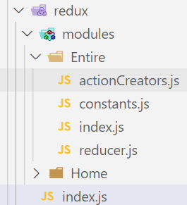

### 1.安装

- 之前安装过@reduxjs/toolkit和react-redux
- @reduxjs/toolkit已经包含了原来redux所需内容

### 2.目录结构



### 3.制定常量

```js
export const HIGH_SCORE_LIST = "HIGH_SCORE_LIST"
```

### 4.创建reducer

```js
import { HIGH_SCORE_LIST } from "./constants"

const initialState = {
  list: []
}

export function reducer(state = initialState, action) {
  switch(action.type) {
    case HIGH_SCORE_LIST:
      return {...state, list: action.list}
    default:
      return state
  }
}
```

### 5.actionCreators

```js
import { HIGH_SCORE_LIST } from "./constants"
import { getHighScore } from "@/service"

export function fetchHighScoreAction() {
  return async function(dispatch, getState) {
    const res = await getHighScore()
    dispatch({type: HIGH_SCORE_LIST, list: res.list})
  }
}
```

### 6.合并reducer

```js
import { configureStore } from "@reduxjs/toolkit"

import homeReducer from "./modules/Home"
import { reducer } from "./modules/Entire"

const store = configureStore({
  reducer: {
    homeReducer,
    entireReducer: reducer
  }
})

export default store
```

### 7.使用

```jsx
import React, { memo, useEffect } from 'react'
import { useSelector, useDispatch, shallowEqual } from "react-redux"
import { fetchHighScoreAction } from "@/redux/modules/Entire/actionCreators"

const Entire = memo(() => {
  const {list} = useSelector((state) => ({
    list: state.entireReducer.list
  }), shallowEqual)

  const dispatch = useDispatch()
  useEffect(() => {
    dispatch(fetchHighScoreAction())
  }, [dispatch])

  return (
    <div>
      {
        list.map(item => <div key={item.id}>{item.name}</div>)
      }
    </div>
  )
})

export default Entire
```

