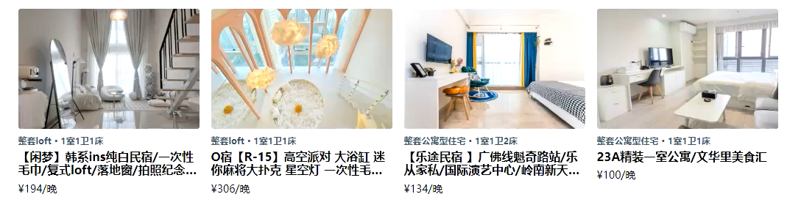

### 1.svg处理

- 在爱彼迎复制你想要的svg

  

- 将复制的svg作为一个组件：

- 使用老师提供的工具，格式化样式

  

- 这样你就可以把它当做组件来使用了

### 2.styled-components

- 安装：npm install styled-components

- style.js文件

  ```js
  import styled from "styled-components"
  
  export const HeaderWrapper = styled.div`
    color: red;
  `
  ```

- 在组件中使用

  ```jsx
  import Logo from "@/assets/svg/Logo"
  
  import { HeaderWrapper } from "./style"
  
  const index = memo(() => {
    return (
      <HeaderWrapper>
        <Logo/>
      </HeaderWrapper>
    )
  })
  ```

- 在svg中有一个属性为fill="currentcolor"，这个currentcolor就是离他最近的父元素的color，也就是我们在style.js文件中写的那个color，也就是说，此时的Logo图标为红色：

### 3.共享主题样式

- 原网站肯定不是红色，而是它的主题色，这个主题色很多地方都会用到

- 不仅主题色会用到，其他的样式类东西也会用到

- 这个时候就需要共享一些主题类的样式

- 在assets文件夹中创建theme文件夹，再在里面创建index.js文件，书写如下代码

  ```js
  const theme = {
    color: {
      primary: "#ff385c"
    }
  }
  
  export default theme
  ```

- 在最外层的index.js中从styled-components中拿到ThemeProvider，然后导入刚刚写的主题

  ```jsx
  <ThemeProvider theme={theme}>
    <App />
  </ThemeProvider>
  ```

  - 将主题共享出去

- 最后在任意style.js文件中使用

  ```js
  import styled from "styled-components"
  
  export const HeaderWrapper = styled.div`
    color: ${props => props.theme.color.primary};
  `
  ```

### 4.头部布局

- 头部总共三个模块，中间的模块要保证居中，但是两边宽度不一样
- 如果给中间的为flex为1，那么由于两边宽度不一样，是无法让中间的完全居中
- 让两个边的flex为1，中间的不设置即可

### 5.混入

- 在很多地方都会用到鼠标移上，阴影出现，并携带动画，这段代码是重复的，每个地方都写效率较低

- 我们想把这些重复的代码用混入实现复用（抽取）：

  

- 这样就是实现了css代码的复用

### 6.图片问题

- 在React中，你想要动态的引入一张本地图片，比如background和img

  

- 图片是显示不出来的，你这个图片是无效的，这个跟webpack的底层有关，你要这么做才可以

  

- 你也可以这么做

  
  
  - 加不加default你看着来吧，有时候要你加，有时候又不要你加

### 7.高性价比部分布局

- 一共有八块内容，分两行，每行四个，每个占据25%，所以一行里面四个是占满的，他们之间是没有距离的
- 给每个块的padding为8px，再给父元素，一个margin左右-8px

### 8.图片宽高比不一致

- 我们的布局是：div包裹img：

  - div的padding-top是父元素宽度的66.66%
  - 这样就保证了div的大小永远是一致的
  - 然后再对图片做绝对定位，让整个图片完全占据div

- 效果对比：

  

