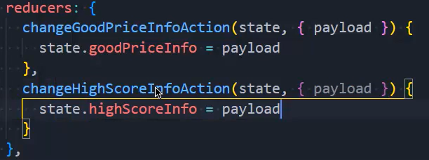
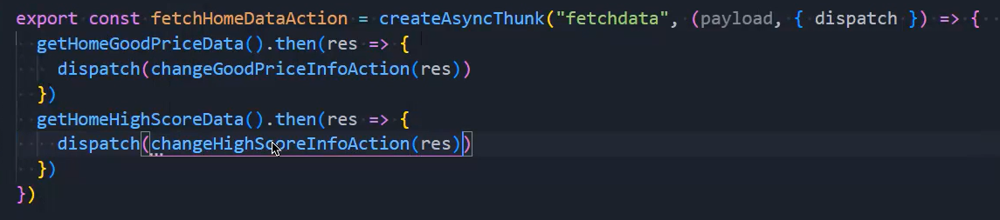
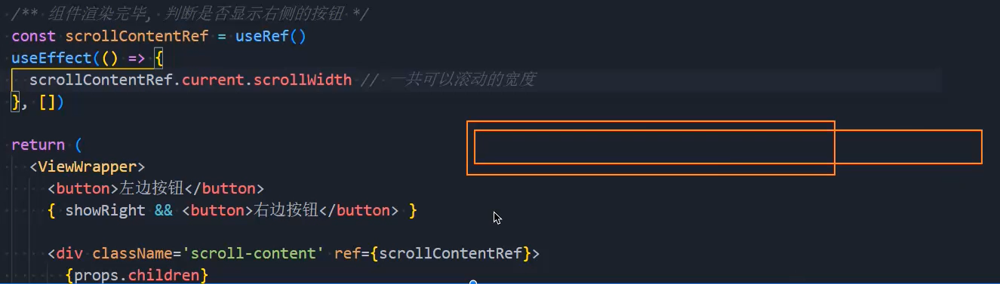
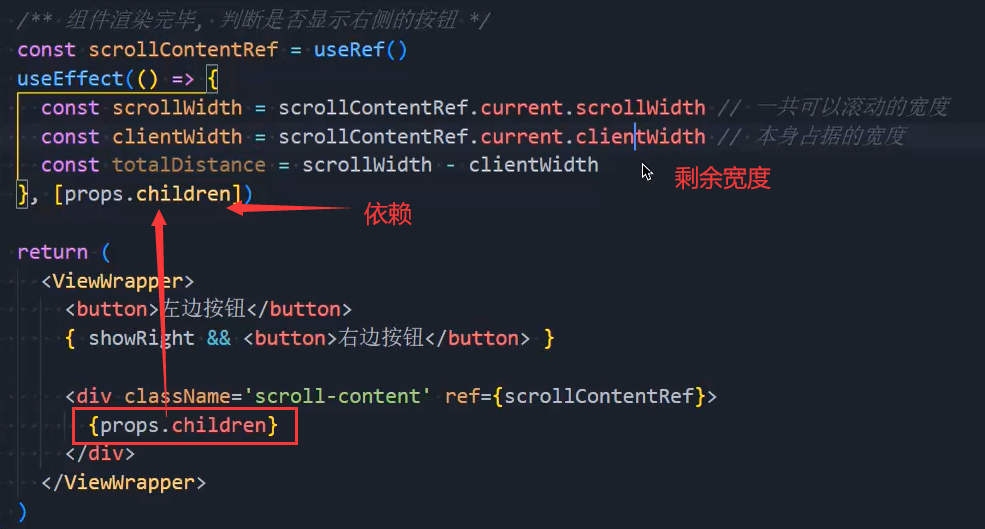
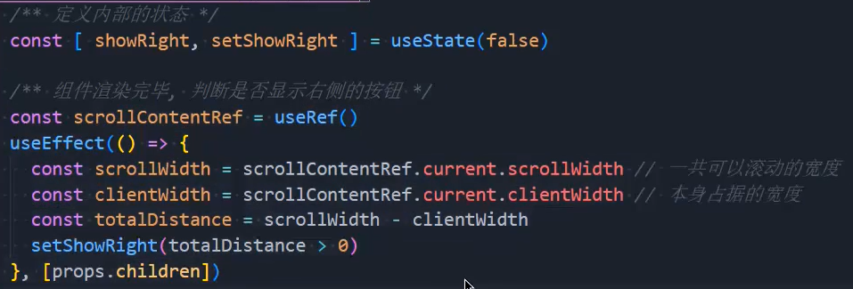
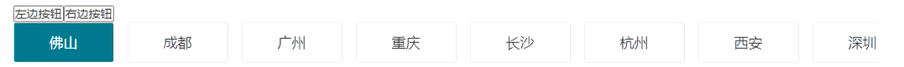
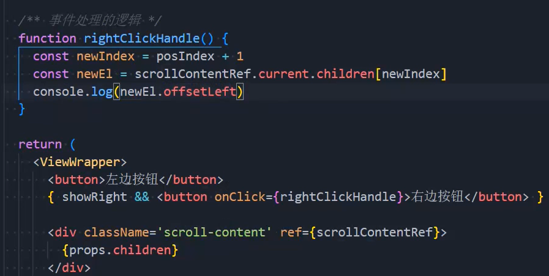
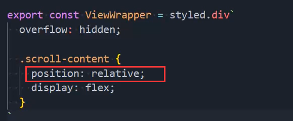
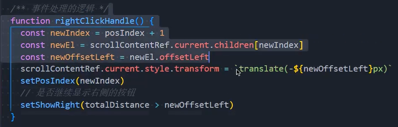
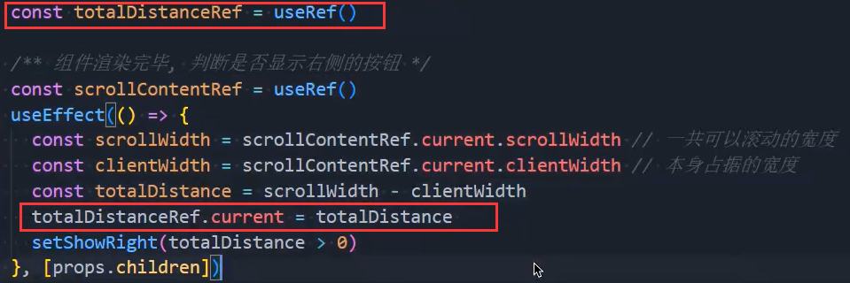

### 1.异步请求

- 书写action：

- 异步请求到数据再派发action

  

### 2.useState的特点

- 我们在父组件使用一个子组件，我们要给这个子组件传递一些数据，并且这些数据通过网络请求获得的
- 首先我们传给这个子组件的肯定是一个空的数据，那么这个组件会渲染一次
- 当我们请求到数据，再给到子组件时，这个子组件会再渲染一次
- 此时我们想在子组件中保存一个网络请求中的数据，比如我们请求到了好多城市的名字，保存其中一个
  - 第一次渲染的时候肯定是拿不到数据的，然后给useState()的括号中，写的是空字符串
  - 第二次渲染的时候，我们想要把其中一个城市的名字放到useState()的括号中，你会发现根本不起作用
  - 因为useState()只会对第一次渲染传入的值生效
- 那么怎么办呢？
  - 第一种办法是拿到值之后再渲染子组件，拿不到值就不渲染，你可以判断对象的keys长度，或者数组长度
  - 第二种办法是在当前组件的useEffect中给useState设置值，但是这样的话，组件总共会渲染三次，性能降低

### 3.flex的补充

- flex-basis: 120px;
  - 给flex-item一个最小宽度，假如你的内容只有两个字，文字撑起的宽度大概在100px左右
  - 我们的需求是，文字多你就自己撑开，如果文字小，内容撑起的宽度不足120px，那么就不能再缩小了
  - 简单来说，就是在设置最小宽度
- flex-shrink: 0;
  - 因为每个flex-item的flex-shrink的默认值都是1，所以如果你不设置为0，flex-item过多的话，就会被压缩
    - 你为每一个flex-item设置的宽度根本不起作用
  - 如果你不想被压缩，就想按照你设置的宽度，给到每一个flex-item，那么就得设置为0

### 4.右边按钮显示与否

- 逻辑是：整个包裹块的父元素是很长的，我们要获取到这个很长的块的长度

- 如果想要得到这个块的元素就必须获取到这个元素，想要获取到元素就必须等到元素渲染完毕

- 所以得在useEffect中进行获取

  - 获取可滚动的宽度

    

  - 获取剩余宽度

    

  - 当剩余宽度大于0就让右边按钮显示，当剩余宽度小于0就让右边按钮消失

    

### 5.点击右边按钮

- 点击右边的按钮拿到成都这个元素

  

  

  - 这里有一个问题，offsetLeft要是能够获取到正确的数值，包裹它的元素就必须是个定位元素

    

- 点击右边按钮，移动整个元素，当不需要移动时，让右边按钮消失

  

  - 理解这段代码就要先理解下面这段文字
    - 假如我有100个块，这100个块一个个向右排列
    - 第一个块的offsetLeft为0，第二个为100，第三个为200
    - 当我向左，通过transform: translate(-100px);，移动这100个块的父元素
    - 那么第二个的offsetLeft还是100，第三个还是200，而不是0和100
    - 也就是说，offsetLeft是不会变得
    - 而且你移动了-100px，还想第二次移动就要写-200px
  - 当剩余距离小于新的offsetLeft的时候，就得让右边的按钮消失
    - 因为剩余距离小于新的offsetLeft就意味着，父元素的右边已经全部显示出来了

### 6.优化

- 如果你只想要记录某一个东西，但是又不想重新加载当前组件，就不能使用useState

  - 要使用useRef去记录你想记录的值

  

- 在把函数传给父组件时，最好包裹useCallback