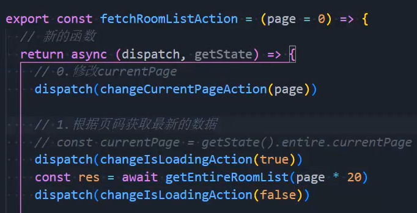
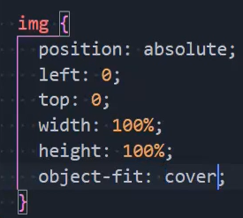

### 1.调样式

```js
styled.div`
	> .cover {}
`
```

- 给div的叫cover类的儿子添加样式

### 2.设置Loading

- 在网络请求的过程中，需要等待一段时间，在等待的过程中，我们想要有一个loading的动画，来提示用户

- 我们可以在拦截其中设置redux中的状态，但是不能使用useDispatch，但是可以引入store

- 通过store.dispatch进行派发状态

- 但是我们不想这么做，我们在请求时这么做

  

### 3.图片被压缩



### 4.图片互斥样式

```css
import styled from "styled-components";


export const PicturesWrapper = styled.div`
  position: relative;

  > .pictures {
    display: flex;
    height: 600px;
    background-color: #000;


    &:hover {
      .cover {
        opacity: 1 !important;
      }

      .item:hover {
        .cover {
          opacity: 0 !important;
        }
      }
    }
  }

  .left, .right {
    width: 50%;
    height: 100%;

    .item {
      position: relative;
      height: 100%;
      overflow: hidden;
      cursor: pointer;

      img {
        width: 100%;
        height: 100%;
        object-fit: cover;

        transition: transform 0.3s ease-in;
      }

      .cover {
        position: absolute;
        left: 0;
        right: 0;
        top: 0;
        bottom: 0;
        background-color: rgba(0,0,0,.3);
        opacity: 0;
        transition: opacity 200ms ease;
      }
      
      &:hover {
        img {
          transform: scale(1.08);
        }
      }
    }
  }

  .right {
    display: flex;
    flex-wrap: wrap;

    .item {
      width: 50%;
      height: 50%;
      box-sizing: border-box;
      border: 1px solid #000;
    }
  }

  .show-btn {
    position: absolute;
    z-index: 99;
    right: 15px;
    bottom: 15px;
    line-height: 22px;
    padding: 6px 15px;
    border-radius: 4px;
    background-color: #fff;
    cursor: pointer;
  }
`
```

### 5.其他

- 老师还讲了很多很多的动画相关的内容
- 但是我现在无法学好，暂不整理
- 内容很多，很有价值