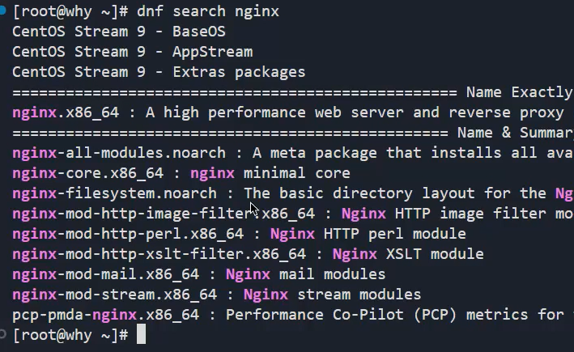
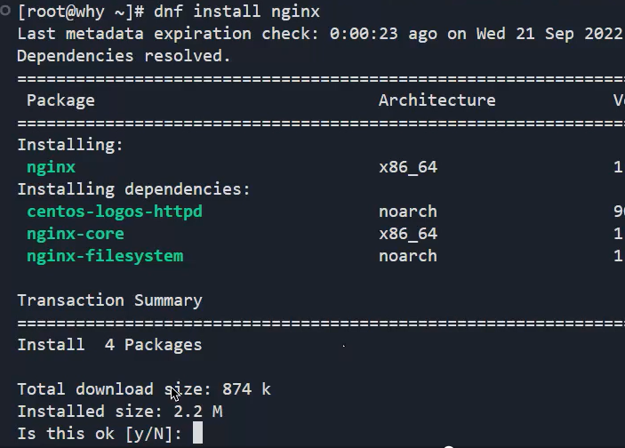
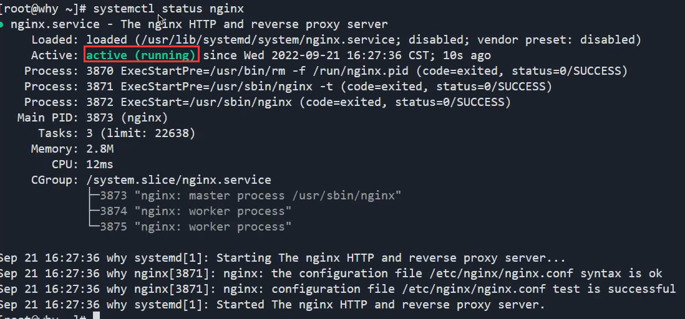
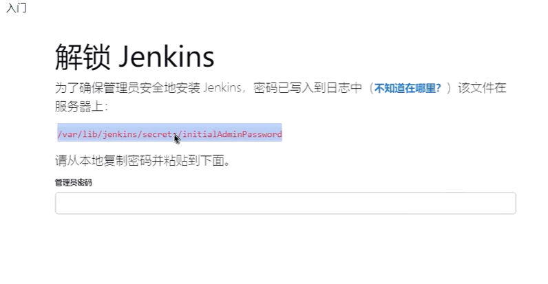
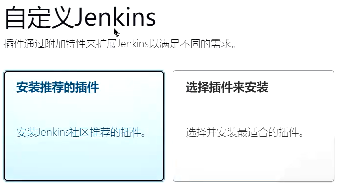
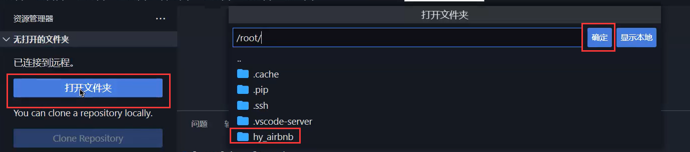
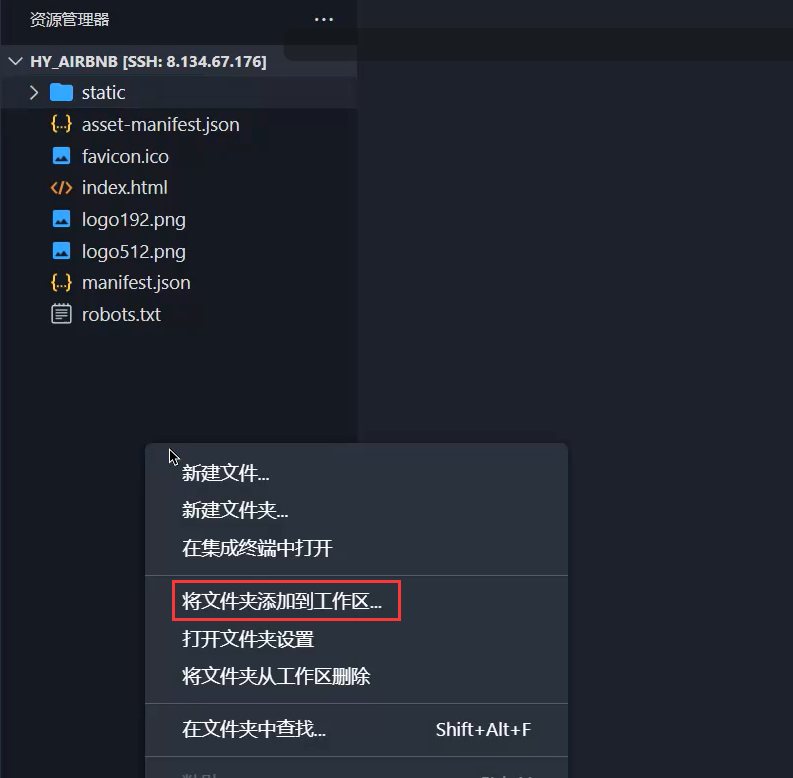
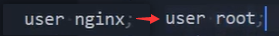
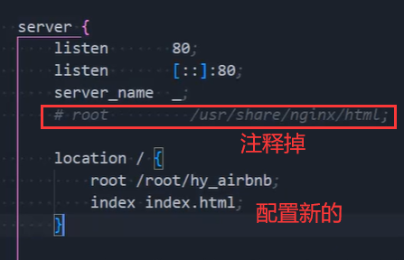

### 1.连接服务器

- ssh root@公网IP
- 在vscode中使用微软提供的remote插件

### 2.搜索和安装nginx

- dnf search nginx：

- dnf install nginx：

### 3.启动nginx

```
systemctl start nginx
systemctl status nginx
systemctl enable nginx
```

- start：启动nginx
- status：查看nginx状态：
  - active (running) ：表示启动成功
- enable：服务器开机自启动nginx
- 然后在浏览器中输入你服务器的公网IP就可以看到nginx默认给我们提供的网页了
- 当然输入公网IP访问的是80端口

### 4.安装jenkins

- 想要在服务器安装最新的jenkins，就得安装最新的java版本

- 搜索java：dnf search java，找到最新的java版本，复制名字

- 安装java：dnf install java-17-openjdk

- 搜索Jenkins：dnf search Jenkins，没有Jenkins，安装不了

- 自己配置Jenkins

  - 下载Jenkins

    ```shell
    wget –O /etc/yum.repos.d/jenkins.repo http://pkg.jenkins-ci.org/redhat-stable/jenkins.repo
    ```

  - 校验软件的合法性

    ```shell
    # 导入GPG密钥以确保您的软件合法
    rpm --import https://pkg.jenkins.io/redhat/jenkins.io.key
    # 或者
    rpm --import http://pkg.jenkins-ci.org/redhat/jenkins-ci.org.key
    ```

  - 修改/etc/yum.repos.d/jenkins.repo这个文件

    ```shell
    vi /etc/yum.repos.d/jenkins.repo
    
    # 敲i, 复制下面的东西到这个文件中
    [jenkins]
    
    name=Jenkins-stable
    
    baseurl=http://pkg.jenkins.io/redhat
    
    gpgcheck=1
    # 敲Esc, 再按Shift+冒号, 再敲wq保存退出
    ```

  - 安装Jenkins：

    ```shell
    dnf install jenkins
    ```

### 5.启动Jenkins

```
systemctl start jenkins
systemctl status jenkins
systemctl enable jenkins
```

- Jenkins启动后我们就可以在浏览器的8080端口查看它了
- 但是我们的8080端口没有进行开放，所以要去服务器的安全组中开放8080端口

### 6.解锁Jenkins



```shell
cat /var/lib/jenkins/secrets/initialAdminPassword
```

- 查看密码，使用密码

### 7.安装推荐的插件



### 8.将项目添加到远程仓库

- 不说了
- git branch -M mian
- 将当前本地master分支改为main分支

### 9.手动部署

- ls：查看当前文件夹下有哪些文件夹和文件

- pwd：查看当前所在文件夹

- 创建文件夹：mkdir 文件夹名字
- 打开这个文件夹：

- 然后把文件拖进去就行了

### 10.配置nginx文件

- 在当前vscode窗口打开新的工作区：

- 访问这个文件：/etc/nginx/nginx.conf

- 配置两个东西

  - 用户：
  - 配置访问目录：

- 重启nginx

  ```shell
  systemctl restart nginx
  ```

  

