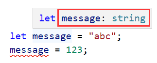

### 1.JavaScript缺点

- 没有类型校验, 代码不够健壮, 存在安全隐患
- 比如一个函数, 要求你最好传一个string类型的值, 你非得传一个number类型的值, 在JavaScript中是可以的
- 但是有可能会报错, 就这么一个小失误就可以让整个项目陷入崩溃

### 2.TypeScript介绍

- TypeScript是拥有类型的JavaScript超集, 我们可以把TypeScript编译成普通、干净、完整的JavaScript代码
- 编译TypeScript可以使用Babel或者tsc
- typescript可以进行类型校验, 适合开发大型项目, 让我们的代码更加健壮, 进而消除安全隐患
- 安装TypeScript: npm install typescript -g
- 查看版本号: tsc --version
- 编译ts文件: tsc 文件名.ts
- 生成一个js文件, 这个js文件你可以引入到html文件中进行运行, 也可以使用node运行

### 3.简化编译步骤

- 方式一: 通过webpack
- 方式二: 通过ts-node
  - npm install ts-node -g  安装ts-node
  - npm install tslib @types/node -g
    - ts-node需要依赖 tslib 和 @types/node 两个包
  - 运行ts文件: ts-node 文件名.ts

### 4.声明变量

- let/const 标识符: 类型注解 = 值

- 类型注解: Type Annotation

  如果我们给message赋值其他类型的值, 就会报错

  - string是TypeScript中定义的字符串类型, String是ECMAScript中的一个类

### 5.类型推导

- 声明变量时, 如果给变量直接进行了赋值, 会根据值的类型推导出变量的类型, 不需要我们再手动添加类型注解

  

- 注意通过const定义的变量, 如果直接赋值的话, 所推导出来的是字面量类型

  

### 6.TypeScript是JS的超集

- Proto Types：原型、Dynamic Types：动态类型、Constructor Functions：构造函数
- Strongly Typed：强类型、Interfaces：接口、Generics /dʒɪˈnɛrɪks/：泛型

### 7.类型

- string、number、boolean、null、undefined

- 数组的类型注解（Array）

  - 第一种：`string[]`
    - 表示我是一个数组类型, 数组中只能存放字符串类型的值, 一般都会这么写
  - 第二种：`Array<number>`
    - 表示我是一个数组类型, 数组中存放number类型

  

- 对象的类型注解（object）

  - 方式一：

  

  - 方式二：

  

  - 方式三：
    - 不要这么做，object类似于一个空对象，你什么都不能取
  - 当然我们这么定义一个对象，一般都不会去写具体的类型，让它类型推导就行了
  - 其实刚才的数组也没有必要明确指定类型，让它自己类型推导就行

- symbol：

