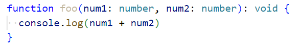

### 1.函数的参数和返回值

- 定义一个函数时, 都要明确指定形参的类型

  

- 返回值的类型可以被推到出来, 也可以明确的进行指定

  - 推导出来: 

    

  - 明确指定: 

    

- 例子: 

  - 你只能往lyrics这个数组中push符合要求的对象, 如果不符合要求立马报错
  - 你的返回值类型一定是`LyricType[]`, 当你在用的时候, 一旦用错, 会立马报错
  - 当然你也可以明确写出返回值的类型: 

- 作为参数的函数的参数最好不要加类型注解, 它会自动推导出类型：
  - item会自动推导出类型为string、index为number、arr为string[]
  - TypeScript会根据forEach函数的类型以及数组的类型推导出item的类型
  - 整个推导的过程称之为上下文类型（contextual typing）
  - 函数执行的上下文可以帮助我们确定参数和返回值的类型
  - 尽量不要手动为作为参数的函数的参数添加类型注解, 因为可能会出现错误
  - 除此之外TS不会对你们函数的形参个数进行校验，你多写会报错，但是你少写不会报错，而是会被忽略

### 2.对象类型

- 对象类型和函数结合：
  - 在这里我们使用一个对象类型来指定函数参数的类型
    - 在对象类型中我们可以添加属性，并告知TypeScript该属性需要是什么类型
    - 属性之间可以使用 , 或者 ; 来分割，最后一个分隔符可加可不加
    - 如果属性分布在不同行，分割符可以省略：
    - 每个属性的类型也是可选的，如果不指定，就是any类型
    - 比如y你不写number类型，只写个y，就是any类型
- 可选类型：

### 3.any类型

- 不限制标识符的类型，可以在该标识符上进行任意操作
- 跟在JS中写代码是一样的，不会报任何错：
- any类型的应用场景
  - 从服务器中拿到数据，数据很复杂，嵌套层级很深，直接用any指定其类型
  - 在引入一些第三方库时，它缺失了类型注解，这个时候我们可以使用any

### 4.unknown类型

- 行any类型很相似，在any类型上进行任何的操作都是合法的，但是在unknown类型上做任何事都是不合法的

  

- 如果想要合法的进行下去必须进行类型缩小：

  - 根据类型再进行对应的操作

- 应用场景：

### 5.void类型

- 一个函数没有返回值，那么这个函数的返回值类型就是void类型：

  - 当然你不知道返回值类型，它经过类型推导，也能推导出此函数的返回值类型是void：

- 如果你指定函数的返回值是一个void类型，TS允许你在函数内主动返回undefined

- 一般应用在描述一个函数类型，描述函数的返回值为void

  

- 举例：

  这个FnType在规定传进来的函数的样子（类型）

- 当基于上下文的类型推导（Contextual Typing），推导出返回值的类型为 void 的时，并不会强制函数一定不能返回内容：

  - 但是这样不行：，当你作为参数时是可以的，如上

### 6.never类型

- never类型的应用场景
  - 开发中很少会去主动定义never类型
    - 某些情况下会自动进行类型推导，推导出never类型
  - 开发框架时可能会用到never
  - 封装一些类型工具时会使用到never
- 一个函数是死循环或者抛出异常，我们为函数的返回值定义任何类型都不合适，此时就可以使用never类型
- 函数中返回一个空数组：
  - 这个数组中什么都不会放，实际开发中，一般是通过类型推导推导出never类型，很少自己写never
- 封装框架是会用到never：
- 在扩展工具的功能时：，提醒开发者

### 7.tuple类型

- 介于数组类型和对象类型之间的一个类型：
  - 元祖中可以存放不同的数据类型，拿到里面的每一个item也是有明确的类型
- 元祖用的最多的地方是指定函数的返回值类型，举例useState

