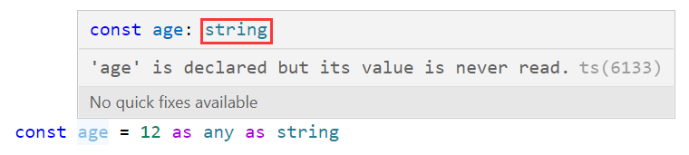

### 1.联合类型（|）

- 联合类型由两个或者多个类型组成，表示这些类型中的任何一个类型
- 联合类型一般需要通过类型缩小来使用：

### 2.类型别名（type）

- 对于很长的类型可以使用别名，多次使用的类型可以使用别名进行复用：

### 3.接口（interface）

- 接口只能描述对象类型：，它也可以描述函数，不过函数也是对象
- type也可以描述一个对象类型，但是它除了可以描述对象类型，其他任何类型都可以描述，范围更广
- interface可以对同一个接口进行多次声明：，但是type不行
  - 定义对象时，必须要有x、y、z
- interface支持继承：
  - x、y、z也必须都要有
- 非对象类型使用type，对象类型使用interface，interface扩展性更强

### 4.交叉类型（&）

- 同时满足number和string类型，没有这种类型就是never类型
- 交叉类型的应用场景是把两个对象类型交叉在一起：

### 5.类型断言（as）

- 这种方式获取的DOM元素是HTMLImageElement和null的联合类型，我们可以通过imgEl拿到src属性：imgEl.src
- 如果你是这么写的，给到你的就是一个Elemet和null的联合类型，无法推断出更加具体的类型，就不好拿到src属性
- 使用类型断言：

- 类型断言只能断言成更加具体的类型，或者不太具体的类型，这里的不太具体的类型指any或者unknown
  - 把一个数字类型断言成字符串类型：
    - 不要这样做

### 6.非空类型断言（!）

- 可选链：，从访问的角度我们可以使用可选链
- 但是如果我想给属性进行赋值，你就不能用可选链了：，左侧不能用可选链
- ：强制的告诉TS的类型检测机制，我对象中一定有friend这个属性
  - 这种写法比较危险，一定要确保friend有值才能这样用，不推荐使用

### 7.字面量类型

- 一方面你可以指定具体的字面量类型也可以让它自己进行类型推导：
- 应用场景：将多个字面量联合起来：
- 这里为什么报错：，因为它认为info.method是字符串类型，而不是具体的post字面量类型
  - 解决方案一：把info.method断言成post类型：
  - 解决方案二：把info这个对象断言成字面量类型：
    - url的类型就是xxx字面量类型，method的类型就是post字面量类型，且均是只读的

### 8.类型缩小

- typeof、平等缩小、instanceof、in