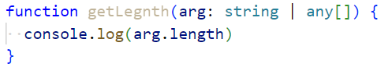

### 1.函数类型表达式

- ，这里的BarType就是函数类型表达式

  - 注意：num1是不能省的，如果你省略了，意味着你的参数名字是number，类型是any
  - 函数类型表达式的参数名你可以随便写，但是不能省略

- 举例：

  - 我规定了fn的类型，你这个sum符不符合呢？符合，符合就可以传进来

- 额外知识

  - 这样是会报错的：

    

  - 这样就不报错：

### 2.函数调用签名

- 函数除了可以被调用以外，我还可以拿到函数中的属性，或者直接修改它的属性
  - 你函数类型表达式可以做到这一点吗？不行，它只能表达你是一个函数，无法表达出来你还有其他特征
- 举例：
  - 如果你只是在描述函数本身，就使用函数类型表达式
  - 如果你既要描述函数本身，又要描述函数中的属性，就得使用函数调用签名
- 注意函数类型表达式使用的是箭头，函数调用签名使用的是冒号

### 3.函数构造签名

- 我们去new某个函数，返回的是any类型
- 举例：

### 4.参数细节

- 可选参数：可选参数的类型是number和undefined的联合类型，所以要进行类型缩小，才能继续使用

- 参数的默认值：，number可以省略，传undefined就是在用100这个默认值

- 剩余参数：

### 5.函数的重载

- 在TypeScript中，我们可以去编写不同的重载签名（overload signatures）来表示函数可以以不同的方式进行调用
- 一般是编写两个或两个以上的重载签名，再去编写一个通用函数以及实现：
  - 在我们调用add时，它会根据我们传入的参数的类型来决定，在执行函数体时，到底执行哪一个重载签名
  - 如果你的参数类型不正确，就会报错
- 注意：通用函数不能被调用
  
- 目前上述代码是不太好用联合类型进行实现的，因为你需要使用类型缩小
  - 但是如果使用联合类型，并且不需要使用类型缩小，就不太需要使用函数重载了：
  - 在联合类型可以做到的情况下，就使用联合类型
  - 如果联合类型做不到，再考虑函数的重载

### 6.this的类型

- 默认情况下，函数中的this是any类型：
  - 在any类型上做任何事情都是合法的，但是这是比较危险的
  - 假如我这么调用foo：obj.foo.call({})，当你这么调用foo函数时，就会出现安全隐患（危险）
- 我们需要对ts进行配置，在当前目录下使用控制台键入tsc --init，就会生成tsconfig.json文件：
  - 此时就会对我们的this产生要求：：不能有模模糊糊的this
  -  TypeScript会根据上下文推导this，但是在不能正确推导时，就会报错，需要我们明确的指定this：
- 如何指定this呢？用函数的第一个参数来指定this的类型：
  - 在后续使用函数传入的参数时，是从第二个参数开始传递的，this参数会在编译后被抹除
  - 注意我们如何通过this拿到window呢，拿不到，也不需要拿，直接使用window即可

### 7.与this相关的内置工具

- 获取函数的this类型：
- 获取this以外的类型，也就是函数类型：
- ThisType：
  - 指定this代表哪个对象