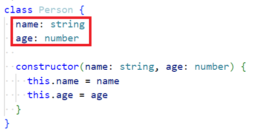
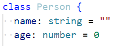
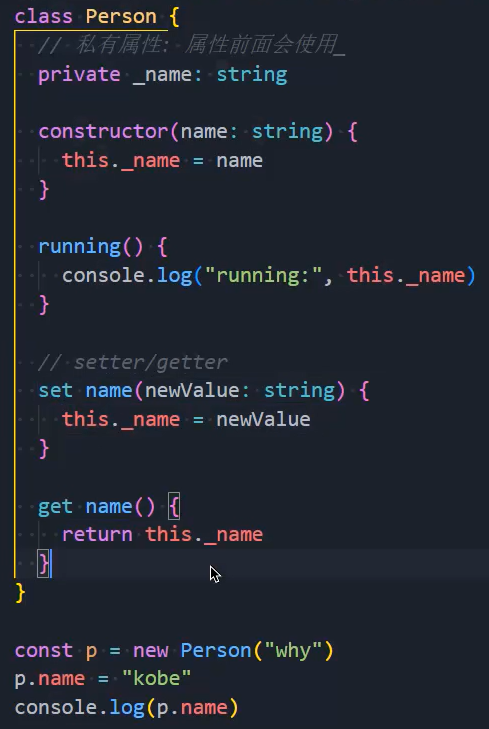
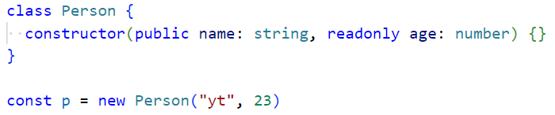
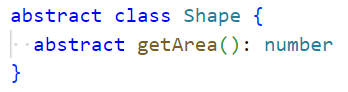
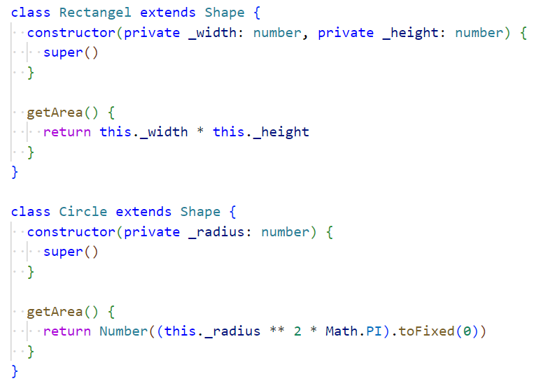
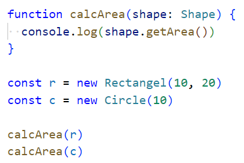
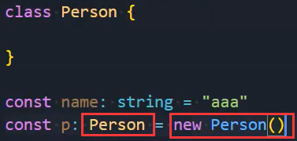
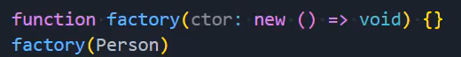

### 1.类的成员属性

- 必须声明成员属性：
  - 当然声明成员属性的时候还可以指定初始化值，当你指定初始化值时，可以不去显示的指定类型了，让它自己进行类型推导即可：

### 2.修饰符

- public：所修饰的属性或方法，在任何地方可见，默认就是public
- private：所修饰的属性或方法，仅在同一类中可见
- protected：所修饰的属性或方法，仅在类自身及子类中可见
- readonly：所修饰的属性或方法，只能被外界访问，不能进行修改

### 3.setter和getter

- 为私有属性提供setter和getter：
- 这样做我们可以对属性的访问进行拦截操作
  - 假如我还有一个age属性，这个属性的值在0到140之间，我们在设置值的时候要进行判断
  - 在这个范围内才能进行设置，不在这个范围内就不能进行设置

### 4.参数属性（语法糖）

### 5.抽象类和抽象方法

- 定义抽象类：，抽象方法必须定义在抽象类中
  - 抽象类是不能被实例化的
  - 抽象类可以包含抽象方法，也可以包含有实现体的方法
  - 抽象方法必须被子类实现
- 定义子类：
- 父类引用指向子类对象：

### 6.鸭子类型

- TypeScript中的类型检测使用的是鸭子类型
  - 一只鸟，走起来像鸭子，游起来像鸭子，看起来也像鸭子，那么它就是鸭子
  - 我只关心你的属性和行为，不关心你具体到底是不是这个类型
- 抽象类是把一个种类进行了抽象，比如我把动物进行了抽象，你可以跑，你可以跳
  - 动物里有猪、狗、羊，但是你能存在机器人吗，不能
- 不过接口可以，接口只关心你是否存在这些属性和行为，具体你是什么，接口不关心
- 抽象类关心你是什么，接口关心你有什么

### 7.类的作用

1. new一个类可以创建实例

2. 类本身可以作为实例的类型

   

3. 可以把类当做是一个有构造签名的函数：

