### 1.对象类型属性修饰符

- 可选和只读属性：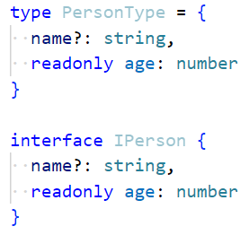

### 2.严格字面量赋值检测

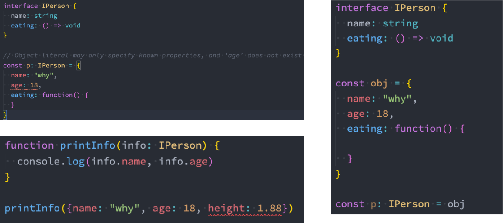

- 每个对象字面量最初都被认为是：新鲜的（fresh）
- 当一个新的对象字面量分配给一个变量或传递给一个非空目标类型的参数时，对象字面量指定目标类型中不存在的属性是错误的
- 当类型断言或对象字面量的类型扩大时，新鲜度会消失

### 3.单个索引签名

- 通过字符串索引去获取一个值，获取的值也是字符串类型：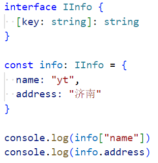
  - 你这个对象中不能有数字类型的值
- 索引签名的使用：编写一些通用的接口：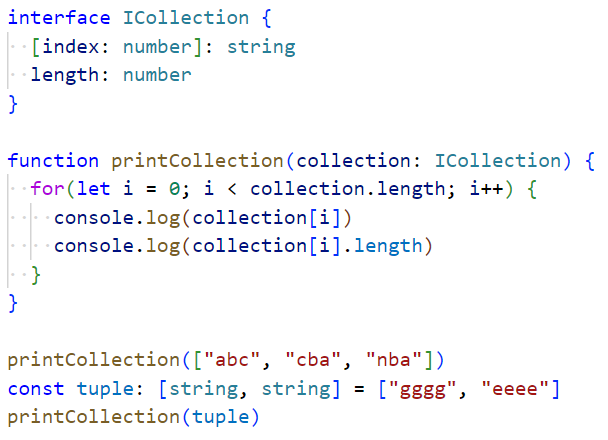
- 索引签名只能是number类型或者string类型，不能是其他任何类型，包括联合类型也不行
- 这个符合要求吗？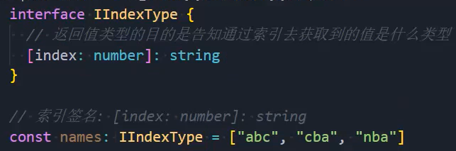
  - 符合，通过数字类型索引，是不是一定获得字符串类型的值，是的
- 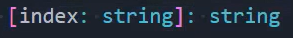这样写不符合，会报错。但是这样写：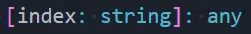又符合了，why
  - 当我们通过string类型拿数组中的值，只能拿到string类型的返回值吗？
  - 不是的，我们可以这么写：names["forEach"]通过这种方式拿到一个函数类型的值，但是是string类型吗
  - 显然不是，所以如果写any就是对的，写string不够全面
  - 我们这里还要说一点，names[0]和names["0"]是一个意思，names.forEach和names["forEach"]一样的

### 4.两个索引签名

- 这样写：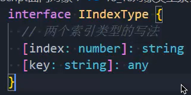没有问题
  - 但是这样写：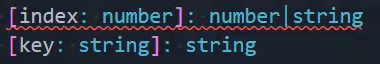就不行
  - 因为通过number去取东西，居然比string取出来的类型还多，是绝对不可能的
  - string索引签名的返回值类型，必须比number索引签名的返回值类型宽泛一些，或者一样，但是不能小
- 这样写也不行：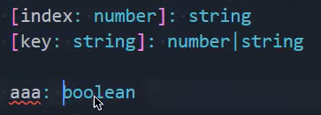
  - 因为你只能取出来string类型或者number类型的值，怎么可能取出boolean类型的值呢？所以不对
  - 3中也提到过

### 5.接口的继承

- 子接口继承了父接口，就必须实现父接口的要求：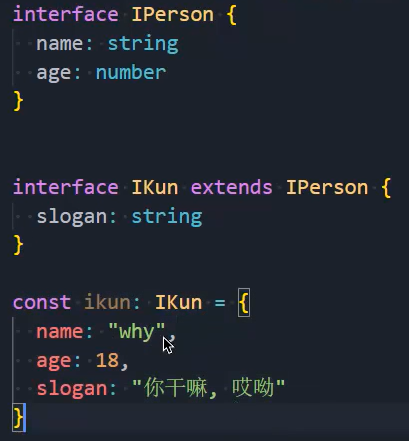
- 作用：
  1. 减少类型的重复编写
  2. 继承第三方库的某些接口

### 6.接口被类实现

- 这样做我们就不需要再去一个个创建多个对象了：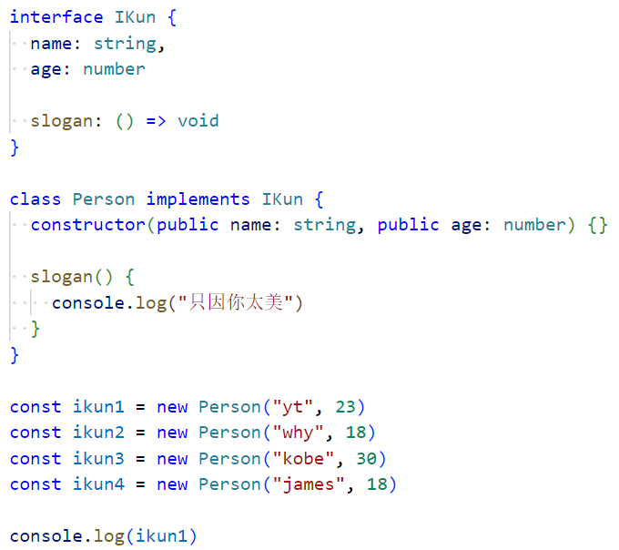

  

- 除此之外，一个类还可以实现多个接口：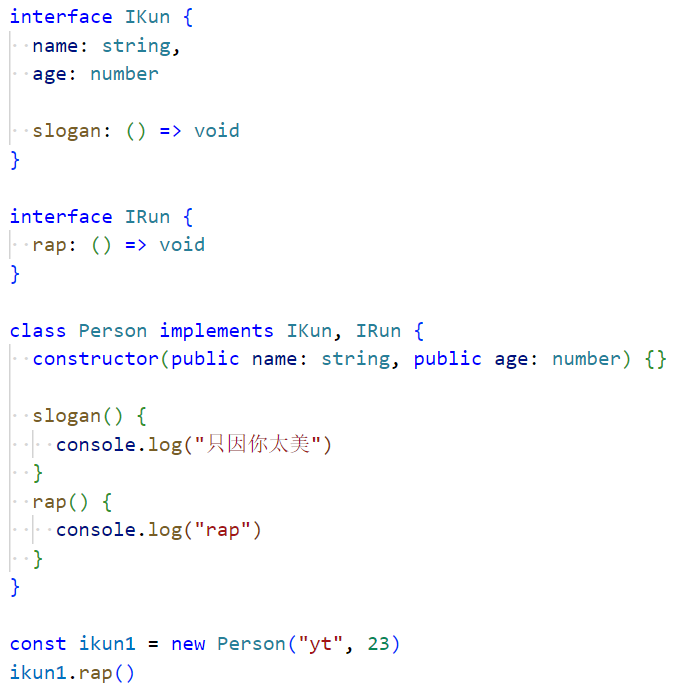

### 7.枚举类型

- 枚举类型的定义和基本使用：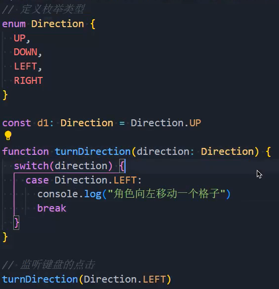
- 枚举类型的值：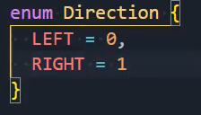，不写就是从0开始，下面的依次递增1
- 递增：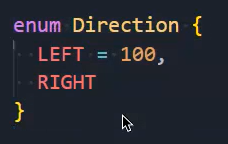，LEFT是100，那么RIGHT就是101
- 字符串类型：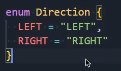，这样就不能递增了，必须指定具体的值
- 位运算：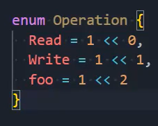，你可能会看到这样的代码，不要惊讶

