### 1.类型丢失

- 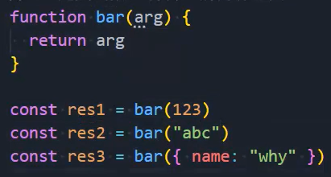，res1、res2、res3都已经把类型丢失了，都是any类型
  - 后面我们再使用res1的时候是不知道怎么使用的，里面是没有属性的，因为是any嘛
- 但是我们可以给arg指定类型，但是你写number类型，字符串和对象类型就不能传，你写啥类型都不行
  - 怎么办？让别人把类型传进去：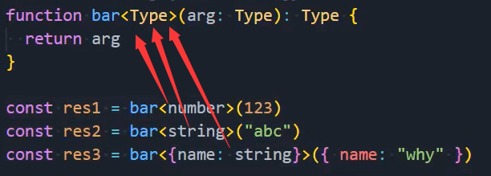

- 自动进行类型推导：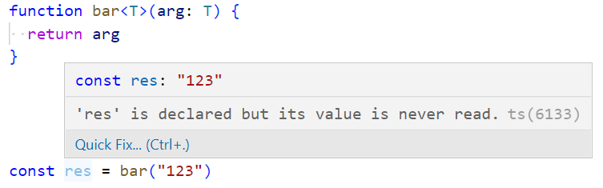，推导出来的类型更具体
  - 当然你如果是let，推导出来的就是string类型

### 2.useState函数

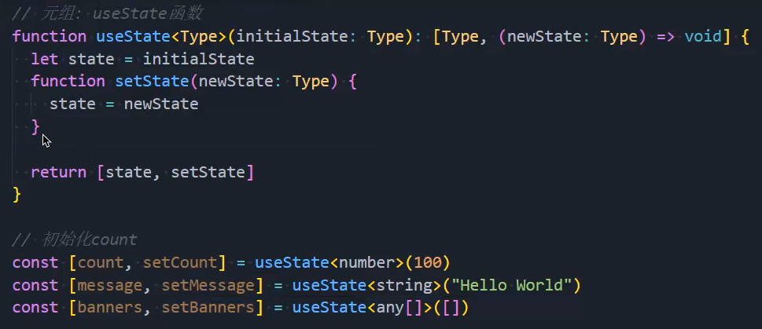

- 我们可以让100和Hello World自动进行类型推导，但是如果不传any[]，让空数组进行类型推导，类型为never[]
  - 如果，类型推导无法推导出正确的类型，就需要自己主动传入类型
- 这样写的好处是，当你调用setCount时，除了传入number类型的值，其他任何类型的值都不能传入

### 3.传入多个类型

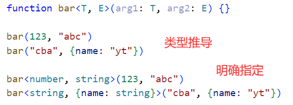

- 缩写：
  - T：Type、K：Key、V：Value、E：Element、O：Object

### 4.泛型接口

- 更灵活：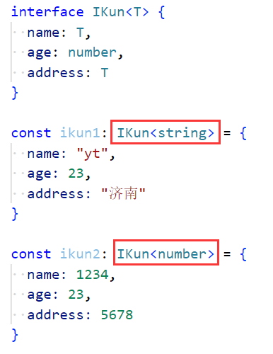
- 给泛型指定默认值：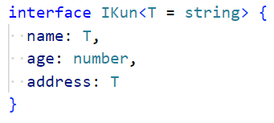

### 5.泛型类

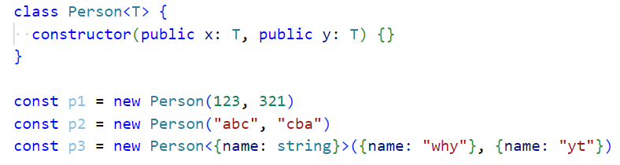

### 6.泛型约束1

- 下面这段代码的返回值也丢失了自己的类型：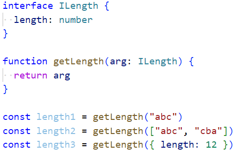
  - length1、length2都是ILength类型，而不是string、string[]类型
- 我们可以这么做：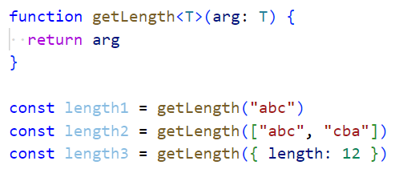
  - 这么做虽然可以让返回值有明确的类型，但是没有约束
  - 因为我的目的是，传进去的值，必须有length属性
  - 假如我传一个数字类型的123也是不会报错的，但是数字类型的123是没有length属性的，应该报错
  - 我想给T对应的约束，让T继承自ILength：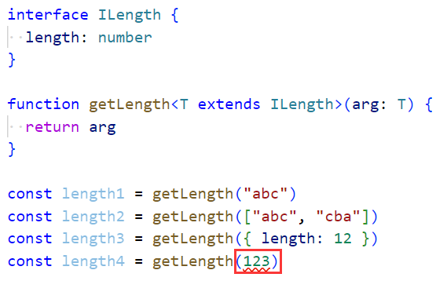
  - 你必须有ILength中的属性，这样可以保证返回值保留类型的同时，还存在一定的约束

### 7.泛型约束2

- 这段代码的参数是any类型，什么都可以传：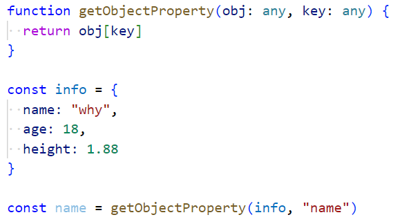
  - 我们想要有一定的约束，第一个参数可以传一个对象，第二个参数只能是传入对象中的key
- 在说明如何做之前，我们先要学习一个语法 `keyof 对象类型`
  - 比如这段代码：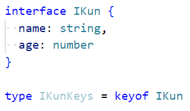，IKunKeys的类型是：`"name"|"age"`
  - name和age这两个字面量的联合类型
- 我们的代码可以这么写：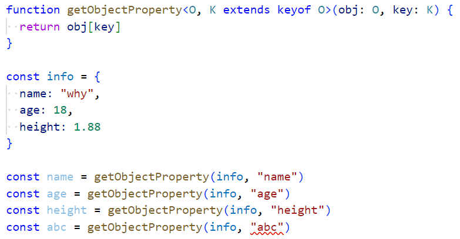
  - 第二个参数只能传info中的键，不能传其他的值
  - 当我是其他对象的时候也是可以的：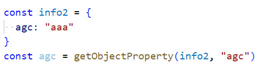
  - 除此之外，返回值也有相对的类型，比如name的返回值就是string类型，age的返回值是number类型