### 1.映射类型基本

- 现在我有一个IPerson类型，我想把它完全的拷贝一份：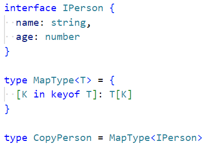

  - keyof 一个对象类型，拿到对象类型中所有的key组成的联合类型
  - K in keyof T   表示：拿到对象类型中的一个个key

  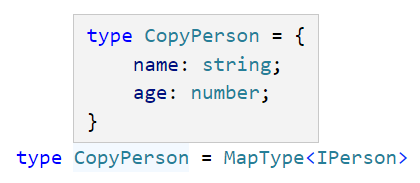

### 2.映射类型修饰符

- 单纯的拷贝没有意义，我完全拷贝，为啥不直接使用原来这个类型呢？
- 让所有属性变成既是可选又是只读属性：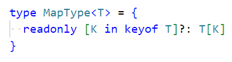
- 单纯写readonly和?相当于在前面写+：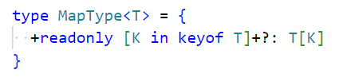

- 以上两张图片是一个意思
- 但是如果是减号，就是删除readonly和删除?：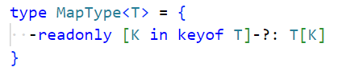
  - 一般用在统一修饰符上：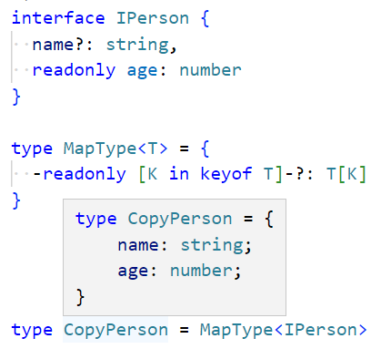

### 3.类型体操的题目

- https://github.com/type-challenges/type-challenges
- https://ghaiklor.github.io/type-challenges-solutions/en/

### 4.条件类型基本（extends）

- 我有一个number和string的联合类型，如果number类型继承这个联合类型就返回true字面量，否则返回false字面量：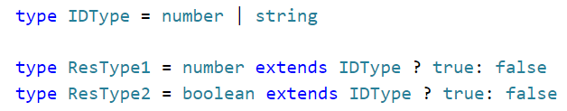：一个是true一个是false

- 举例子：
  - 之前我们写过函数的重载：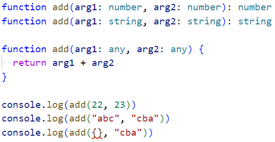
  - 现在我们可以这么实现：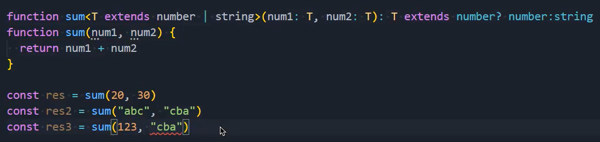

### 5.条件类型推断（infer）

- 获取一个函数类型的返回值类型：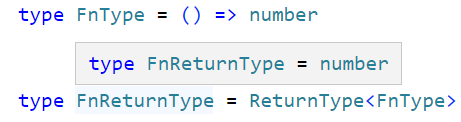
- 获取一个函数的返回值类型：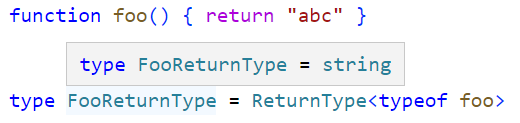
  - typeof 一个函数：拿到函数的类型
- 自己封装一个ReturnType：
- 推断参数的类型：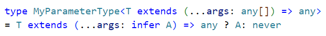

### 6.条件类型分发

- 看下面这段代码：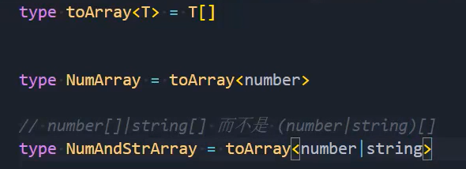
  - NumArray的类型是：number[]
  - NumAndStrArray的类型是：(number|string)[]，这是一个数组类型，数组中可以存放string和number类型的值
  - 但是我们想得到这样的类型：number[]|string[]，要么是一个只能存放number类型的数组，要么是一个只能存放string类型的数组，上面的toArray做不到
- 修改toArray：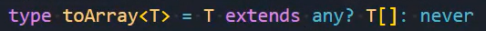
  - 当在泛型中使用条件类型时，如果传入的是一个联合类型，就会进行分发
  - number时执行一次，string时再执行一次，就会变成number[]|string[]这样的一个联合类型

