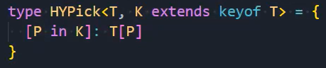

### 1.Partial

- 将对象类型中的属性全部变成可选属性：

### 2.Required

- 将对象类型中的属性全部变成必选属性：

### 3.Readonly

- 将对象类型中的属性全部变成只读属性

### 4.Record

- IKun2的类型：
- 自己实现：
  - keyof any：生成一个number|string|symbol的联合类型，主要用来限定对象的key
  - 就是如果你要想限定对象的key的类型，是不是只能是number、string、symbol三者之一啊
  - 所以keyof any就是用来做这个的

### 5.Pick

- 类型结果为：
  - 新对象类型只想留下slogan属性和name属性
- 自己实现：

### 6.Omit

- 某些属性我不想要了：，只剩age属性了
- 自己实现：

### 7.Exclude

- 把rap从联合类型中排除掉：
- 使用分发来实现：

### 8.Extract

- 提取：，从IKun里提取rap

### 9.NonNullable

- 把null和undefined类型去除掉：

