### 1.TypeScript模块化

- JavaScript 规范声明：任何没有 export 的 JavaScript 文件都应该被认为是一个脚本，而非一个模块

  - 对于TypeScript这句话同样适用

- 如果你有一个文件，现在没有任何 import 或者 export，但是你希望它被作为模块处理，请添加这行代码

  ```js
  export {}
  ```

- 类型导入：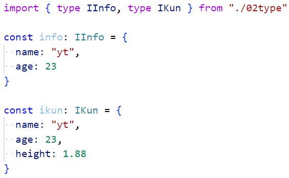

  - 还有一种引入类型的方式

    ```ts
    import type { IInfo, IKun } from "./02type"
    ```

  - 这样写的好处是：告诉TS编译器，这是类型，编译时直接删掉即可，提高编译速度

### 2.命名空间

- 防止冲突：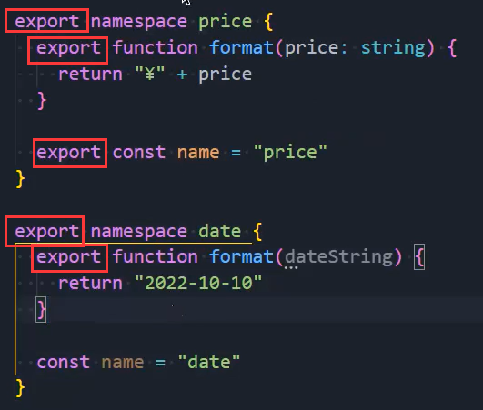

  - 如果你想导出使用，无论是命名空间还是内部的东西，都需要导出

- 导入命名空间，并使用命名空间中的属性

  ```ts
  import { price, data } from "./02type"
  
  price.format("100")
  ```

### 3.类型查找

- 为什么会有类型？这些类型来自哪里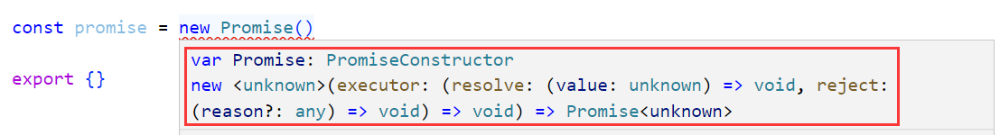
  - 还有之前的HTMLDivElement类型，我们没有引入，又来自哪里？
  - 这些内容就涉及到typescript对类型的管理和查找规则了
- 我们除了会看到.ts文件，还会看到.d.ts文件
  - .d.ts文件是用来做类型的声明(declare)的，称之为类型声明或者类型定义文件
  - 用来告知TypeScript我们拥有哪些类型
- 我们可以把之前编写的type.ts文件改成type.d.ts文件，并且里面的类型不需要导出，就可以使用
  - 因为在.d.ts文件中编写的类型是放在全局中的，具体放不放在全局，以及TypeScript怎么根据tsconfig.json的配置，使用什么样的查找规则，后面再说
  - .d.ts文件不能写逻辑代码，只能写类型相关代码

- 我们具体有哪些类型声明文件呢？
  - 内置类型声明
  - 外部定义类型声明
  - 自己定义类型声明

### 4.内置类型声明

- 比如我们通过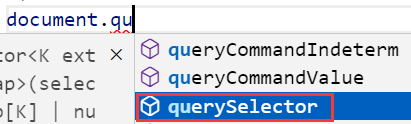拿到querySelector，那这个document到底来自哪里呢？
  - 我们可以按住Ctrl键点击document，就会进入一个lib.dom.d.ts
  - 这里面就声明了很多的类型：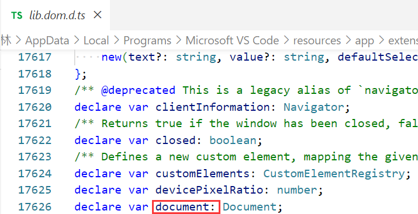
  - 这个文件来自：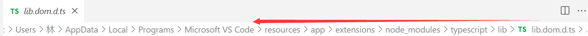
    - 只要你电脑安装过TypeScript就可以有这些文件
- 内置类型声明是typescript自带的，帮助我们内置了JavaScript运行时的一些标准化API的声明文件
  - 包括Function、String、Math、Date等内置类型
  - 也包括运行环境中的DOM API：比如Window、Document等
- 它内置的声明文件可以查看这个地址：https://github.com/microsoft/TypeScript/tree/main/lib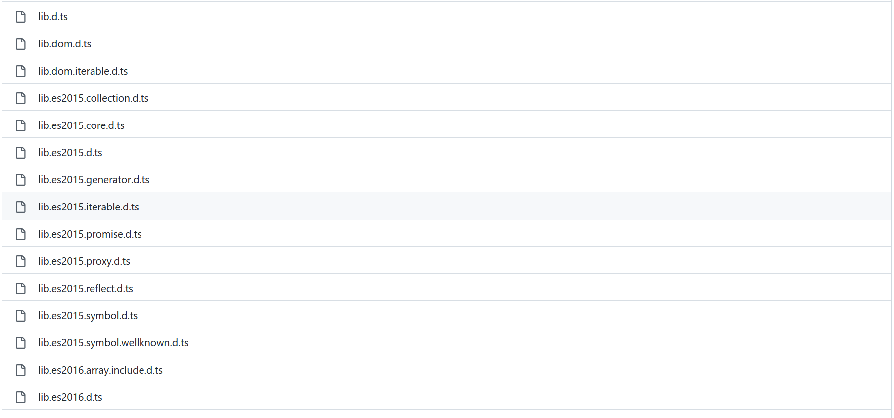

### 5.target属性

- 在tsconfig.json文件中有一个target属性，指定版本
  - 比如Promise，只能在ES6之后的版本才能使用，你指定一个ES3是会报错的
- 这个东西其实真实的开发编译中是没啥用的，因为我们用babel进行编译，而babel是根据.browserrc编译

### 6.第三方库

- 第三方库我们可以有三种方式来提供类型声明
  1. 在它自己的库中编写了.d.ts文件：axios库
  2. 它没有在自己的库中编写.d.ts文件
     - 那么社区就为其编写了对应的.d.ts文件，我们只需要安装就可以使用
     - https://www.typescriptlang.org/dt/search?search进入这个网址：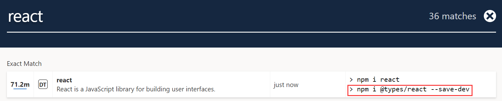
     - 安装相应的类型即可
     - 这样我们在使用React时就不会报错了
  3. 社区也没有编写相应的.d.ts怎么办？自己写
     - 随便定义一个.d.ts文件，名字可以随便取：声明lodash模块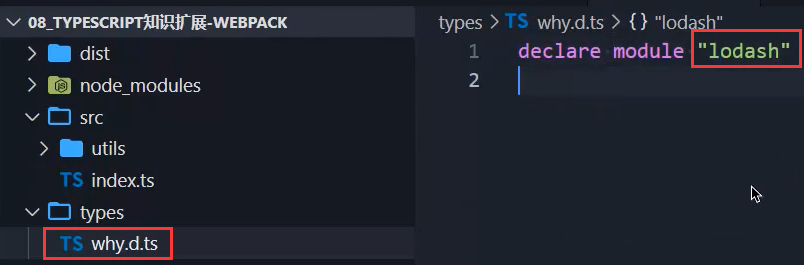
     - 此时引入lodash就不会报错了，但是你只是声明了一个模块，你没有告诉当前这个模块的类型和里面包含什么样的东西
     - 比如我可以拿到lodash用里面的东西吗？可以：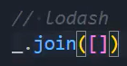不报错，但是会把join当成一个any类型
     - 在.d.ts中这样写：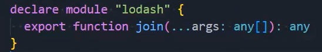
     - 此时就会有提示了：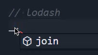

### 7.自定义声明（变量-函数-类）

- 我们自己编写了一段代码：`let name: NameType = "abc"`
  - 这个NameType可以在.d.ts文件中进行声明，也无需导入，就可以使用，但是有必要这样做吗？没有
  - 哪里用到类型，我在哪里写就可以了
- 场景一：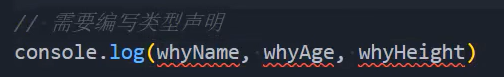
  - 我在当前ts文件中并没有编写相应的变量，而是在index.html中进行了编写：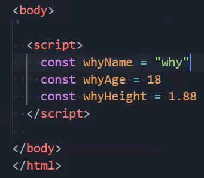
  - 此时我们就可以在.d.ts中进行声明：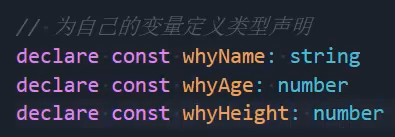这样就不会报错了
  - 除了可以声明变量，我们还可以声明函数和类：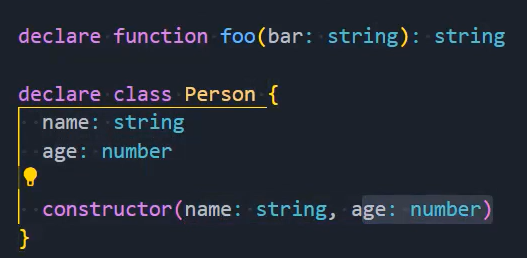
    - 当然用语法糖也是可以的：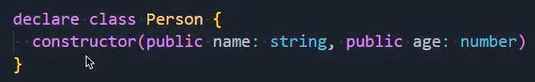

### 8.自定义声明（模块）

- 之前已经说过了，比如`import "xxx" from "aaa"`

  - 我要为aaa声明一个模块：`declare module "aaa"`
  - 但是一个模块中可以包含很多东西，所以像刚才我们声明的lodash模块，需要在大括号内导出很多内容
  - 这样我们就可以从aaa以点的方式拿到很多的内容

  

### 9.自定义声明（文件）

- 声明图片文件
  - ts文件不认识图片：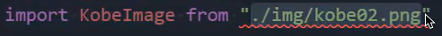，这个时候就需要我们去声明文件模块
  - 这样声明：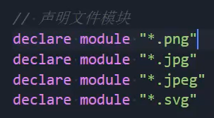这种声明不需要在后面加大括号
- 声明vue文件
  - 对于ts来说，vue文件也不认识：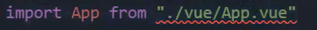我们也需要去声明vue文件
  - 这么写：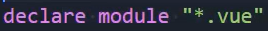ts就知道你在用vue文件，但是ts并不知道这个App到底是什么类型
  - ts认为你这个App只是一个模块，相当于认为App是any类型，我们需要让ts知道这是一个组件
  - 所以要这么写：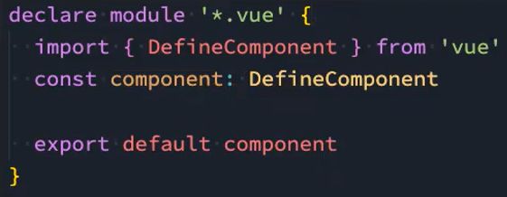

### 10.自定义声明（命名空间）

- 如果我使用CDN在index.html引入了某个库，比如我通过CDN的方式引入了jquery
- 我如何告诉ts我现在有$这个东西呢？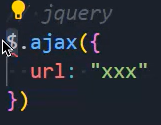
- 我们此时可能会想到声明一个模块，但是不行，因为我们不是通过from引入jquery
  - 我们把它声明成命名空间是最好的：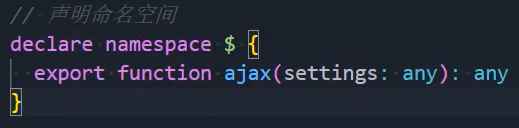


