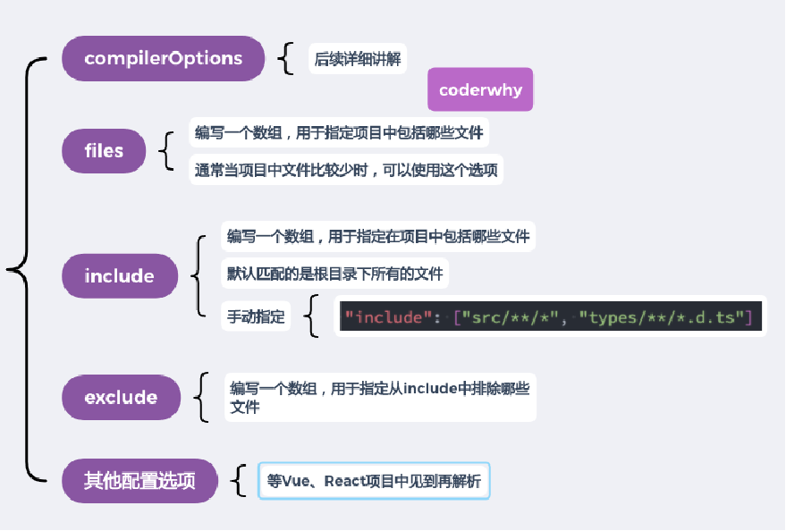
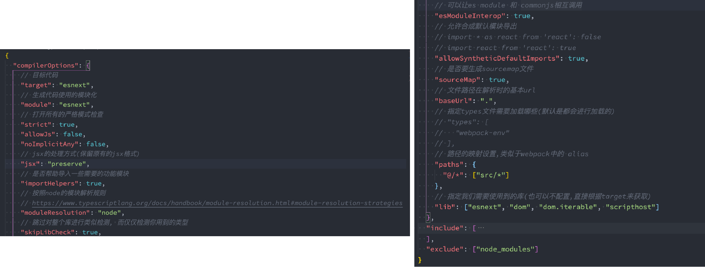

### 1.作用

- 作用一（主要作用）：让TypeScript Compiler在编译的时候，知道如何去编译TypeScript代码和类型检测
  - 比如是否允许不明确的this选项，是否允许隐式的any类型
  - 将TypeScript代码编译成什么版本的JavaScript代码
- 作用二：让编辑器（比如VSCode）可以按照正确的方式识别TypeScript代码
  - 对于哪些语法进行提示、哪些语法进行类型错误检测等等

### 2.使用

- 在调用 tsc 命令并且没有其它输入文件参数时，编译器将由当前目录开始向父级目录寻找包含 tsconfig 文件的目录
- 调用 tsc 命令并且没有其他输入文件参数，可以使用 --project （或者只是 -p）的命令行选项来指定包含了 tsconfig.json 的目录
- 当命令行中指定了输入文件参数， tsconfig.json 文件会被忽略
- webpack中使用ts-loader进行打包时，也会自动读取tsconfig文件，根据配置编译TypeScript代码
- tsconfig.json文件包括哪些选项呢？
  - tsconfig.json本身包括的选项非常非常多，我们不需要每一个都记住
  - 可以查看文档对于每个选项的解释：https://www.typescriptlang.org/tsconfig
  - 当我们开发项目的时候，选择TypeScript模板时，tsconfig文件默认都会帮助我们配置好的

### 3.顶层选项

### 4.编译选项

