### 1.axios二次封装疑问

- 为什么要进行二次封装？
  - 假如axios有一天不维护了，我们不需要大面积的进行代码的修改
- 为什么要使用类进行二次封装？
  - 扩展性更强
  - 你可以一次性创建多个实例，传入不同的url，实例与实例之间互不干扰

### 2.目录结构

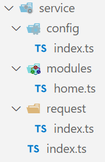

- service/index.ts：统一的出口
- service/request/index.ts：axios二次封装的地方
- service/config/index.ts：放置常量的地方，BASE_URL和TIME_OUT
- service/modules：此文件夹主要用来分模块，对封装后的axios进行使用

### 3.instance

- create函数的返回值：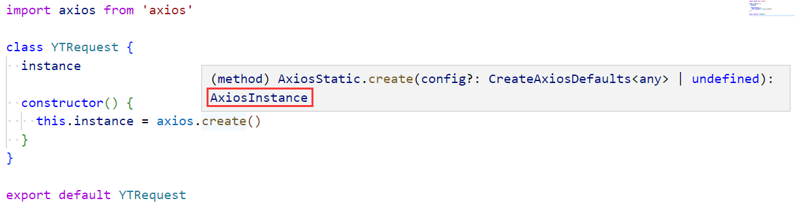
- 所以instance的类型就是AxiosInstance：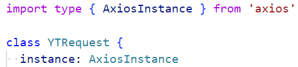

### 4.config

- 这个config包括baseURL，timeout，headers，是需要传进来的，我们需要知道它的类型：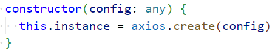
- 点击create中：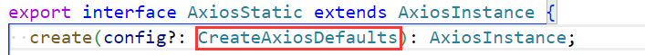
- 再点进CreateAxiosDefaults中：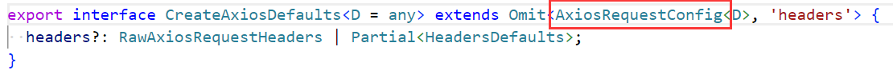
  - 这个类型就是一个比较具体的类型
- 当我们使用它的时候就会有提示了：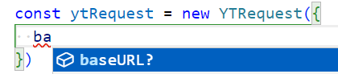，并且当你类型不正确时会报错

### 5.封装方法

- request方法：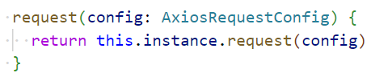
- 其实现在就已经可以发送请求了：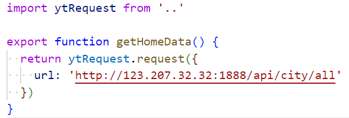

### 6.配置文件

- 主要是baseURL和timeout：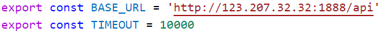
- 创建实例并使用BASE_URL和TIMEOUT常量：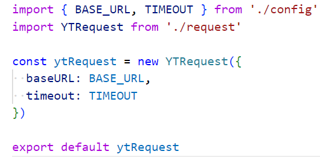
- 使用创建的实例，调用request方法：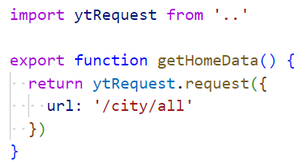

### 7.全局拦截器

- 为每一个axios实例都添加拦截器：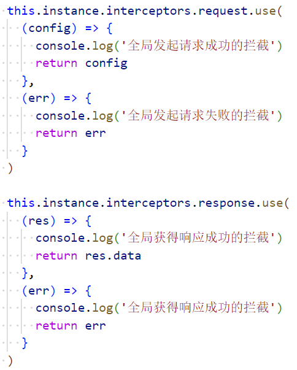

### 8.其他请求

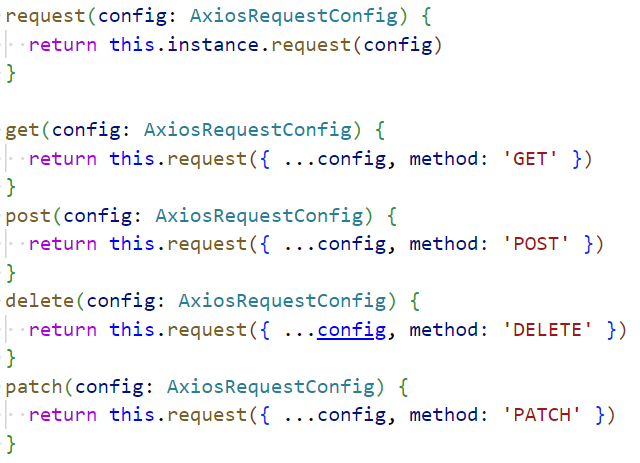

### 9.完整代码

```ts
import axios from 'axios'
import type { AxiosInstance, AxiosRequestConfig } from 'axios'

class YTRequest {
  instance: AxiosInstance

  constructor(config: AxiosRequestConfig) {
    this.instance = axios.create(config)

    this.instance.interceptors.request.use(
      (config) => config,
      (err) => err
    )

    this.instance.interceptors.response.use(
      (res) => res.data,
      (err) => err
    )
  }

  request(config: AxiosRequestConfig) {
    return this.instance.request(config)
  }

  get(config: AxiosRequestConfig) {
    return this.request({ ...config, method: 'GET' })
  }
  post(config: AxiosRequestConfig) {
    return this.request({ ...config, method: 'POST' })
  }
  delete(config: AxiosRequestConfig) {
    return this.request({ ...config, method: 'DELETE' })
  }
  patch(config: AxiosRequestConfig) {
    return this.request({ ...config, method: 'PATCH' })
  }
}

export default YTRequest
```


