### 1.针对某个实例的拦截器

- 我们在为当前实例传入拦截器后，你会发现报错：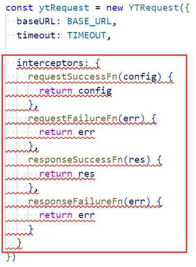
  - 因为类型中根本就没有interceptors这个属性，指定对应的类型即可：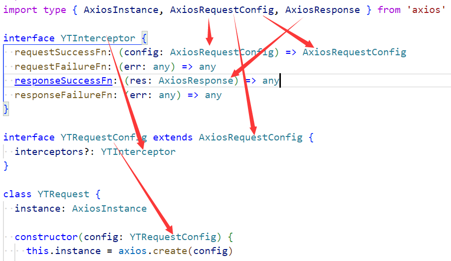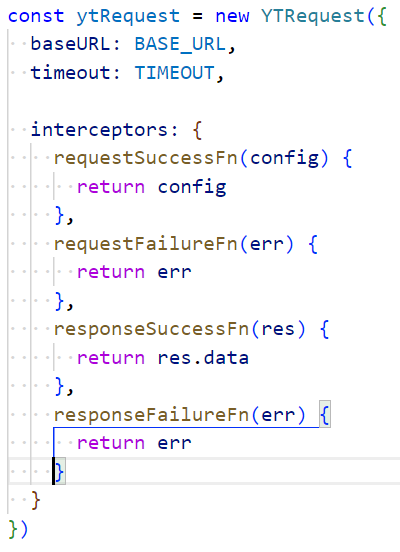
- 使用传入的当前实例拦截器：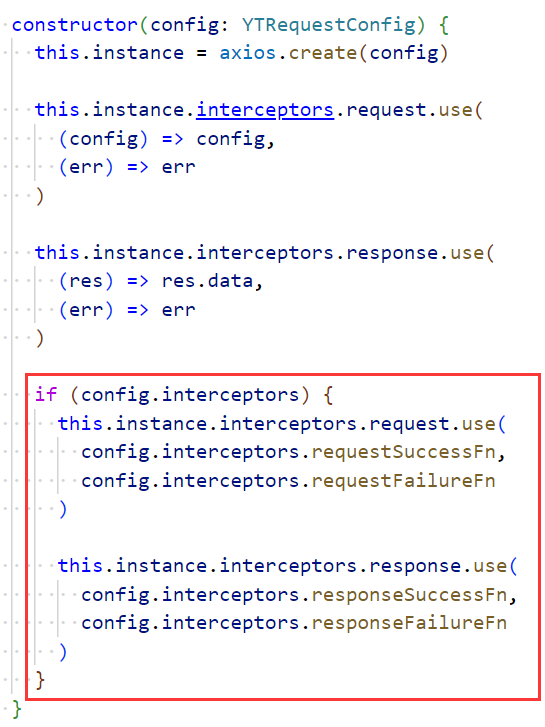
  - 优化1：将if去掉，使用可选链：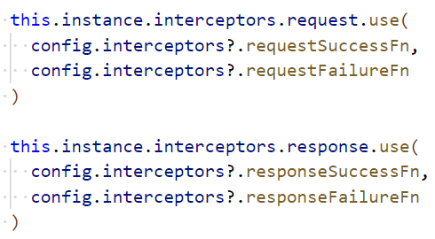
  - 优化2：将类型抽离出去：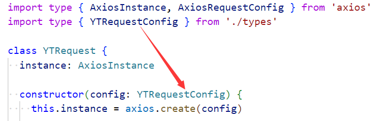

### 2.针对某个接口的拦截器

- 针对某个接口实施拦截：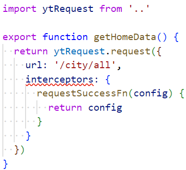
  - 有两个问题需要解决，第一个需要指定类型：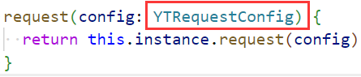
  - 第二个修改类型：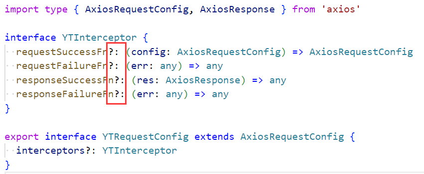
    - 修改为可选
- 如何使用这些拦截器？
  - 可以这么做吗？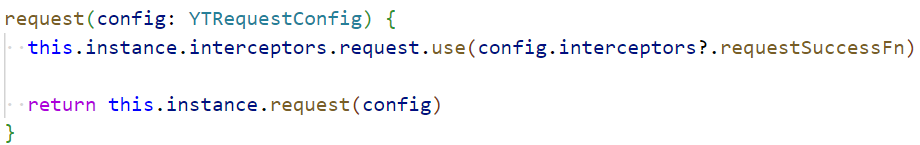
    - 不可以，因为你直接把它加到了实例中，如果有其他接口没有添加拦截器，也会执行拦截器
  - 手动处理：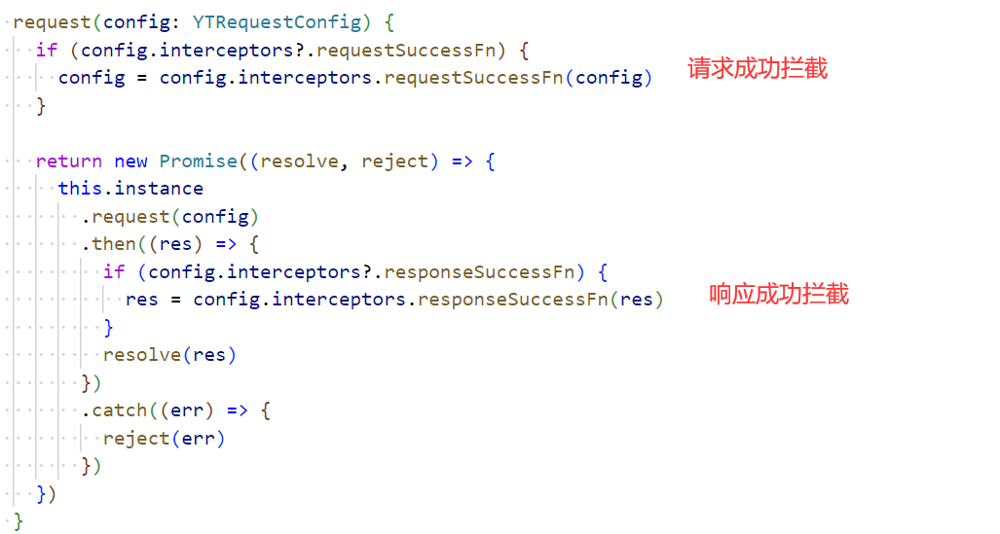

### 3.问题

- 拿结果的时候报错：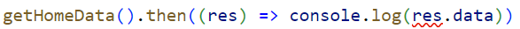
  - 为什么报错？因为res的类型是unknown，为什么是unknown？
  - 问为什么是unknown，我就要反问你，这里的.then是在.then谁？
  - 在.then我们自己写的那个Promise：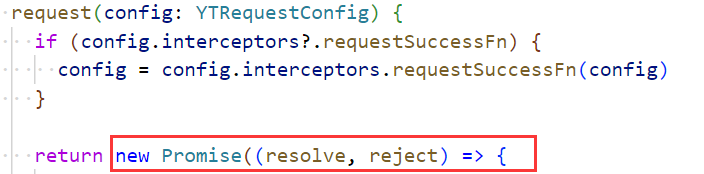
  - 看一下源码：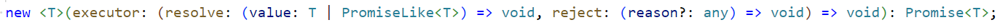
    - 这是一个构造签名，没有传泛型，就是unknown类型
  - 这里的这个泛型在决定谁的类型？在决定resolve的实参类型，继而决定了res的类型：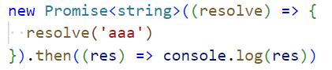这里的resolve中只能传入字符串类型的值，不能传其他类型的值
    - 这里的res也是理所当然的是string类型：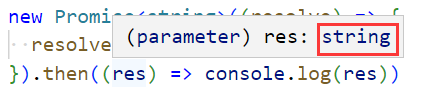
- 既然知道了需要为Promise传入泛型，我们应该传入什么泛型呢？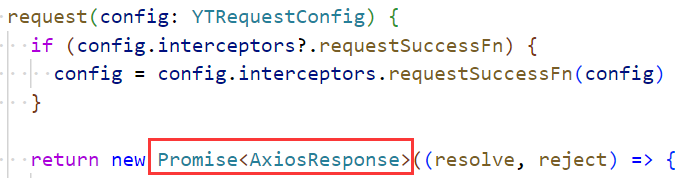
  - 传AxiosResponse类型，为什么？我们为reslove传入了什么？传入了res，res的类型不就是AxiosResponse吗？
- 这里依然有一个问题，在说这个问题之前要明确一个事情，就是我们只能在全局响应成功里返回res.data：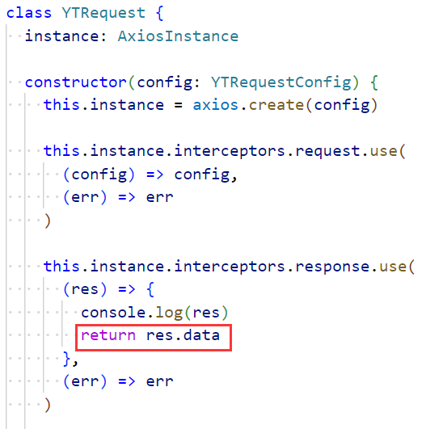其他位置只能返回res：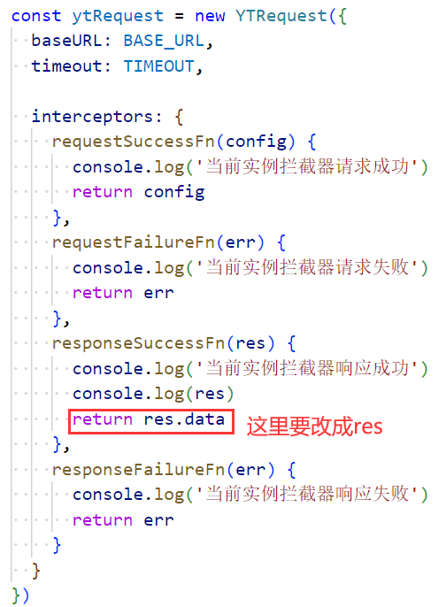
  - 这样就有问题了，我们为Promise传入的泛型还能是AxiosResponse类型吗？
  - 不行了，我们应该传入从服务器请求到的真实数据的类型
  - 但是我们能直接将某个数据的类型传给Promise吗？不行，因为它是一个通用的类型
  - 所以我们要为request传入泛型：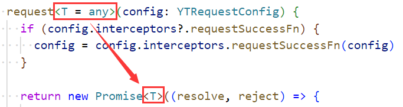
  - 此时我们就可以在封装具体的接口时传入具体的类型：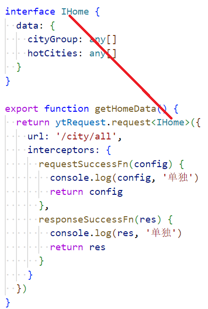
  - 这样在使用时类型就非常明确了：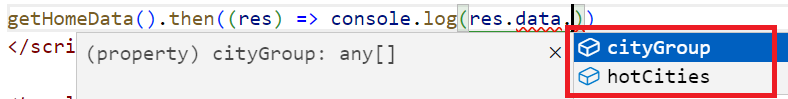
- 还有问题：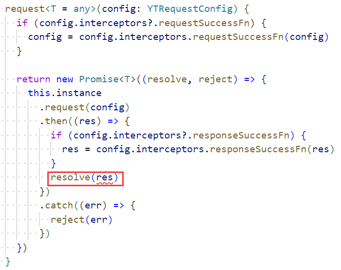这里报错了，为什么？
  - 首先this.instance.request是我们在使用axios为我们提供的方法
  - 通过.then拿到的res是什么类型：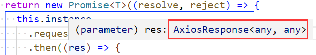
    - 毫无疑问是AxiosResponse类型，axios写的
  - 但是我们的resolve是需要一个AxiosResponse类型吗？不是，它需要的是我们传进来的T类型
- 怎么办？进入request中看一下：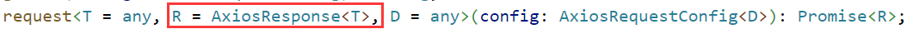
  - 为request明确指定第二个泛型即可：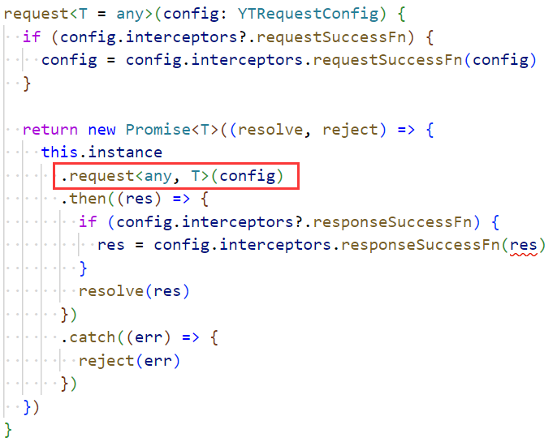
- 还有一个问题，有个地方报错了，你看到了吗？
  - 为什么？因为我们要求出入的res的类型是：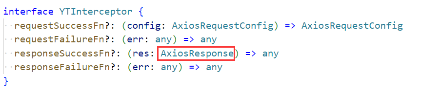
    - 现在res的类型是T当然报错
  - 怎么办？传泛型啊：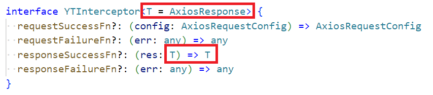
    - 这么传行吗？不行，以为内我们根本没用这个接口：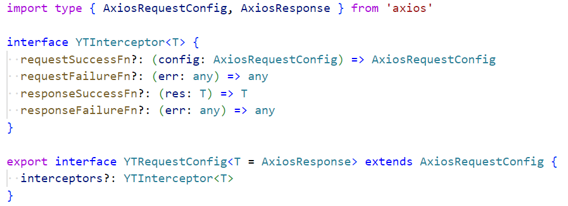这么写就行了
    - 此时就没有问题了：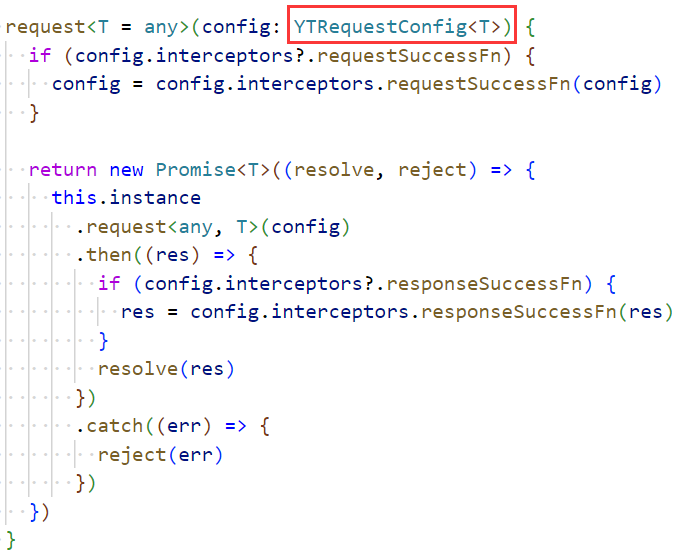

### 4.其他方法的实现

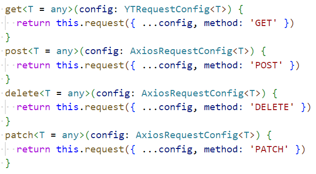

- 这里有一个问题：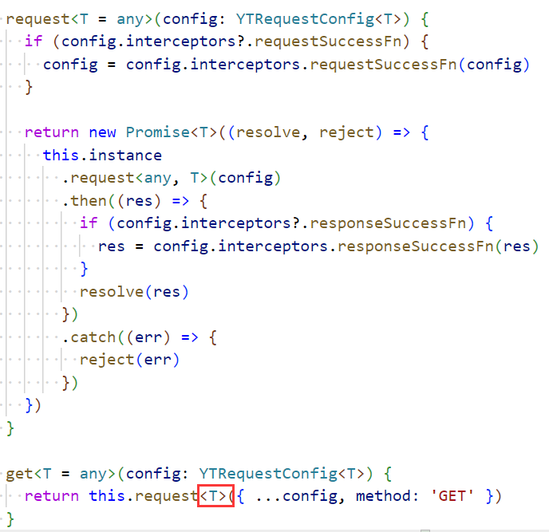
  - 为什么不加红框中的东西依然有提示？我不知道