### 1.初始化项目

- npm init vue@latest
- pnpm install
- 推荐安装的插件：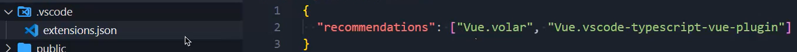
- tsconfig.json：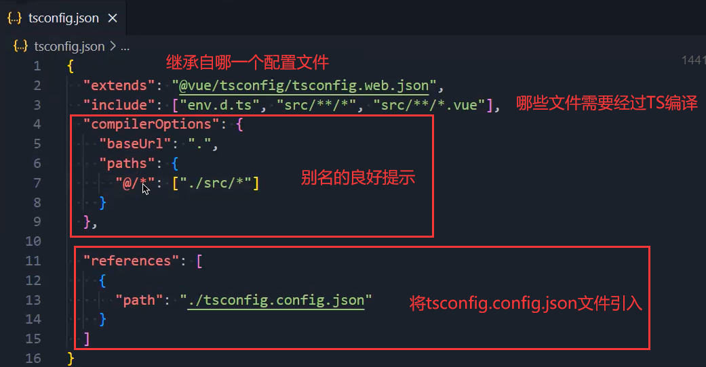
- 声明vue文件：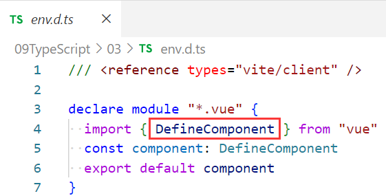
  - 之前我们都是使用Component，现在使用DefineComponent有啥区别呢？
  - DefineComponent加入了类型：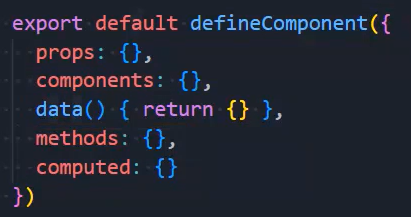
  - 你可以给defineComponent传入泛型来规定props等属性的类型
  - defineComponent的返回值类型：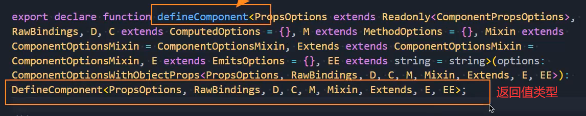

### 2.editorconfig

- 一个项目一般都是多人进行开发的，当不同的人使用不同的编辑器时，可能会出现编码不一致的情况

  - 比如张三使用vscode开发这个项目的某一个模块，使用的是utf-8
  - 而李四使用的是HBuilder开发这个项目的某一个模块，使用的是utf-16
  - 在合并项目时，就会出现乱码的情况

- 在根目录下创建 `.eidtorconfig` 文件

  - 写入如下代码

    ```yaml
    # http://editorconfig.org
    
    root = true
    
    [*] # 表示所有文件适用
    charset = utf-8 # 设置文件字符集为 utf-8
    indent_style = space # 缩进风格（tab | space）
    indent_size = 2 # 缩进大小
    end_of_line = lf # 控制换行类型(lf | cr | crlf)
    trim_trailing_whitespace = true # 去除行首的任意空白字符
    insert_final_newline = true # 始终在文件末尾插入一个新行
    
    [*.md] # 表示仅 md 文件适用以下规则
    max_line_length = off
    trim_trailing_whitespace = false
    ```

- 如何让这些配置生效呢？

  - 需要在VSCode中安装一个插件：EditorConfig for VS Code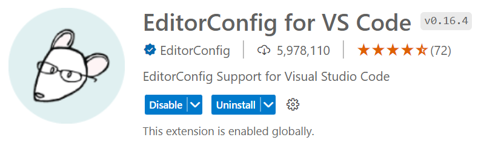
  - 安装这个插件之后VSCode会自动读取 `.eidtorconfig` 文件，让这些配置生效

- 其他人在使用其他编辑器时，也要想办法，让自己的编辑器能够读取这个文件，生效这些配置

### 3.prettier

- 格式化文档

  - 比如我们想删除多余空行，双引号变单引号，删除尾部分号等等

- 安装prettier：npm install prettier -D和配置prettier

  - 我们初始化项目时，已经选择过prettier了，所以默认情况下已经安装和配置过了

- 但是我们按Ctrl+s是不起作用的

  - 安装插件：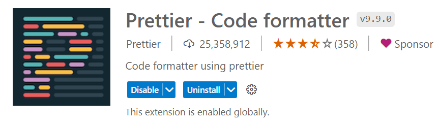
  - 两个配置：
    - Format On Save勾选上：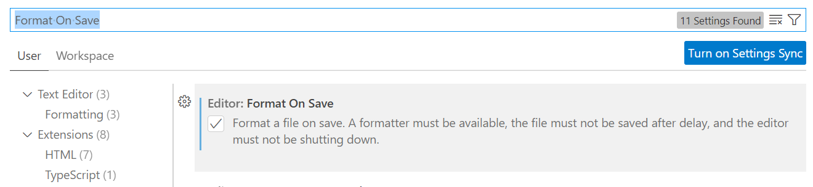
    - Default Formatter选择如下：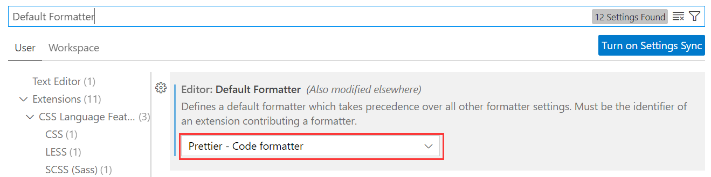

- 但是这些都是默认的，比如它会为每行代码的尾部加上分号，使用双引号等等不太符合我们的要求

  - 在.prettier.json文件中写如下代码：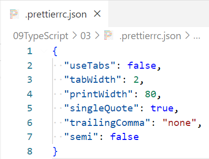

    ```json
    {
      "useTabs": false,  // 使用tab缩进还是空格缩进，选择false，使用空格缩进
      "tabWidth": 2, // tab是空格的情况下，是几个空格，选择2个
      "printWidth": 120,  // 当行字符的长度，推荐120，也有人喜欢80或者100
      "singleQuote": true,  // 使用单引号还是双引号，选择true，使用单引号
      "trailingComma": "none",  // 在多行输入的尾逗号是否添加，设置为 none，不添加
      "semi": false  // 语句末尾是否要加分号，默认值true，选择false表示不加
    }
    ```

  - 来到文件中按Ctrl+s就生效了

- .prettierignor忽略文件：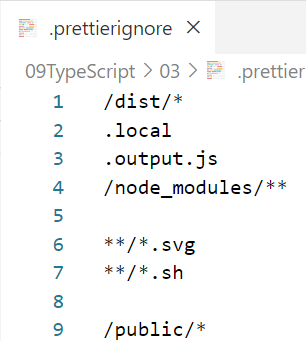

  ```yaml
  /dist/*
  .local
  .output.js
  /node_modules/**
  
  **/*.svg
  **/*.sh
  
  /public/*
  ```

### 4.ESLint

- 当你的代码不符合规范时，给出一定的提示

- 安装ESLint插件：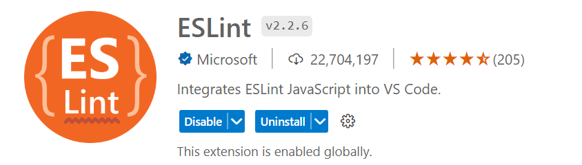

- 目前我们想让ESLint的检测规则和prettier的规则一致，怎么办？

- 需要npm安装一些插件，但是vue给我们安装了

  ```shell
  npm i eslint-plugin-prettier eslint-config-prettier -D
  ```

  - 目前不需要安装

- 在.eslintrc.cjs文件中加一行代码即可：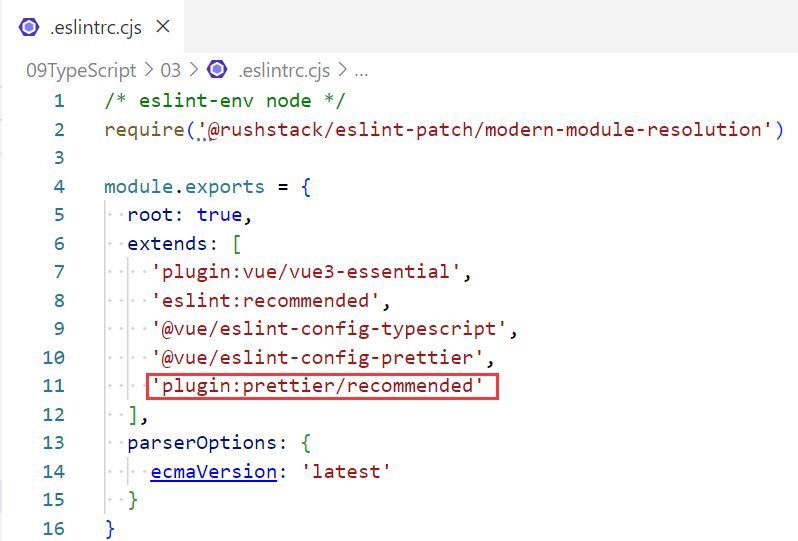

  - 此时就可以保持一致了

- 如果你想关闭掉一些没有必要的提示可以这样做：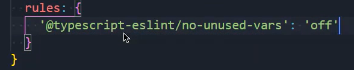

### 5.区分开发和生产环境

- 方式一：自己进行修改

  - 弊端：一旦忘了，会造成损失

- 方式二：vite的环境变量

  - Vite 在一个特殊的 import.meta.env 对象上暴露环境变量
  - 这里有一些在所有情况下都可以使用的内建变量
    - import.meta.env.MODE: {string} 应用运行的模式
      - 返回development或者production
    - import.meta.env.PROD: {boolean} 应用是否运行在生产环境
      - 如果是生产环境返回true，开发环境返回false
    - import.meta.env.DEV: {boolean} 应用是否运行在开发环境 (永远与 import.meta.env.PROD相反)
      - 如果是开发环境返回true，生产环境返回false
    - import.meta.env.SSR: {boolean} 应用是否运行在 server 上

- 方式三：dotenv dot就是点的意思，就是在 `.env` 文件中加载额外的环境变量

  - Vite 使用 dotenv 从你的 环境目录 中的下列文件加载额外的环境变量

    - .env文件，任何情况下都会加载
    - .env.[mode]文件
      - .env.development  开发环境下会进行加载
      - .env.production  生产环境下会进行加载
    - 对于.env.local和.env.[mode].local文件会在git提交时，进行忽略

  - 只有以 VITE_ 为前缀的变量才会暴露给经过 vite 处理的代码

    ```js
    VITE_BASE_URL = "456"  // 在.env.development中写的
    ```

    ```js
    console.log(import.meta.env.VITE_BASE_URL)  // 在当前项目任何文件中都可访问
    ```


