### 1.元素占满整个屏幕

- 给index.html模板设置样式

  ```css
  html, body, #app { height: 100% }
  ```

  - 再给组件最外层元素设置样式

    ```css
    .app { height: 100% }
    ```

- 我们不喜欢上面的方式，应该想办法直接让组件最外层元素占满整个页面

  ```css
  .app { 
    height: 100vh;
    width: 100vw;
  }
  ```

### 2.elemen-plus注意点

- 重写样式：给当前element-plus组件添加一个类，然后修改你找到的变量
- 图标问题：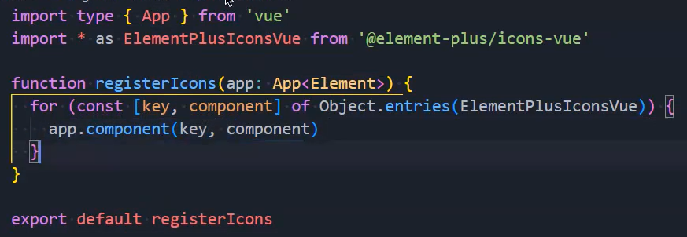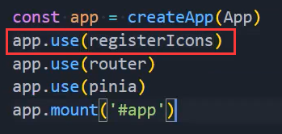
- 以插槽的方式写入图标：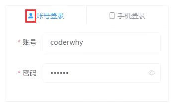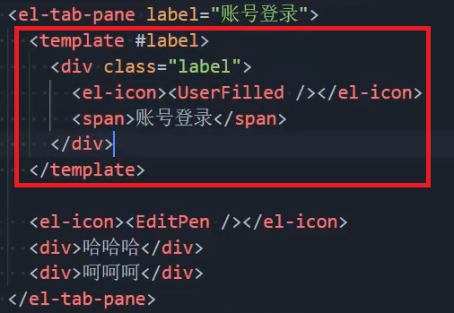

### 3.获取组件实例的类型

- 获取到组件类型：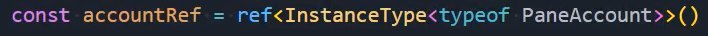
  - 这里的PaneAccount是我们通过import引入的组件
  - PaneAccount看似是定义了一个对象，但是其实是一个类，之前讲过
  - 引入之后，会通过 `<PaneAccount/>` 这种方式创建出一个个实例
  - typeof PaneAccount：这个是在拿PaneAccount这个类的类型
  - `InstanceType<typeof PaneAccount>` ：是在拿PaneAccount实例化之后，生成的那个对象的类型
  - 我们就可以通过：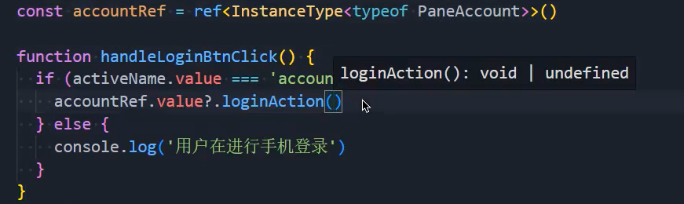
    - 这种方式在父组件拿到子组件的函数，再进行调用了
- 点击按钮进行验证：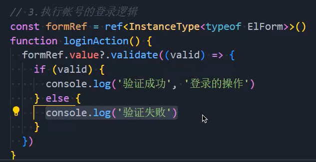

### 4.elemen-plus的提示

- 你会发现这个提示看不见：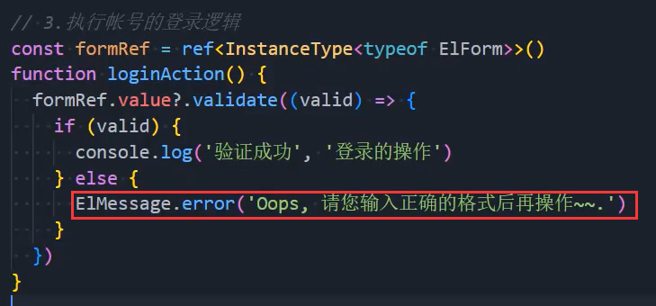
  - 是因为没有样式，在百度搜vite-plugin-style-import就能找到解决方案

### 5.登录token的思路

- 第一次登录时向服务器发送请求，请求到数据就把token保存到localStorage中，然后也保存到store中
- 然后在store的state的token初始化时写localStorage.getItem("token")
  - 这样即便我们刷新过页面，store中依然会存在token

### 6.公共的类型

- 我们可以单独抽取到一个types文件夹的文件中，对类型进行共享

### 7.postman的使用

- 登录接口的测试：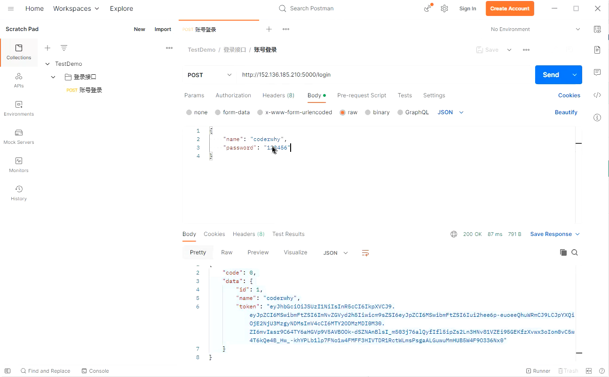
- 在全局添加baseURL：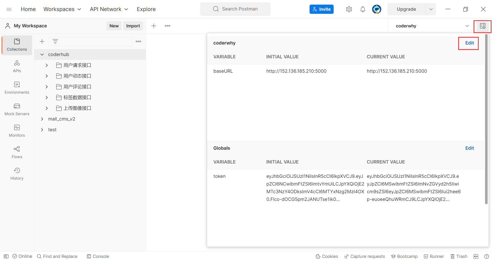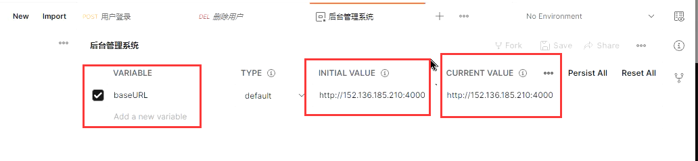
- 将token添加到全局变量中
  - 在login测试阶段：
  - 其他接口就可以使用token了：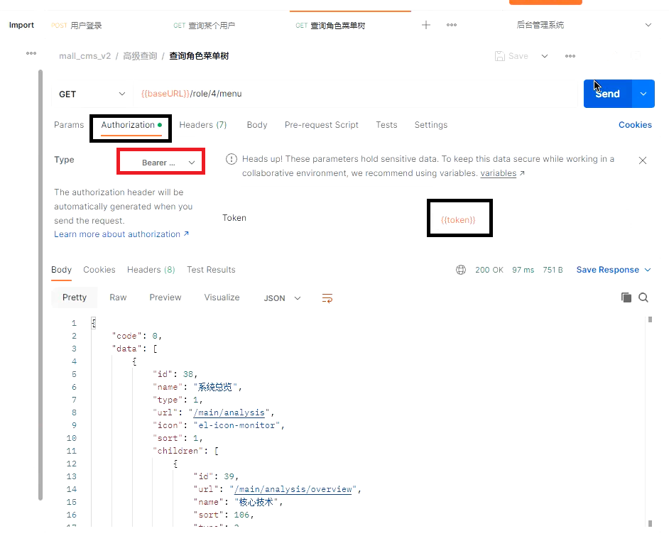


