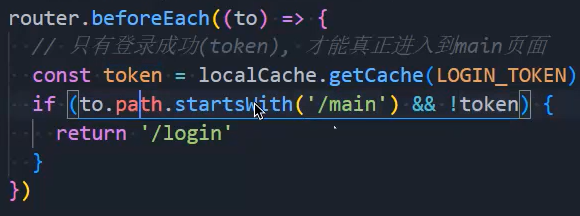
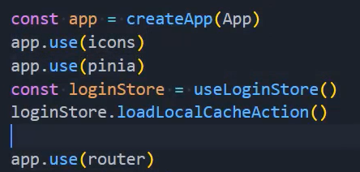

### 1.RBAC

- Role based access control：基于角色的访问控制
- 用户、角色、权限
- 用户：用户可能有100个，我们不可能为每一个用户制定权限，太麻烦了
  - why用户、yt用户。。。
- 角色：角色可能有10个
  - 总经理、副经理、主管、主任、员工、销售、运营
- 权限
  - 所有权限
  - 比所有权限少一个权限
  - 只有数据权限等等
- 先为角色分配权限，再为用户分配角色
- 获取token => 获取角色信息 => 获取角色权限
- 通过拦截器携带token：

### 2.函数相关类型区分

- 指定箭头函数的返回值类型

  ```ts
  interface IFooReturn {
    name: string,
    age: number
  }
  
  const foo = (): IFooReturn => {
    return {
      name: "yt",
      age: 18
    }
  }
  ```

- 指定箭头函数的类型

  ```ts
  type FooType = () => IFooReturn
  
  const foo: FooType = () => {
    return {
      name: "yt",
      age: 18
    }
  }
  ```

- 指定普通函数返回值类型

  ```ts
  interface IFooReturn {
    name: string,
    age: number
  }
  
  function bar(): IFooReturn {
    return {
      name: "yt",
      age: 18
    }
  }
  ```

- 为state指定类型：

- 将对象转成接口的工具网站：https://transform.tools/json-to-typescript

### 3.图标

- 通过插槽设置图标：

- 通过动态组件设置图标：
  - 动态设置：

### 4.Vue中组件样式说明

- 为什么这个类要使用:global，而不使用:deep呢？
  - 因为这个类所在的元素的父元素和id为app的div是同一级的，也就是说它所在的父元素很有可能使用了teleport内置组件来实现的，所以使用deep不起作用：
- 现在我们会发现有的时候我们使用element-plus的组件，想要改它的样式，直接使用它上面的类即可
  - 可是以前都是在使用:deep()，现在不使用了，是因为：
  - 首先test是一个class为app中的一个组件，你会发现test这个组件的根上的属性和class为app元素上的属性一样，所以才不需要使用:depp()

### 5.导航守卫补充

- ：为什么使用不等于"/login"不太好呢？
  - 因为无论我调到什么路由，只要没有token都会进入login页面，我们想让它进入notFont页面
- 修改：

### 6.coderwhy自动化工具

- npm install coderwhy -g
- 创建组件：
- 同时创建对应的路由文件：

### 7.读取router/main下所有文件

- store/login/login.ts的loginAccountAction方法：
  - 这样只会返回一个函数：
  - 这是因为它是懒加载，我想立即拿到需要加一个参数：
  - 拿到最终的那个对象：
  - 把这些对象push到数组中：
  - 现在不管什么全部权限的，我们把所有的路由都写了，只是还没注册
    - 我们把所有的路由都拿到了，接下来就需要根据权限去注册相应的路由了

### 8.根据菜单信息寻找相应的路由

- 菜单信息中的url和路由数组中的path是存在共性的：
- 根据这些共性做判断，添加该添加的路由：

### 9.解决刷新路由消失问题

- 我们之前通过点击登录按钮，实现了路由的动态添加的功能
- 当我们登陆成功，进入主页面时，再点击刷新，你会发现，之前注册的路由都消失了，因为没有点击登录按钮，之前的loginAccountAction不会再被执行一遍，所以才会消失
- 解决方案：
  - 再在loginStore中添加一个action：
    - 判断你确实登录过，并且存在必要的值，再动态添加相应的路由，说白了就是再执行一遍
  - 有个问题，在哪里调用这个action呢？我们知道，在刷新页面的时候一定会执行main.ts文件，所以我们可以在这里调用这个action，如下：
    - 当然得先安装pinia才行，也就是先得执行app.use(pinia)
    - 还有就是要把app.use(router)放到下面会更好一些：
    - 注册完在使用router
  - 但是这样做有点丑，我们需要把这段代码抽取出去：
    - 使用：

