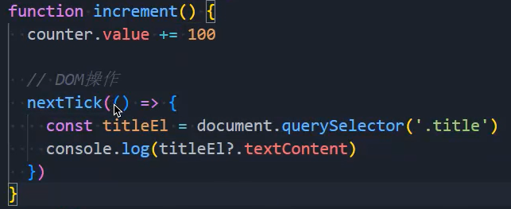

### 1.点击登录按钮

- 当我们点击登录按钮后，就会进入main页面，但是main页面是没有对应的组件的
- 我们想，当点击登录按钮后，进入的是第一个路由，比如进入的是/main/analysis/overview
  - 但是不一定非得进入这一个，我们只是想要属于这个角色权限中的第一个
- 我们用一个单独的变量去保存第一个：
- 我们之前点击登录按钮后，会跳到/main页面，那是因为我们在login.ts文件的loginAccountAction中写了这段代码：
  - 我们可以注释掉这段代码，但是我们无法确认，用户是否会在地址栏直接写一个/main来进行跳转
  - 所以不要进行注释，而是使用导航守卫去实现：
  - 其实这样不太完美，万一用户只写了一个/main/analysis这个咋办呢？也应该像上面一样，判断是否是以/main开头

### 2.根据某个数据变化改变界面

- 通过watch或者computed

### 3.国际化

- 为router-view包裹一个el-config-provider：
- 但是有一个问题：报错，是因为没有声明mjs文件，在env.d.ts文件中声明：

### 4.作用域插槽

- 启用还是禁用：
- 零时区UTC时间转化
  - pnpm add dayjs
  - 在utils文件夹中创建格式化文件：format.ts：
  - 但是这个是零时区的，我们需要东八区的时间，需要偏移八个小时：
  - 使用formatUTC函数：

### 5.defineProps的泛型

- 之前我们都是给defineProps传递一个对象，对象中写需要的东西和类型
- 在ts中我们只需要指定类型，最为其泛型传进去就行了：

### 6.作用域插槽嵌套作用域插槽

- 预留插槽：
- 使用预留的插槽：

### 7.nextTick

- 这是一段计数器的代码：
  - 请问，当我点击+1按钮后，会打印多少什么？100
- 这个问题我们可以这么解决：
- 首先解决在不使用nextTick的情况下为什么不同步
  - 因为响应式数据在发生变化之后，不会立即让界面进行渲染，而是进行批量处理
  - Vue会将它们缓存到一个队列当中，直到下一个“tick”再一起执行
  - 这样做可以确保每个组件无论发生多少状态变化，都仅执行一次更新
  - 所以响应式数据发生变化，DOM不会立即更新，继而在不使用nextTick的情况下不同步
- 为什么使用nextTick就可以了呢？
  - 因为在Vue3中，它把nextTick作为了微任务，所以肯定会等到js主线程所有代码执行完才会执行nextTick中的代码，所以才会成功
- 使用场景，当DOM更新完之后再在nextTick中做一些事
  - 拿到DOM更新后的数据
  - 当数据发生变化，DOM更新完毕后再做一些东西
    - 就是有的时候有些需求是需要在DOM更新完毕之后再去做一些事情
    - 你可能要说，不是在声明周期中做吗？
    - 假如我们现在使用watch在监听一个数据发生了变化，总不能在watch中写生命周期函数吧
    - 所以就可以使用nextTick
  - 当我点击一个按钮，创建一个蒙版，此时你是有数据的，但是你发现调起的蒙版中没有数据显示
    - 因为我们在调起蒙版时，需要拿到这个DOM，然后设置数据
    - 你都没有渲染出来，我拿到DOM，给DOM设置数据有什么意义呢
    - 所以我们要延后一个”tick“，等到DOM更新后拿到DOM，再在DOM上设置数据
    - 所以要在nextTick函数中做