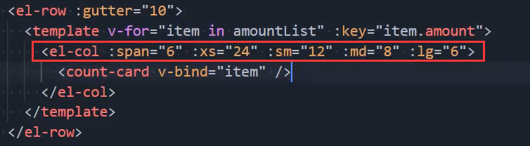
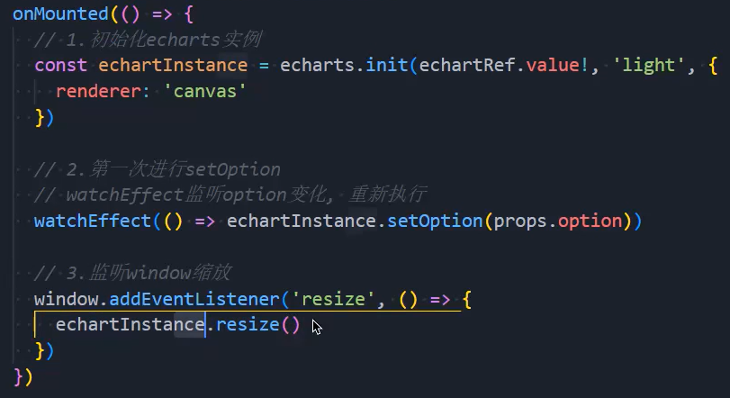
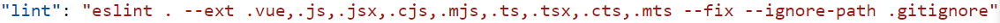
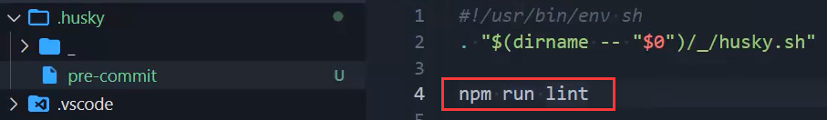
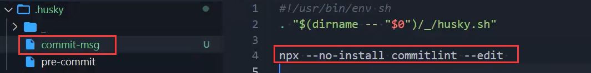

### 1.富文本库和tree

- 富文本库：wangEditor
- tree命令一键生成目录结构

### 2.可视化库

- countup
- echarts

### 3.响应式

- element-plus的响应式系统的应用：
- Echarts中的图形随着窗口的变化而变化：

### 4.husky

- 当我们的代码写的不规范时，比如我们多了分号，我们会对代码进行提交，能不能提交，可以的
- 但是我们应该让他提交吗？不应该，我们应该在他提交前对代码进行格式化，格式化成符合自己标准的代码
- 在package.json中有一个link命令，我们可以通过它npm run lint，对我们不规范的代码进行格式化：
- 但是我们不能每次都得npm run lint吧，万一忘了咋办，我们需要执行：npm husky-init && npm install
- 然后将pre-commit修改如右：

### 5.cz规范提交信息

- 安装Commitizen：npm install commitizen -D

- 安装cz-conventional-changelog，并初始化cz-conventional-changelog

  ```shell
  npx commitizen init cz-conventional-changelog --save-dev --save-exact
  ```

- 当我们提交时使用git add .然后再使用npx cz

- 但是有一个问题，假如我们在git add .之后依然使用git commit -m''进行提交怎么办？

- 我们需要限制它以这种方式提交

- 安装@commitlint/config-conventional和@commitlint/cli

  ```shell
  npm install @commitlint/config-conventional @commitlint/cli
  ```

- 在根目录创建commitlint.config.js配置commitlint

  ```js
  module.exports = {
    extends: ["@commitlint/config-conventional"]
  }
  ```

  - 如果有错误提示，在eslint文件中进行忽略即可

- 最后执行下面这个命令

  ```shell
  npx husky add .husky/commit-msg "npx --no-install commitlint --edit $1"
  ```

- 自动生成下面这个文件：

- 这样做完git commit -m''是提交不上去的，只能用npx cz

- 但是我们每次都要执行npx cz比较麻烦

- 我们可以在脚本中写："commit": "cz"

  - 这样就可以通过npm run commit进行提交了