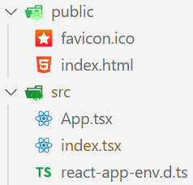
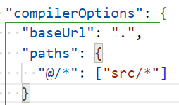
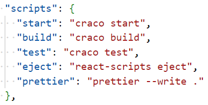
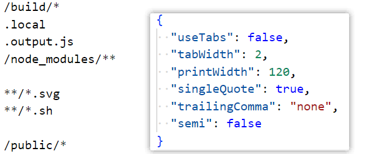
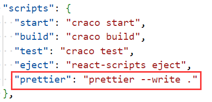
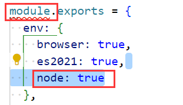
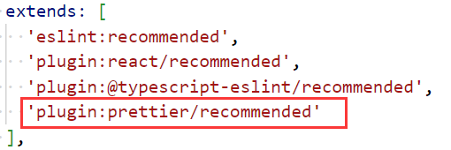

### 1.创建react+ts项目

- create-react-app 项目名称 --template typescript
- 创建好项目后留下这些文件即可：

### 2.配置别名

- 安装craco：pnpm add @craco/craco@alpha -D

- 在根目录下创建craco.config.js文件，做如下配置：

  ```js
  const path = require('path')
  const resolve = (dir) => path.resolve(__dirname, dir)
  
  module.exports = {
    webpack: {
      alias: {
        '@': resolve('src')
      }
    }
  }
  ```

  - 这里有一个问题，由于我们在使用pnpm管理项目，找不到path模块，安装ts-node：pnpm add ts-node

- 除了配置别名以外，我们在使用@的时候希望vscode给我们一个友好的提示，并且不报错，此时需要配置tsconfig.json：

- 修改脚本，使用craco启动、打包、测试我们的项目：

### 3.代码规范

- editorconfig

  ```shell
  root = true
  
  [*]
  charset = utf-8
  indent_style = space
  indent_size = 2
  end_of_line = lf
  trim_trailing_whitespace = true
  insert_final_newline = true
  
  [*.md]
  max_line_length = off
  trim_trailing_whitespace = false
  ```

- prettier

  - 安装prettier：pnpm add prettier -D
  - 创建.prettierrc和.prettierignore文件：
  - 一键格式化：pnpm prettier即可一键格式化所有文件，除了忽略文件
  - 其他安装插件，以及vscode配置prettier等问题不再给出，vue项目已经说明的很详细了

- eslint

  - 安装eslint：pnpm add eslint -D

  - 初始化eslint文件：npx eslint --init，它会出现选择，不给出，很简单

  - 这样的话就会在根目录创建一个eslintrc.js文件：module报错，写node: true即可

  - 安装两个库

    ```shell
    pnpm add eslint-plugin-prettier eslint-config-prettier -D
    ```

  - 配置eslintrc.js文件：重启vscode即可