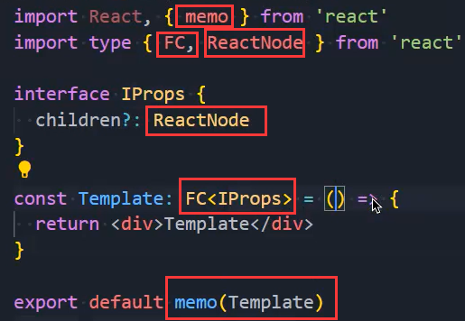

### 1.杂项补充

- 目录结构的划分：
- 重置css：normalize.css

### 2.路由的集成

- 安装路由：pnpm add react-router-dom
- 配置文件中的类型：
- 使用配置文件：
- 指定使用HashRouter：

### 3.组件的使用

- 直接对props进行类型约束：
- 第二种写法：
  - 简写：
- 插槽：这种方式是通过children获取的：
- 最终写法：如果你要指定一些需要传的属性，再写props也不为迟晚

### 4.路由懒加载问题

- 路由的懒加载不说了，我们这里要说的是，在使用路由懒加载的后，需要使用Suspense组件，在哪使用的问题：在这使用即可
- 二级路由需要使用Outlet组件进行占位：
- 二级路由存在的问题，当我们切换某个二级路由时，整个二级路由也在跟着闪烁，因为之前设置的Suspense的原因，如何解决呢？为Outlet组件包裹一个Suspense即可：

### 5.redux

- 安装：pnpm add @reduxjs/toolkit react-redux
- 给useSelector指定类型：
  - 在组件中使用：
- 给useDispatch指定类型：
  - 在组件中使用：

### 6.类型讲解

- 这个类型到底是怎么回事呢？
- 首先要明白一下这段代码：
  - IFnCall定义了一个函数签名，要求foo这个函数在调用时，必须传入两个参数，且foo这个函数在被调用后返回字符串类型的值
  - 第一个参数要求是函数类型，且必须返回字符串类型的值，第二个参数要求传入一个number类型的值
- 请问`<TWhy>`是啥：
  - 它是一个泛型，当foo在被调用时需要由你来传入一个类型，比如这样：
  - 比如你这么写：第一个参数必须返回一个string类型的值
  - 如果我不传呢？它会类型推断，我们在调用foo时，第一个参数是不是返回aaa啊，它是一个字符串类型
  - 所以会推导出红框中的TWhy是一个string类型，继而没有被红框圈起来的也是string类型
  - 我们有改了代码：，此时要求foo的返回值类型比如和第一个参数的返回值类型一样
  - 我们回头看一下useAppSelector的使用：
    - useAppSelector的返回值类型，必须和你写的第一个参数的返回值类型一致，所以才会有提示呀
- foo：这么写不行，foo的返回值类型必须要和第一个参数的返回值类型一样，所以要这么写：

