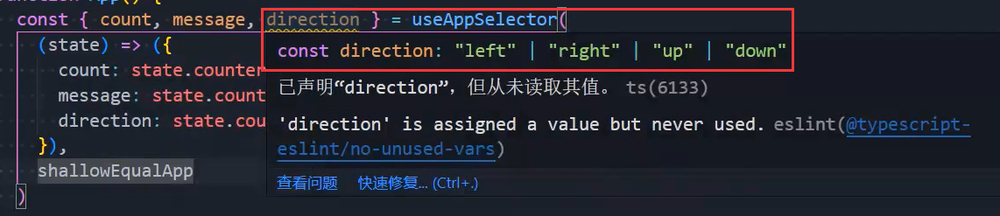

### 1.给useState指定泛型

- 其实一般写any就行：

### 2.环境区分

- 方式一：手动进行区分
- 方式二：process.env.NODE_ENV
  - 开发环境下打印development，生产环境下打印production
  - 生产环境的启动方式：pnpm build
    - 然后安装一个服务：再执行第二个命令即可
- 方式三：创建.env.development和.env.production这两个文件
  - 都要以REACT_APP_开头：
  - 然后我们去打印process.env就有了：
  - 然后我们就可以使用process.env.REACT_APP_BASE_URL了，但是在我们写的时候没有提示
  - 在类型声明文件中有引入一个东西：
    - 点到这里面去，写了一个命名空间：
    - 我们不要直接改它的源码，而是在类型声明文件中：
    - 对同一个接口进行多次声明，在实现时需要满足所有要求

### 3.类组件的类型约束

- 对props进行约束：
- 对state进行约束：
- 代码优化，TS中的类是需要指定成员类型的，可以这么写：
  - 不需要写constructor函数

### 4.给initialState指定类型

- 我们知道initialState是可以进行类型推导的，但是为什么还要指定类型呢？
  - 像这种：
  - 我们在使用的时候就可以明确的知道：direction是一个联合类型而不是推导出来的string类型
- 对于一些无法正确推导出来的类型，是需要我们自己去指定的

### 5.指定action中的payload类型

### 6.styled-components的类型

- 我们在安装了styled-components之后，在我们引入它之后，会报错，因为我们没有声明它的类型
- 需要再安装一个类型：pnpm add @types/styled-components -D当然它会给你提示的

### 7.Link和NavLink的区别

- 当地址和NavLink的to属性的值模糊匹配时，会自动加上一个active类
- 所以NavLink比Link更常用
- 当然如果你不想用active可以自己进行定义：
  - 当你这么写后，选中时就不加active了，而是加activeaaaaa

### 8.antd注意

- 安装之后，需要全局引入它的css
- 轮播图的属性很多没有写，需要你去自己去另一个它推荐的网站进行查找

### 9.给标签添加属性

- 之前我们在使用styled-components时，都是在创建div，现在我们想创建a标签并给他属性
- 这样它就会有href属性和target属性

### 10.通过ref拿到轮播图组件实例

