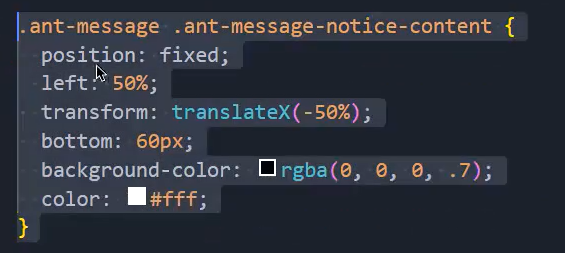

### 1.Promise

- 获取榜单数据：
  - 这种方式有一个问题，我们虽然发出去了三个请求，但是谁先拿到结果是不一定的，因为是异步的嘛
  - 也就是说，results这个数组中的返回值和rankingIds数组中的值无法一一对应
- 如何保证其顺序呢？使用Promise：
- 这里有一个问题：Promise接收的泛型有什么用？
  - 当我们在使用Promise时：
  - 传进去的string决定的是resolve中的类型，也就当你往resolve中传实参时必须是string类型，不能是其他类型，比如把aaaaaa改成数字类型的：1111就不行
  - 这样then中的res才知道自己是什么类型
- 这么做拿到的res一定是有正确的顺序：
  - 这里的res是一个数组，数组中的结果和id是一一对应的

### 2.音乐播放逻辑

- 拿到audio元素，为其src属性赋值播放地址：
  - 调用play方法，返回一个Promise对象

### 3.为样式组件传入属性和值

- 当我们使用styled-components创建组件后，在使用创建的组件时，需要传入属性，但是报错
  - 报错是因为我们没有定义相关的类型：
  - 传入泛型即可：

### 4.useState异步实践

- 这段代码：
  - 假如在调用此函数之前，isPlaying是false，调用这个函数之后，执行第50行，执行了之后isPlaying应该变为true了
  - 但是第53行的isPlaying是true吗？不是，因为useState是异步的，此时的isPlaying依然是false
- 怎么办？这样写：

### 5.对时间进行格式化

### 6.歌词解析

### 7.寻找歌词

- 看这张图：
  - 当前时间是100000毫秒，我们应该播出哪句歌词？应该播放第16句吧
  - 我们应该去遍历所有歌词，找到第一个时间大于当前时间的歌词，然后减一就是需要播出的歌词
  - 这样我们就拿到了歌词：
- 关于最后一句我们是无法找到的，因为没有任何一句歌词的时间是大于播到最后的当前时间的
  - 怎么办？让初始值为最后一句歌词：
- 有一个问题，由于我们是在onTimeUpdata中进行的，每句歌词会打印很多很多次，我们只想打印一次
  - 把索引保存到store中一份：
  - 当你的保存的lyricIndex和当前index一致时就直接return掉，或者index为-1时也return掉即可
- 展示歌词：
  - 这里有三个问题
  - 第一个是展示的时间问题，消失的太快了，还没唱完歌词就消失了，让duration为0，永远不会消失
  - 第二个问题是：所有的歌词都不会消失，让他们的key相同即可，可以相同就会覆盖掉之前地
  - 第三个问题是：样式问题，重写样式即可：

### 8.指定getState的返回值类型

- 第一个void是指定第二个参数的返回值类型
  - 第二个number是指定id的类型
  - 第三个对象类型中的state类型是指定getState的返回值类型

