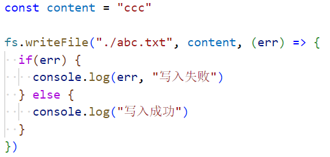

### 1.开发node没有提示

- 安装类型：npm install @types/node
- 在当前目录下执行tsc --init生成tsconfig.json文件
- 在tsconfig.json文件中加上红框中的内容：
- 然后创建ts文件：
  - 使用es module就可以出现提示了
  - 运行代码要使用ts-node
- 但是这肯定不是最优方案，因为我看老师的什么都没做就可以有提示

### 2.读取文件

- fs是File System的缩写，表示文件系统
- 同步读取文件：
  - 当第三行有结果了才会执行第四行第五行：
  - 我在abc.txt文件中写的内容是abc所以打印Buffer格式下的61、62、63
  - 正好对应ascii码中的abc：，具体Buffer相关概念后面再说
  - 当然我们现在无法直接看出来你这里的61、62、63代表什么，有两种方式可以对其进行查看
    - 方式一：调用结果的toString方法：
    - 方式二：传递第二个参数：

- 异步读取文件（传入回调函数的方式）：
  - 第一个打印Buffer，第二个打印abc
- 异步读取文件（Promise的方式）：
  - 当然捕获异常肯定是在catch中，不多说

### 3.文件描述符

- 每一个打开的文件都会被分配一个数字，这个数字就是文件描述符，fd（file descriptors）
- 操作系统中就维护着这样一个表，使用这些文件描述符来标识和跟踪特定的文件
- 拿到文件描述符：，打印3
- 有啥用呢？可以通过这个文件描述符读取这个文件：
- 当然获取文件描述符主要是用来获取文件的信息：
  - 打印结果：
    - size：文件中存储内容的大小，这里是3个字节
    - atime：访问时间（access time）访问文件就会更新
    - mtime：修改时间（modify time）更改文件的内容就会更新
    - ctime：状态修改时间（change time）更改文件任何属性就会更新，比如更改内容，权限，类型等
    - birthtime：创建时间
    - 这些时间都是零时区
- 我们现在是手动打开了abc.txt这个文件，需要手动关闭这个文件：
  - 手动关闭是需要传入文件描述符的

### 4.写入文件

- 将文件中的所有内容全部替换掉：
  - 无论文件中有多少内容，执行完这段代码，文件中就只剩ccc了
- flag选项
  - w：打开文件并写入内容，如果文件不存在，则创建文件，默认值
  - w+：打开文件进行读写，如果文件不存在，则创建文件
    - 无论是w还是w+都会把之前的内容进行覆盖
  - r：打开文件读取文件中的内容，读取时的默认值
  - r+：打开文件并进行读写，如果文件不存在，则抛出异常
    - 如果你想在中间插入内容，需要使用这里的r+
  - a：打开要写入的文件，将流放在文件末尾，如果不存在，则创建文件
  - a+：打开文件并进行读写，将流放在文件末尾，如果不存在，则创建文件
    - a是append的意思，追加到内容后面

### 5.创建和读取文件夹

- 创建文件夹：
- 读取文件夹，我现在有一个较为复杂的目录，如右图所示：
  - 读取文件夹的代码：，结果：
  - 你会发现它给到我们的是一个数组，但是我们需要知道你的每一项是一个文件夹还是一个文件
- 读取文件夹的同时获取每一项的信息：
  - 结果：
  - 但是这样还不够，需要遍历这个数组并做出判断：
    - 结果：
- 这里很明显需要使用递归才能拿到到每一个文件：

### 6.重命名文件夹或文件

- 重命名文件夹：
  - 将yt文件夹重命名为ytree
- 重命名文件：
  - 将yyy.txt文件重命名为ttt.txt文件