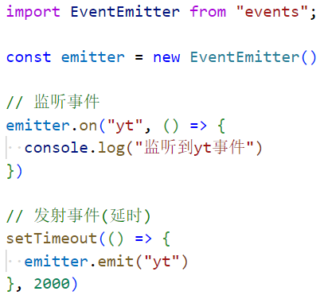
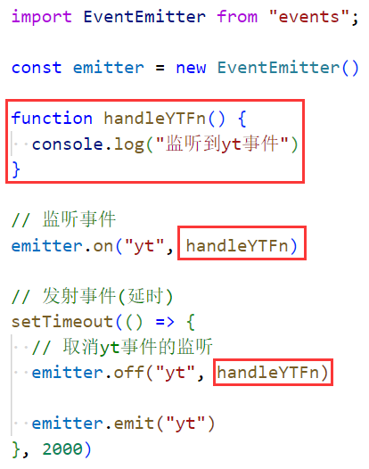
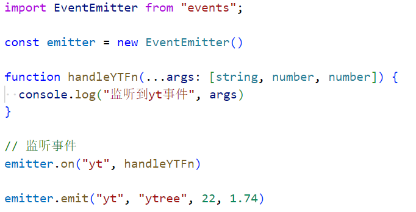
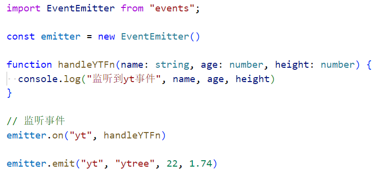

### 1.监听和发射事件

- 代码如右图所示：

### 2.取消事件的监听

- 代码如右图所示：
  - 注意：需要把函数抽取出来

### 3.发射事件时传递参数

### 4.其他方法

- 获取注册过的所有事件：emitter.eventNames()
  - 返回一个数组，数组中是一个个字符串
- 获取最大监听个数：emitter.getMaxListeners()
  - 默认值是10，你可以通过：emitter.setMaxListeners(n)，设置最大个数
- 获取某一个事件的监听器个数：emitter.listenerCount(eventName)
  - 比如你注册了很多个yt事件，它可以获取你具体注册了多少个yt事件
- 获取某一个事件的所有监听器函数：emitter.listeners(eventName)
  - 你会获得一个数组，数组中放着你注册过的函数
- 如果你多次监听某个事件，使用once注册的事件只会被监听一次：emitter.once()
- 如果你想把后监听的事件，放到最前面使用：emitter.prependListener()
- 添加到最前面的同时只能被监听一次：emitter.prependOnceListener()
- 移除所有的监听器：emitter.removeAllListeners()
  - 不传参，移除所有监听器
  - 传参，只移除当前参数的所有监听器