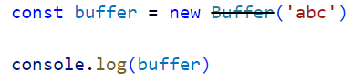
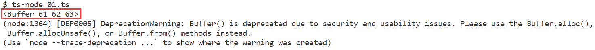
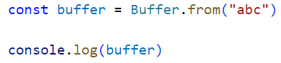
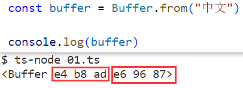
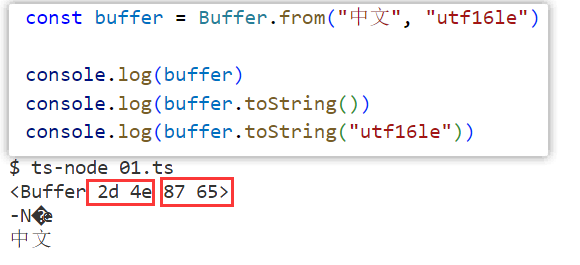
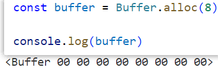
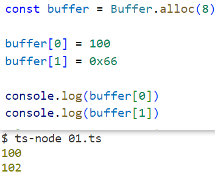
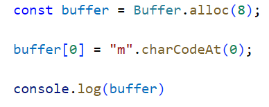
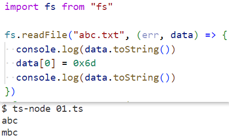

### 1.二进制和Buffer理解

- 在计算机中，无论是什么，都是使用二进制来存储
  - 比如文字、数字、图片、音频、视频，都会由二进制进行存储
  - 我们之前开发网页时很少会直接跟二进制打交道，但是开发服务器，我们就得学会和二进制打交道，因为我们需要直接去操作数据
  - 但是直接处理二进制数据实在是太麻烦了，可以用恐怖来形容，所以为我们提供了一个Buffer
- 在讲解Buffer之前我们还要明白一些知识
  - 首先，假如我们需要直接去操作二进制数据，我们是很少会去操作一位二进制的，因为一位二进制保存的数据实在是太有限了
  - 比如我们想通过二进制表示1，我们不会直接去写个1就完了，而是将八位二进制合在一起作为一个单元
  - 也就是如果我们想表示1，就得这么写：0000 0001
  - 这8位二进制组成的单元叫做一个字节（byte），一位二进制叫做一个比特（bit）
    - 8bit = 1byte、1024byte = 1kb、1024kb = 1M、1024M = 1G
- 我们可以把Buffer看成一个数组，这个数组中的每一项代表一个字节，也就是8位二进制
  - 比如刚才的1还有数字255：[0000 0001, 1111 1111]
  - 我们刚刚说过直接处理二进制太麻烦了，阅读起来也不方便，所以我们一般把他们以16进制来表示
  - 每四位为一个16进制，所以一个字节需要由两个16进制来表示：[01, ff]

### 2.Buffer类

- Buffer是一个全局的类，不需要导入：
  - 你很明显能看到它被画了一条横线，意思是不推荐你使用了：
    - 61代表a、62代表b、63代表c，之前说过了：可以去查ascii码
- 那它推荐你使用啥呢？警告上都说了，这里先使用Buffer.from方法：
  - 一个英文字母需要使用一个字节来存储，但是如果你想存储一个中文，需要三个字节：
  - 中文默认使用utf-8来编码，英文使用ascii来编码，utf-8里面是包含ascii编码的，所以英文也是用utf-8进行编码的
- 手动指定Buffer创建过程的编码：
  - 比如使用utf-16来进行编码，中文是使用两个字节来表示
  - 使用默认的utf-8进行解码，就会乱码，要明确指定使用utf-16来解码，才不会乱码

### 3.alloc方法

- alloc是分配的意思：const buffer = Buffer.alloc(8)

  - 这段代码的意思就是我向内存申请了8个字节的空间：，8个00

    

- 有这八个字节，我们就可以手动的操作和访问每个字节：

  - 如果你直接写一个字母会报错的：
  - 它不会自动转码，需要你手动转码，charCodeAt这个方法需要传一个参数，代表当前字符串的索引值
  - 打印的时候不能打印buffer[0]，它会把十六进制转为数字需要直接打印，像图里所示
  - 或者调用buffer.toString方法

### 4.读取文件操作字节

- 我们之前使用readFile读取文件时，得到的那个data就是Buffer，当然你不能传入编码格式
  - 除此之外我们还可以修改拿到的Buffer：
    - 将a改为了m
- 我们也可以读取图片的Buffer数据，然后对其进行操作
  - 这里还要提一个库，sharp，我们读取到图片的Buffer数据后把这个数据传给这个库，让它帮我们处理
  - 它帮我们处理完图片之后，会输出另外一个Buffer数据的，再把处理完的Buffer数据写入到文件中即可

- Buffer的内存申请
  - 我们在创建Buffer时，并不会频繁的向操作系统申请内存，它会自己先申请一个8kb的内存