### 1.Stream的理解

- Stream是流的意思，比如一个视频文件是很大的，如果我们一次性读取它目前是不太现实的，可能花费很多的时间跟资源
- 那么怎么办呢？我们可以把这些资源想象成流水，一点一点获取，这样数据就会被远远不断地被读取到我们的程序中，这一连串的数据就是流
- 流：连续字节的一种表现形式和抽象概念
  - 流应该是可读的也是可写的
- 我们之前已经可以读取文件了，为什么还需要流呢？
  - 直接读写文件的方式，虽然简单方便，但是一些细节无法精准控制

### 2.Node四种基本流

- 读取数据的流：fs.createReadStream()

- 写入数据的流：fs.createWriteStream()
- 可读可写数据的流、修改数据的流

### 3.通过流读取文件

- 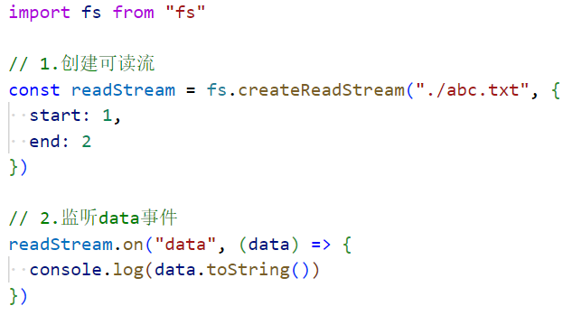，abc.txt文件中写的是abcd，所以打印bc
  - 闭区间，索引1和索引2都读取到了
- highWaterMark：每次读取几个字节：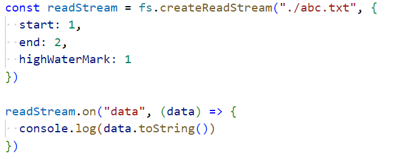
  - 每次读取一个字节，所以先打印b，再打印c，函数会被回调两次
  - 如果你不传，默认是64kb
- 读完一次暂停两秒，两秒后恢复读取，循环往复：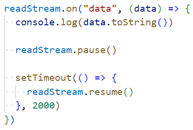
  - resume：继续

### 4.可读流的其他事件监听

- open事件：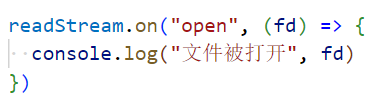
  - 通过open时间可以拿到文件描述符，继而可以获取文件的信息
  - open事件最先被执行
- end事件：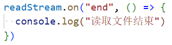
- close事件：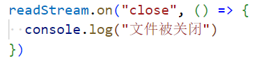
  - 我们不需要手动关闭

### 5.通过流写入文件

- 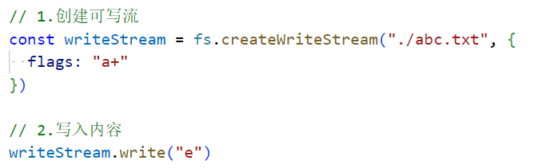，abc.txt中已经存在abc了，所以会往后等e
- 替换内容：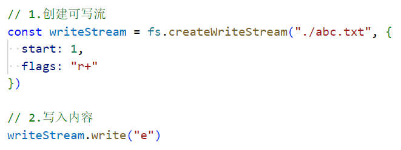
  - 本来我想在索引1的位置加一个e，把abcd变成aebcd，但是结果确实aecd，它把d给替换掉了
- 写入是否成功：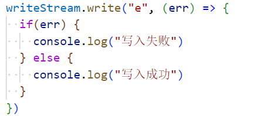
- 什么时候写入结束，你可能会想到监听close事件，但是监听不到，因为node程序不知道你什么时候写入结束
  - 我们需要在写入成功时，手动关闭文件：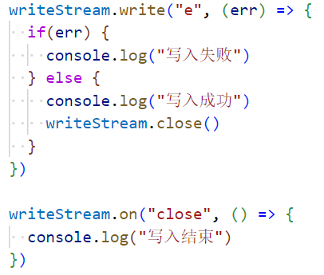
  - 这样就可以监听到close事件了
- end方法：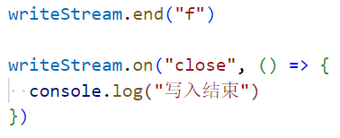，将f写入文件，并关闭文件
  - 一个end操作，做了之前的两件事，所以可以监听到close事件
  - 开发中我们经常会使用end方法
- open事件：跟之前的一样
- 你会发现没有end事件，但是它有一个finish事件，当监听到这个finish事件时，表示写入完成：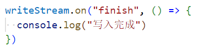

### 6.pipe方法

- 对文件进行拷贝，方式一：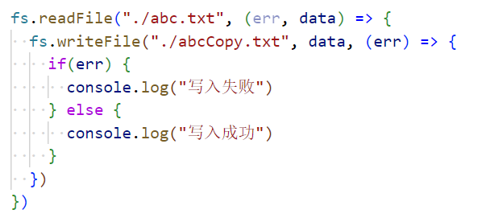
- 对文件进行拷贝，方式二：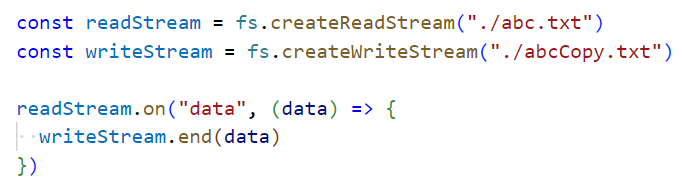
- 对文件进行拷贝，方式三：在可读流和可写流之间建立一个管道：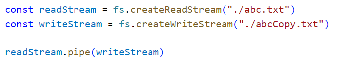

