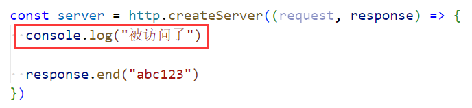
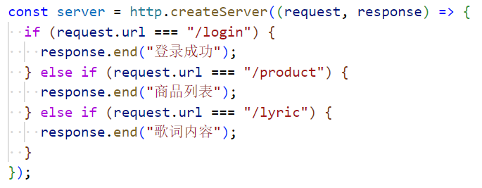
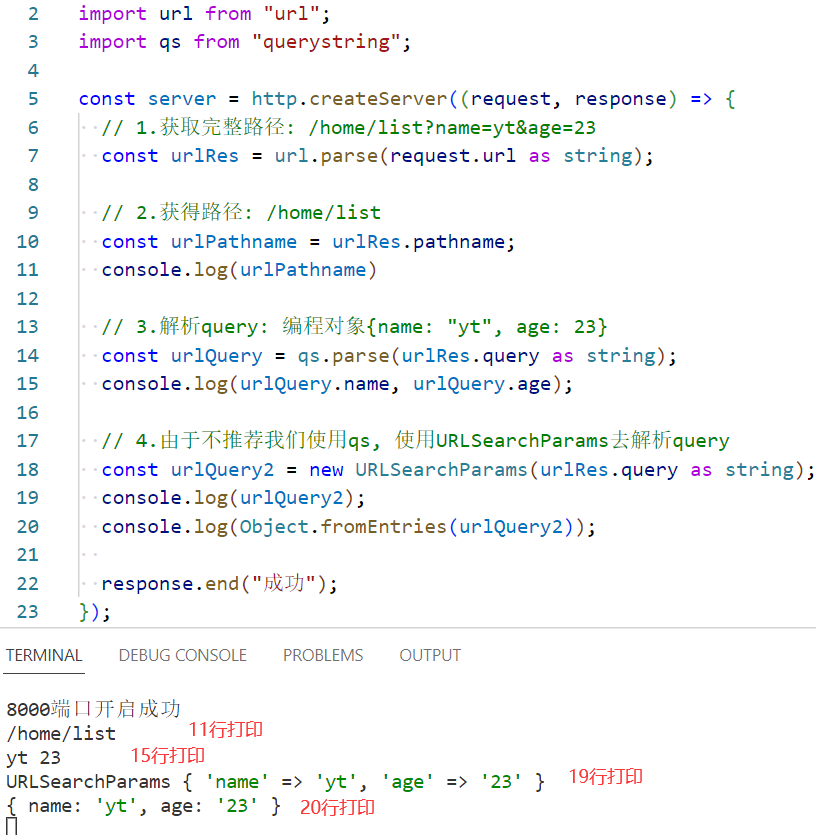

### 1.开启一个服务

- ，创建一个服务并监听8000端口
  - 端口监听范围：1025 ~ 65535
  - 当你执行node命令后，整个程序就停在这里了，不会退出
  - 但是当前你去浏览器访问这个端口，是不会有啥反映的：
  - 因为我们没有明确指定，到底要提供什么服务
- 在createServer中需要传入一个回调函数作为它的参数，这个回调函数有两个参数，request和response
  - request是一个对象，包含请求的url、请求的method、请求的headers、请求携带的数据、等等
  - response也是一个对象，用于给客户端返回结果，可以使用response.end()
    - 为什么可以使用end方法呢？我们可以理解为：当我们使用浏览器访问地址时，是在访问一个文件
    - response是我们创建的写入流，所以可以往这个文件中写入内容，继而我们可以访问文件中的内容：
    - 相应的request是一个可读流
- 创建多个服务：
- 底层直接new Server

### 2.listen函数的参数

- 参数一：端口port，不写会自动分配
- 参数二：主机地址host
  - ip地址有俩：127.0.0.1和0.0.0.0
  - 域名有一个：localhost，localhost会被解析成127.0.0.1

- 参数三：回调函数，当服务器启动成功后，就会回调这个函数

### 3.问题

- 使用浏览器访问出现的问题和解决方案
  - 当我们在浏览器上访问http://localhost:8000这个地址时：
    - 红框中的内容会被打印两次，为什么？
    - 第一次：主动访问，第二次：访问站点图标：http://localhost:8000/favicon.ico
  - 除了这个问题，你使用浏览器是无法测试post请求的，只能测试get请求
  - 怎么办？使用postman
- 每次写完代码无法自动更新
  - 使用nodemon：npm install nodemon -g
  - nodemon 文件名

### 4.request对象

- url属性：当我输入http://localhost:8000/home时，request.url就代表home
- method属性：判断你是post请求还是get请求，亦或是其他请求
- headers属性：请求头信息：
- 代码示例：

### 5.区分url和method

- 区分不同的url：
- 区分不同的method：

### 6.处理参数

- query类型参数
  - 有这样一个地址：http://localhost:8000/home/list?name=yt&age=23
  - request.url打印结果为：/home/list?name=yt&age=23
  - 处理方式：
  - 注释4说的不太严谨，node不推荐使用querystring，qs是我们自己起的名字
    - 但是qs还有一个库，这个库是推荐使用的
- body：什么时候会用到body呢？登录的时候：
  - 代码示例：
  - 放在body中的数据在request这个可读流中，所以要监听data事件，拿到数据
  - 相当于给我们传过来一个文件，我们自己读取这个文件中的所有内容

### 7.headers

- content-type：
  - 当我们在body中使用json传递数据时，就会再headers中加上content-type为application/json
  - 当然还有其他类型：
- content-length：数据的长度，文件上传，文件太大，知道文件的总长度
- connection: 'keep-alive'：在node中默认是5s
- 'accept-encoding': 'gzip, deflate, br'：文件压缩格式
- accept：指定编码格式
- user-agent：客户端相关信息，比如：PostmanRuntime/7.29.2

- authorization：携带token：
  - 代码示例：

