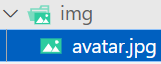

### 1.response对象

- 响应结果
  - response对象是一个可写流，我们可以调用write方法，但是需要我们手动关闭，之前讲到了
  - 但是它不让我们调用close方法，我们还是得调用end方法才行
  - 如果你不调用end方法，客户端会一直处于等待状态
- 响应状态码
  - statusCode：
  - writeHead：

### 2.编码问题

- 当响应结果是中文时，在浏览器中访问会乱码，在postman软件进行访问，就不乱码
  - 在postman中默认是使用utf-8进行编码，浏览器不知道它默认是什么编码，所以会乱码
  - 我们要告诉它们我们到底是什么编码：
  - 还可以使用刚才的writeHead：
  - 但是一般返回的数据类型都是json类型的：
    - 注意：返回的数据外面单引号，里面双引号
    - 还可以通过JSON.stringify去转换：

### 3.发送网络请求

- axios可以在浏览器发送网络请求，是因为它是基于XMLHttpRequest
- axios可以在node中使用，是因为啥呢？axios在node中是基于http模块的
- 使用http模块发送网络请求
  - 也就是说http模块除了可以搭建一个服务器以外，还可以主动发送网络请求：中
  - request请求：
- 使用axios发送网络请求：

### 4.文件上传（错误）

- 客户端上传图片：
  - 服务端接收：
    - 你会发现，当你的图片比较大的时候，一次是上传不完的，可能要分多次
- 将接收到的图片写入到文件中：，也可以简写，这样就不用调用close方法了
  - 但是这个文件是无法查看的，因为这么做会把一些别的信息混在一起写入

### 5.文件上传（正确）

- 代码示例：

### 6.浏览器文件上传

- 代码示例：

