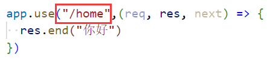
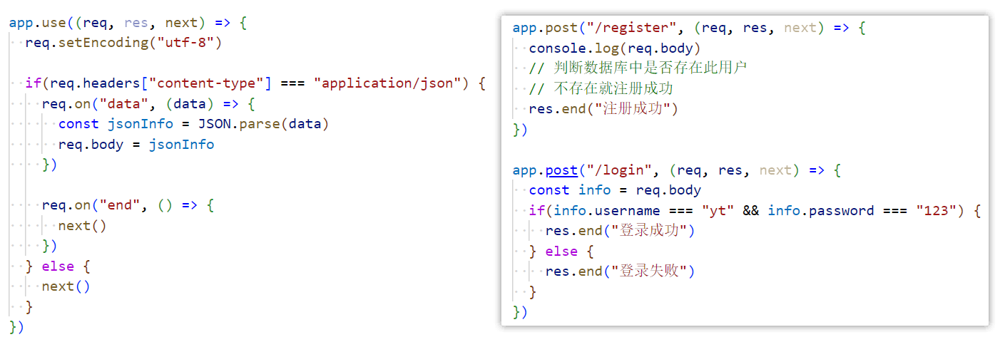

### 1.准备和示例

- 安装express：npm install express
- 代码示例：
  - 如果login路径使用GET方法，或者home路径使用POST方法，会返回一个错误页面

### 2.中间件

- 我们刚才调用了app的post方法和get方法，我们给他传入的第二个参数是一个回调函数，此函数就是中间件
- 当我们发送请求的时候就会执行此回调函数，执行此函数时，会传过来三个参数：request和response
  - 还有第三个参数：next
- 中间件中的操作
  1. 可以执行任意代码
  2. 可以修改request对象和response对象
  3. 可以结束请求-响应周期：response.end()或者response.json({message: "你好啊", code: 200})
     - 如果当前中间件没有结束请求-响应周期，请求将被挂起
  4. 可以执行下一个中间件：
     - 当调用了next方法后，2才会被打印
- 解析图：

### 3.普通的中间件

- 通过use方法注册的中间件是最普通、最简单的中间件
- 通过use方法注册的中间件，无论是什么样的请求方式、什么样的路径都能匹配上：
  - 这就说明当express接收到客户端发送的网络请求时，会在所有的中间件中进行匹配
  - 当找到第一个匹配上的中间件后，就会执行此中间件
- 如果我写两个普通的中间件呢：
  - 2会不会打印，取决于第一个中间件有没有调用next方法
  - 只要你调了next方法，下一个被匹配到中间件就会被执行，即便你调用end方法，也会执行下一个中间件

### 4.符合path和method的中间件

- 符合path的中间件
  - 代码示例：
  - 但是这种没有对请求方式进行限制，可以使用get请求，也可以使用post请求或者其他请求
- 既得符合path又得符合method的中间件
  - 代码示例：

### 5.注册多个中间件

- 代码示例：，只有调用了next才能执行接下来的中间件
- 这有啥用呢？假如你有很多的操作，比如验证身份、查询数据库、返回数据
  - 我们可以把这些东西分步来做

### 6.解析json

- 注册请求：路径：/register，方法：post，参数：username、password
  - 代码示例：
- 登录请求：路径：/login，方法：post，参数：username、password
  - 代码示例：
- 请求示例：
- 代码重构：你会发现上面的代码还是比较麻烦的，我们可以对其进行简化：
  - 但是我们要是每次都这么写那就太麻烦了express为我们提供了一个中间件：，调用json这个函数，返回值是中间件

### 7.解析urlencoded

- 请求示例：
- 代码示例：，虽然可以用，但是报一个警告
  - 直接调用urlencoded方法是在使用querystring，node已经不推荐我们使用了
- 代码修改：，加上它就代表我们在使用qs这个库
  - 打印结果：

### 8.日志记录

- 使用第三方库morgan
- 代码示例：

