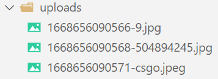

### 1.单文件上传

- 使用第三方库multer
- 请求示例：
- 代码示例：，有的时候就得自己创建文件夹，加上后缀名就可以查看了：

### 2.多文件上传

- 请求示例：
- 代码示例：

### 3.解析formdata

- 一般不会通过formdata来传递数据：
- 代码示例：结果：

### 4.querystring和params的解析

- querystring的解析
  - 请求示例：
  - 代码示例和结果：
- params的解析
  - 请求示例：
  - 代码示例和结果：

### 5.res对象

- 我们一般用end是比较少的，因为我们一般是返回json数据，所以使用json方法比较多：
- 除了以上两个方法还有一个status方法：

### 6.路由

- 代码示例：
- 将路由部分的代码抽取出来：

### 7.静态资源服务器

- 将一个图片文件夹作为静态资源
  - 我们之前上传过很多图片资源，如何才能让用户访问呢？
  - 地址跟上图片名称即可访问：
- 将一个项目作为静态资源
  - 之前我们开发过很多项目，打包之后交给nginx，让nginx作为静态资源服务器，我们也可以交给node
  - 复制一个之前打包的目录：，代码：效果：

### 8.错误处理方案

- 我们在访问服务器的时候并不是每次都是正确的，比如过期的token，比如错误的密码，不存在的用户等
- 当出现这些错误时，我们应该给客户端返回错误信息
  - 方案一：返回http错误码，比如：res.status(401)或者res.json("未授权")
  - 方案二：返回http错误码为200，明明是一个错误的请求，为啥还要返回200，会把错误信息包含进去
    - 举例：res.json({code: -1001, message: "未授权，请检查token"})
    - 示例：
    - 但是这种方式并不优雅，因为正确的代码和错误的代码都在一起
  - 方案三：

