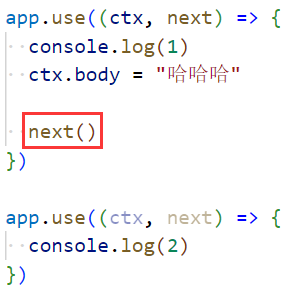

### 1.基础

- 创建一个普通的koa服务器
  - 创建一个普通的koa服务器：
  - 当然既然koa是一个类，按照规范k应该大写

- ctx的解析，请求对象和响应对象都放在了ctx中：
  - 区别在于ctx.res中有end方法，而ctx.response中没有end方法

- 多个中间件
  - 目前和express一样，当执行了next函数才会执行下一个匹配的中间件：

- 区分path和method：，但是自己区分太麻烦了，我们一般会使用路由

### 2.路由的使用

- 代码示例：
- 有一个问题，当我们的方法或者路径没有匹配到的时候，Koa给我们返回的是Not Found
  - 可以这么写：，来处理方法不匹配的问题
  - 返回：Method Not Allowed
- 将路由抽取出来：

### 3.参数的传递和解析

- get请求有两种
  - 第一种params：/:id
    - 示例：
  - 第二种querystring：?name=yt&age=23
    - 示例：
- post请求有三种
  - 第一种json：{"name": "yt", "age": 23}
    - 使用第三方库：koa-bodyparser
    - 示例：
    - 注意不能通过ctx.body去获取数据
    - 那会不会把数据放到ctx.req.body中呢？那要看这个第三方库有没有实现？这个没实现
  - 第二种x-www-form-urlencoded
    - 和上面代码一样，这个第三方库解析过了，既会解析json数据又会解析urlencoded数据
  - 第三种form-data
    - 使用另外两个第三方库：@koa/multer和multer
    - 示例：

### 4.文件上传

- 单文件上传：
  - 信息：
  - 自定义图片名字：
- 多文件上传：

### 5.静态资源服务器

- 第三方库：koa-static
- 代码示例：

