### 1.body的类型

- string类型：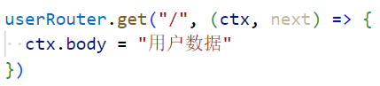
- Buffer类型：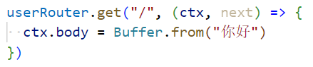
- stream类型：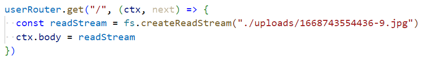
  - 结果：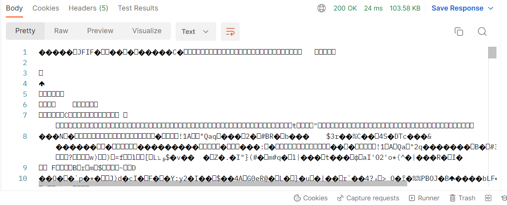
  - 我们要告诉它你要给我展示一张图片：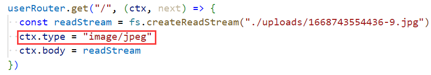
    - 结果：
- array或object类型：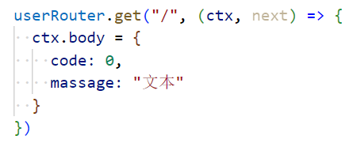
- null类型：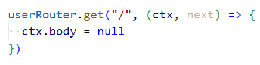
  - 当为null时，会自动设置状态码，当然其他的也会自动设置，设置为200
  - 主动设置状态码：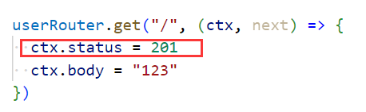

### 2.错误处理

- 代码示例：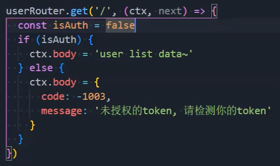
- 统一管理：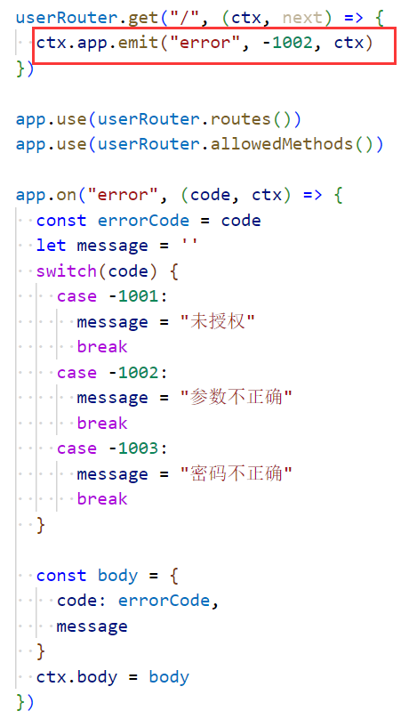

### 3.kao执行顺序（同步）

- 执行完第七行之后，是先执行第13行呢？还是先执行第9行呢？：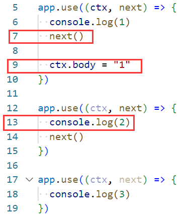
  - 先执行第13行代码
- 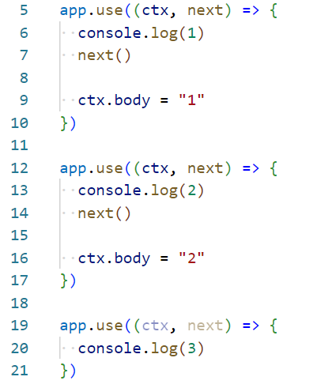先顺序执行：6、7、13、14、20，再逆向执行15、9，所以最后响应1

### 4.koa执行顺序（异步）

- 第10行能不能拿到第27行的结果呢？：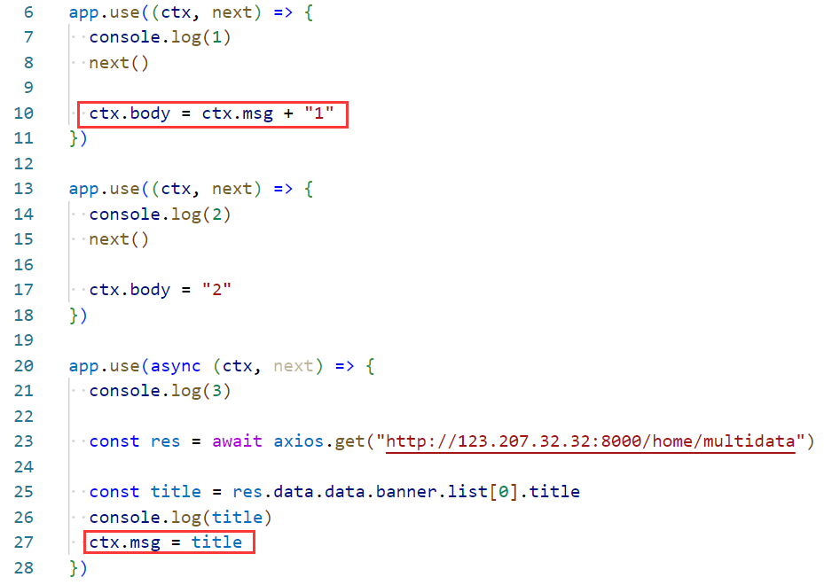
  - 拿不到，如果你的中间件是一个异步函数，当执行完第15行时，结束顺序执行，开始逆向执行
  - 也就是从17行开始往回执行，但是我们希望等到结果：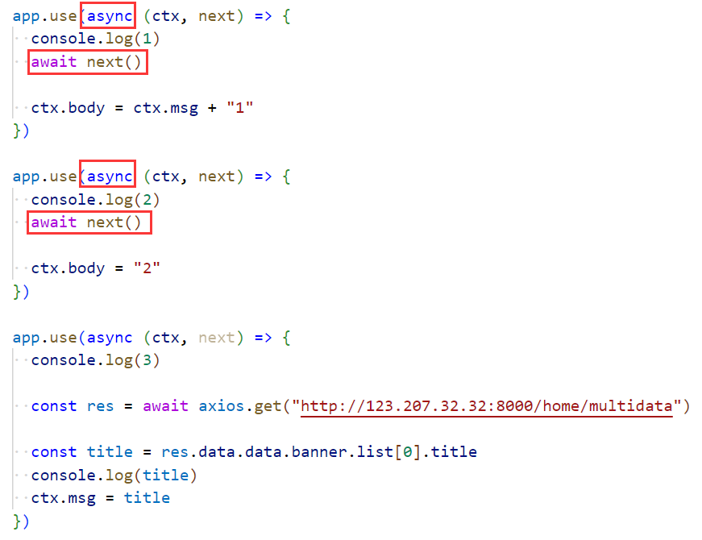，在next前加上await，整体改为异步函数
- 最主要的原因是：next函数的返回值是一个Promise对象

### 5.express执行顺序（异步）

- 就同步代码来说与koa的执行顺序没有区别：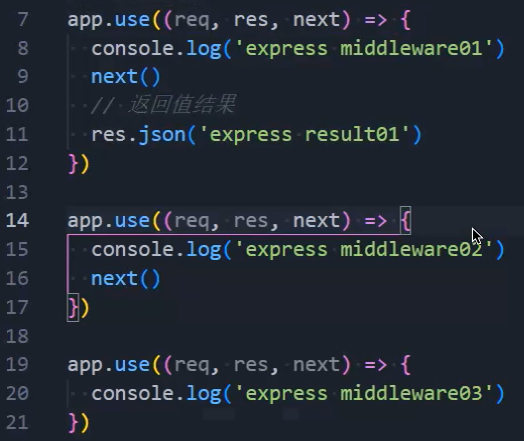
  - 顺序执行：8、9、15、16、20，逆向执行：11
- 我们在2中知道在next前写await可以进行等待，但是在express中是不行的，因为express的next函数的返回值是void类型：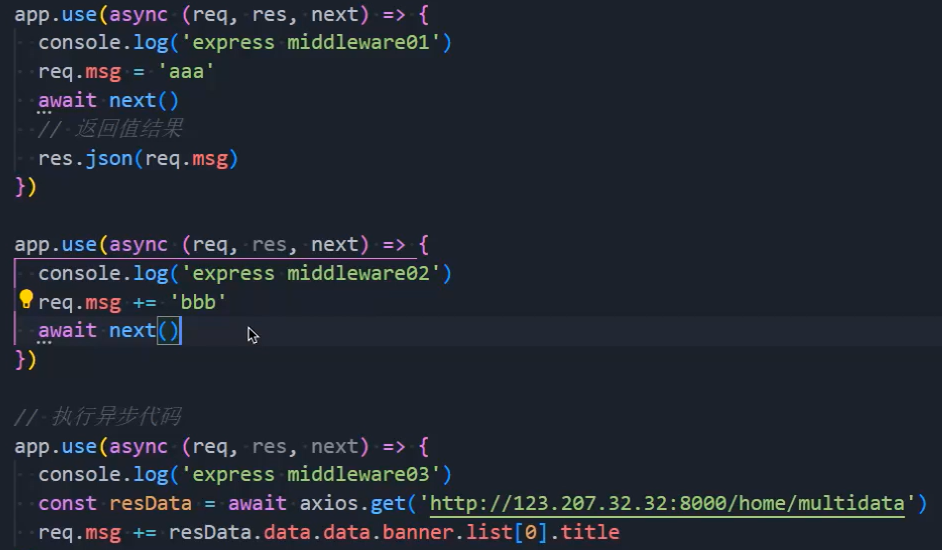，这样做拿不到结果
- 解决办法：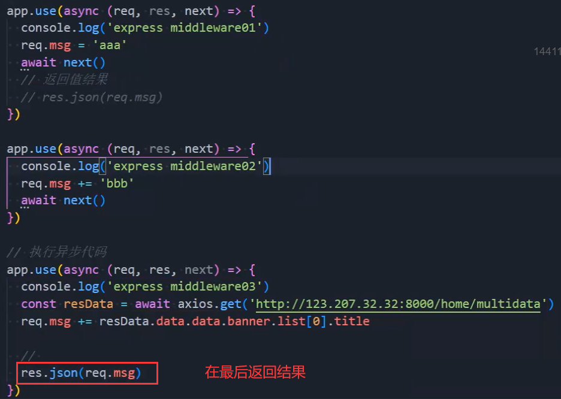，依次往下执行

