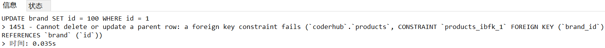

### 1.聚合函数

```mysql
# 求所有手机的价格总和
SELECT SUM(price) totalPrice FROM products;
# 求华为手机的价格总和
SELECT SUM(price) totalPrice FROM products WHERE brand = '华为';
# 求华为手机的平均价格
SELECT AVG(price) totalPrice FROM products WHERE brand = '华为';
# 求手机的最高价格和最低价格
SELECT MAX(price), MIN(price) FROM products;
# 求华为手机的个数
SELECT COUNT(*) FROM products WHERE brand = '华为';
SELECT COUNT(*) FROM products WHERE brand = '苹果';
SELECT COUNT(url) FROM products WHERE brand = '苹果';
# 去重
SELECT COUNT(price) FROM products;
SELECT COUNT(DISTINCT price) FROM products;
```

### 2.Group By

- 事实上聚合函数相当于默认将所有的数据分成了一组
  - 我们前面无论是使用avg还是使用max，都是将所有的结果看成一组来计算的
  - 那么如果我们希望划分多个组：比如华为、苹果、小米等手机分别计算平均价格，应该怎么做呢？
  - 这个时候我们可以使用 GROUP BY

- GROUP BY通常和聚合函数一起使用

  - 表示我们先对数据进行分组，再对每一组数据，进行聚合函数的计算

    ```mysql
    # GROUP BY 的使用
    SELECT brand, AVG(price), COUNT(*), AVG(score) FROM products GROUP BY brand;
    # 以什么分组就加什么你不能把brand变成别的东西，比如变成title
    
    # 在没有分组的情况下是不能加单个字段的比如
    SELECT SUM(price) totalPrice FROM products;
    # 在SUM前面是不能加price、brand
    ```

- Group By的约束

  - 我们希望给Group By查询到的结果添加一些约束，那么我们可以使用：HAVING

    ```mysql
    # HAVING的使用
    # 在我分组的基础上找出平均价格大于2000的手机
    SELECT brand, AVG(price) price, COUNT(*), AVG(score) FROM products GROUP BY brand WHERE price > 2000;
    # 在 GROUP BY 后面加WHERE是语法错误，正确的语法是在 FROM 表名 后面加WHERE
    SELECT brand, AVG(price) price, COUNT(*), AVG(score) FROM products GROUP BY brand HAVING price > 2000;
    
    # 需求：求平均分大于7.5分的手机的平均价格是多少
    SELECT AVG(price) FROM products WHERE score > 7.5;
    # 升级：平均分大于7.5分的手机，按照品牌进行分类，求出平均价格
    SELECT brand, AVG(price) FROM products WHERE score > 7.5 GROUP BY brand;
    ```

- HAVING和WHERE的区别

  - HAVING是对GROUP BY之后的结果做一个筛选，在分组之后
  - WHERE是对我们的表做一些相关的筛选，在分组之前
  
- GROUP BY一般和聚合函数一起使用

### 3.创建多张表

- 假如我们上面的商品表中，对应的品牌还需要包含其他的信息：
  
- 比如品牌的官网，品牌的世界排名，品牌的市值等等；
  
- 如果我们直接在商品中去体现品牌相关的信息，会存在一些问题

  - 一方面，products表中应该表示的都是商品相关的数据，应该有另外一张表来表示brand的数据
  - 另一方面，多个商品使用的品牌一致时，会存在大量的冗余数据

- 所以，我们可以将所有的品牌数据，单独放到一张表中，创建一张品牌表：

  ```mysql
  CREATE TABLE IF NOT EXISTS brand (
  	id INT PRIMARY KEY AUTO_INCREMENT,
  	name VARCHAR(20) NOT NULL,
  	website VARCHAR(100),
  	phoneRank INT
  );
  ```

### 4.插入模拟数据

- 这里刻意没有添加一些品牌


- 并且添加了一些不存在的手机品牌；


```mysql
INSERT INTO brand (name, website, phoneRank) VALUES ('华为', 'www.huawei.com', 2);
INSERT INTO brand (name, website, phoneRank) VALUES ('苹果', 'www.apple.com', 10);
INSERT INTO brand (name, website, phoneRank) VALUES ('小米', 'www.mi.com', 5);
INSERT INTO brand (name, website, phoneRank) VALUES ('oppo', 'www.oppo.com', 12);
INSERT INTO brand (name, website, phoneRank) VALUES ('京东', 'www.jd.com', 8);
INSERT INTO brand (name, website, phoneRank) VALUES ('Google', 'www.google.com', 9);
```

### 5.创建外键

- 将两张表联系起来，我们可以将products中的brand_id关联到brand中的id
  - 如果是创建表添加外键约束，我们需要在创建表的()最后添加如下语句

    ```mysql
    CREATE TABLE IF NOT EXISTS brand (
    	id INT PRIMARY KEY AUTO_INCREMENT,
    	name VARCHAR(20) NOT NULL,
    	website VARCHAR(100),
    	phoneRank INT,
        FOREIGN KEY (brand_id) REFERENCES brand(id)
    );
    ```

  - 如果表已经创建好，额外添加外键
    ```mysql
    # 添加一个brand_id字段
    ALTER TABLE `products` ADD brand_id INT;
    
    # 修改brand_id为外键
    ALTER TABLE `products` ADD FOREIGN KEY (brand_id) REFERENCES brand(id);
    ```

- 现在我们可以将products中的brand_id关联到brand中的id

  ```mysql
  UPDATE products SET brand_id = 1 WHERE brand = '华为';
  UPDATE products SET brand_id = 2 WHERE brand = '苹果';
  UPDATE products SET brand_id = 3 WHERE brand = '小米';
  UPDATE products SET brand_id = 4 WHERE brand = 'oppo';
  ```

### 6.外键存在时更新和删除数据

- 我们来思考一个问题：如果products中引用的外键被更新了或者被删除了，这个时候会出现什么情况呢？

- 我们来进行一个更新操作：比如将brand表中的华为的id更新为100

  ```mysql
  UPDATE brand SET id = 100 WHERE id = 1;
  ```

- 这个时候执行代码是报错的：

### 7.如何进行更新

- 如果我希望可以更新呢？需要修改on delete或者on update的值
- 我们可以给更新或者删除时设置几个值：
  - RESTRICT（默认属性）：当更新或删除某个记录时，会检查该记录是否有关联的外键记录
    - 有的话会报错的， 不允许更新或删除
  - NO ACTION：和RESTRICT是一致的，是在SQL标准中定义的
  - CASCADE：当更新或删除某个记录时，会检查该记录是否有关联的外键记录，有的话
    - 更新：那么会更新对应的记录
    - 删除：那么关联的记录会被一起删除掉
  - SET NULL：当更新或删除某个记录时，会检查该记录是否有关联的外键记录，有的话
    - 将对应的值设置为 NULL

### 8.修改外键更新时的动作

- 第一步：查看表结构：

  ```mysql
  SHOW CREATE TABLE `products`;
  ```
  - 执行命令之后是下面的东西

    ```mysql
    CREATE TABLE `products` (
      `id` int NOT NULL AUTO_INCREMENT,
      `brand` varchar(20) DEFAULT NULL,
      `title` varchar(100) NOT NULL,
      `price` double NOT NULL,
      `score` decimal(2,1) DEFAULT NULL,
      `voteCnt` int DEFAULT NULL,
      `url` varchar(100) DEFAULT NULL,
      `pid` int DEFAULT NULL,
      `brand_id` int DEFAULT NULL,
      PRIMARY KEY (`id`),
      KEY `brand_id` (`brand_id`),
      CONSTRAINT `products_ibfk_1` FOREIGN KEY (`brand_id`) REFERENCES `brand` (`id`)
    ) ENGINE=InnoDB AUTO_INCREMENT=109 DEFAULT CHARSET=utf8mb4 COLLATE=utf8mb4_0900_ai_ci
    ```

    - 这个时候，我们可以知道外键的名称是products_ibfk_1。

- 第二步：删除之前的外键

  ```mysql
  ALTER TABLE `products` DROP FOREIGN KEY products_ibfk_1;
  ```

- 第三步：添加新的外键，并且设置新的action

  ```mysql
  ALTER TABLE `products` ADD FOREIGN KEY (brand_id) REFERENCES brand(id) ON UPDATE CASCADE ON DELETE RESTRICT;
  ```

- 再来更新就没有问题了

  ```mysql
  UPDATE brand SET id = 100 WHERE id = 1;
  ```

  

