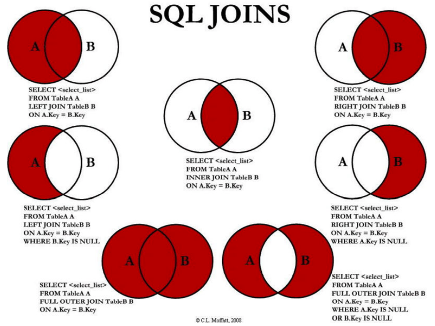
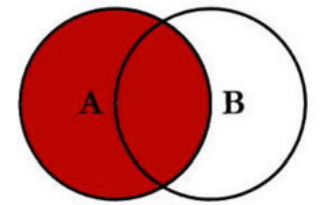
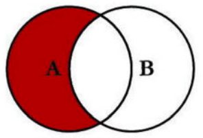
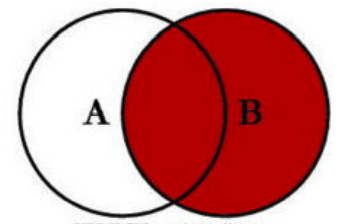
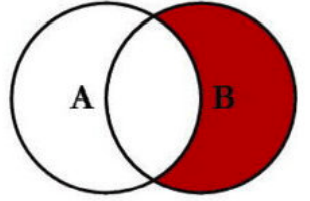
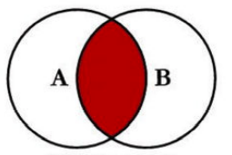
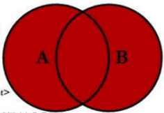
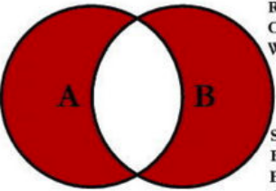

### 1.什么是多表查询

- 如果我们希望查询到产品的同时，显示对应品牌的相关信息，因为数据是存放在两张表中，所以这个时候就需要进行多表查询

- 如果我们直接通过查询语句希望在多张表中查询到数据，这个时候是什么效果呢？

  ```mysql
  SELECT * FROM `products`, `brand`;
  ```

- 我们会发现一共有648条数据，这个数据量是如何得到的呢？
  - 第一张表的108条 * 第二张表的6条数据
  - 也就是说第一张表中每一条数据，都会和第二张表中的每一条数据结合一次
  - 这个结果我们称之为笛卡尔乘积，也称之为直积，表示为 X*Y

- 但是事实上很多的数据是没有意义的，比如华为和苹果、小米的品牌结合起来的数据就是没有意义的，我们可不可以进行筛选呢？

  - 使用where来进行筛选

    ```mysql
    SELECT * FROM `products`, `brand` WHERE `products`.brand_id = `brand`.id;
    ```

    - 表示在查询到笛卡尔乘积后的结果中，把符合products.brand_id = brand.id条件的数据给过滤出来

### 2.多表之间的连接

- 事实上我们想要的效果并不是这样的，而且我们想要获取表中的某些特定数据，这个时候我们可以使用 SQL JOIN 操作
- 左连接、右连接、内连接、全连接：

### 3.左连接

- 如果我们希望获取到的是左边所有的数据（以左表为主）
  - 这个时候就表示无论左边的表是否有对应的brand_id的值对应右边表的id，左边的数据都会被查询出来
  - 这个也是开发中使用最多的情况，它的完整写法是LEFT [OUTER] JOIN，但是OUTER是可以省略的

- 查询所有的手机（包括没有品牌信息的手机）以及对应的品牌：

  ```mysql
  SELECT * FROM products LEFT JOIN brand ON products.brand_id = brand.id;
  ```

- 查询没有对应品牌数据的手机：

  ```mysql
  SELECT * FROM products LEFT JOIN brand ON products.brand_id = brand.id WHERE brand.id IS NULL;
  ```

### 4.右连接

- 如果我们希望获取到的是右边所有的数据（以右表为主）
  - 这个时候就表示无论左边的表中的brand_id是否和右边表中的id有对应，右边的数据都会被查询出来
  - 右连接在开发中没有左连接常用，它的完整写法是RIGHT [OUTER] JOIN，但是OUTER是可以省略的

- 查询所有的品牌（没有对应的手机数据，品牌也显示出来）以及对应的手机数据：

  ```mysql
  SELECT * FROM products RIGHT JOIN brand ON products.brand_id = brand.id;
  ```

- 查询没有对应手机品牌的数据：

  ```mysql
  SELECT * FROM products RIGHT JOIN brand ON products.brand_id = brand.id WHERE products.brand_id IS NULL;
  ```

### 5.内连接

- 事实上内连接是表示左边的表和右边的表都有对应的数据关联：
  - 内连接在开发中偶尔也会使用，看自己的场景
  - 内连接有其他的写法：INNER JOIN、CROSS JOIN 或者 JOIN 都可以

  ```mysql
  SELECT * FROM products JOIN brand ON products.brand_id = brand.id;
  ```

- 我们会发现它和之前的下面写法是一样的效果

  ```mysql
  SELECT * FROM `products`, `brand` WHERE `products`.brand_id = `brand`.id;
  ```

- 但是他们代表的含义并不相同

  - SQL语句一：在两张表连接时就会约束数据之间的关系，来决定之后查询的结果
  - SQL语句二：先计算出笛卡尔乘积，在笛卡尔乘积的数据基础之上再进行where条件的筛选

- 做进一步的筛选

  ```mysql
  SELECT * FROM products JOIN brand ON products.brand_id = brand.id WHERE price = 3699;
  ```

### 6.全连接

- SQL规范中全连接是使用FULL JOIN，但是MySQL中并没有对它的支持，我们需要使用 UNION 来实现

- 左连接和右连接做一个联合，重复的会自动删掉：

  联合

  ```mysql
  (SELECT * FROM products LEFT JOIN brand ON products.brand_id = brand.id)
  UNION
  (SELECT * FROM products RIGHT JOIN brand ON products.brand_id = brand.id)
  ```

- 去除掉为空的部分：

  联合

  ```mysql
  (SELECT * FROM products LEFT JOIN brand ON products.brand_id = brand.id WHERE brand.id IS NULL)
  UNION
  (SELECT * FROM products RIGHT JOIN brand ON products.brand_id = brand.id WHERE products.brand_id IS NULL)
  ```

  

