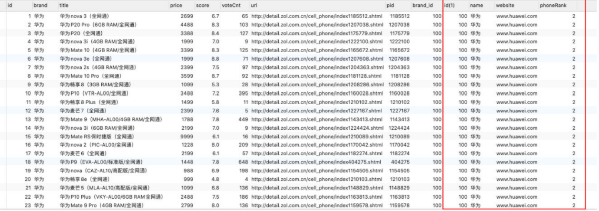
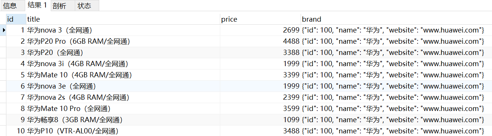
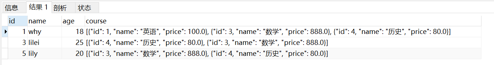

### 1.数据准备

- 在开发中我们还会遇到多对多的关系：
  - 比如学生可以选择多门课程，一个课程可以被多个学生选择
  - 这种情况我们应该在开发中如何处理呢？

- 我们先建立两张表

  ```mysql
  CREATE TABLE IF NOT EXISTS students(
  	id INT PRIMARY KEY AUTO_INCREMENT,
  	name VARCHAR(20) NOT NULL,
  	age INT
  );
  
  CREATE TABLE IF NOT EXISTS courses(
  	id INT PRIMARY KEY AUTO_INCREMENT,
  	name VARCHAR(20) NOT NULL,
  	price DOUBLE
  );
  ```

- 为表插入数据

  ```mysql
  INSERT INTO `students` (name, age) VALUES('why', 18);
  INSERT INTO `students` (name, age) VALUES('tom', 22);
  INSERT INTO `students` (name, age) VALUES('lilei', 25);
  INSERT INTO `students` (name, age) VALUES('lucy', 16);
  INSERT INTO `students` (name, age) VALUES('lily', 20);
  INSERT INTO `courses` (name, price) VALUES ('英语', 100);
  INSERT INTO `courses` (name, price) VALUES ('语文', 666);
  INSERT INTO `courses` (name, price) VALUES ('数学', 888);
  INSERT INTO `courses` (name, price) VALUES ('历史', 80);
  ```

### 2.创建关系表

- 我们需要一个关系表来记录两张表中的数据关系：创建关系表

  ```mysql
  # 建立关系表
  CREATE TABLE IF NOT EXISTS students_select_courses(
  	id INT PRIMARY KEY AUTO_INCREMENT,
  	student_id INT NOT NULL,
  	course_id INT NOT NULL,
  	FOREIGN KEY (student_id) REFERENCES students(id) ON UPDATE CASCADE,
  	FOREIGN KEY (course_id) REFERENCES courses(id) ON UPDATE CASCADE
  );
  ```

- 学生选课

  ```mysql
  INSERT INTO students_select_courses (student_id, course_id) VALUES (1, 1);
  INSERT INTO students_select_courses (student_id, course_id) VALUES (1, 3);
  INSERT INTO students_select_courses (student_id, course_id) VALUES (1, 4);
  
  INSERT INTO students_select_courses (student_id, course_id) VALUES (3, 3);
  INSERT INTO students_select_courses (student_id, course_id) VALUES (3, 4);
  
  INSERT INTO students_select_courses (student_id, course_id) VALUES (5, 4);
  INSERT INTO students_select_courses (student_id, course_id) VALUES (5, 3);
  ```

### 3.多对多数据查询

- 查询所有有选课的学生选择了哪些课程，没有选课的学生就不用显示出来了

  ```mysql
  SELECT stu.id id, stu.name stuName, stu.age stuAge, cs.id csId, cs.name csName, cs.price csPrice
  FROM students stu 
  JOIN students_select_courses ssc ON stu.id = ssc.student_id
  JOIN courses cs ON ssc.course_id = cs.id;
  ```

- 查询所有有选课的学生的选课情况

  ```mysql
  SELECT stu.id id, stu.name stuName, stu.age stuAge, cs.id csId, cs.name csName, cs.price csPrice
  FROM students stu
  LEFT JOIN students_select_courses ssc ON stu.id = ssc.student_id
  LEFT JOIN courses cs ON ssc.course_id = cs.id;
  ```

- 查询哪些学生是没有选课的

  ```mysql
  SELECT stu.id id, stu.name stuName, stu.age stuAge, cs.id csId, cs.name csName, cs.price csPrice
  FROM students stu
  LEFT JOIN students_select_courses ssc ON stu.id = ssc.student_id
  LEFT JOIN courses cs ON ssc.course_id = cs.id
  WHERE cs.id IS NULL;
  ```

- 查询哪些课程是没有被选择的

  ```mysql
  SELECT stu.id id, stu.name stuName, stu.age stuAge, cs.id csId, cs.name csName, cs.price csPrice
  FROM students stu
  RIGHT JOIN students_select_courses ssc ON stu.id = ssc.student_id
  RIGHT JOIN courses cs ON ssc.course_id = cs.id
  WHERE stu.id IS NULL;
  ```

- 某一个学生选择了哪些课程（why）

  ```mysql
  SELECT stu.id id, stu.name stuName, stu.age stuAge, cs.id csId, cs.name csName, cs.price csPrice
  FROM students stu
  LEFT JOIN students_select_courses ssc ON stu.id = ssc.student_id
  LEFT JOIN courses cs ON ssc.course_id = cs.id
  WHERE stu.id = 1;
  ```

### 4.多对多转对象

- 前面我们学习的查询语句，查询到的结果通常是一张表，比如查询手机+品牌信息

  ```mysql
  SELECT * FROM products LEFT JOIN brand ON products.brand_id = brand.id;
  ```

  

- 但是在真实开发中，红色圈起来的部分应该放入到一个对象中，那么我们可以使用下面的查询方式
  - 这个时候我们要用 JSON_OBJECT

    ```mysql
    # 将联合查询到的数据转成对象（一对多）
    SELECT 
    	products.id id, products.title title, products.price price,
    	JSON_OBJECT('id', brand.id, 'name', brand.name, 'website', brand.website) brand
    FROM products
    LEFT JOIN brand 
    ON products.brand_id = brand.id;
    ```

    

### 6.多对多转数组

- 在多对多关系中，我们希望查询到的是一个数组
  - 比如一个学生的多门课程信息，应该是放到一个数组中的

  - 数组中存放的是课程信息的一个个对象

  - 这个时候我们要 JSON_ARRAYAGG 和 JSON_OBJECT 结合来使用

    ```mysql
    # 将查询到的多条数据组织成对象放入到一个数组中（多对多）
    SELECT 
    	stu.id id, stu.name, stu.age,
    	JSON_ARRAYAGG(JSON_OBJECT('id', cs.id, 'name', cs.name, 'price', cs.price)) course
    FROM students stu 
    JOIN students_select_courses ssc ON stu.id = ssc.student_id
    JOIN courses cs ON ssc.course_id = cs.id
    GROUP BY stu.id;
    ```

    

