### 1.前期准备

- koa @koa/router koa-bodyparser @types/node 以及其他类型声明包
- 加入tsconfig.json文件，加入脚本：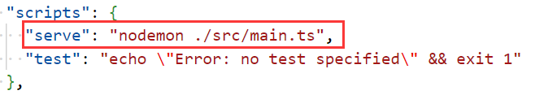
- 服务器简单搭建：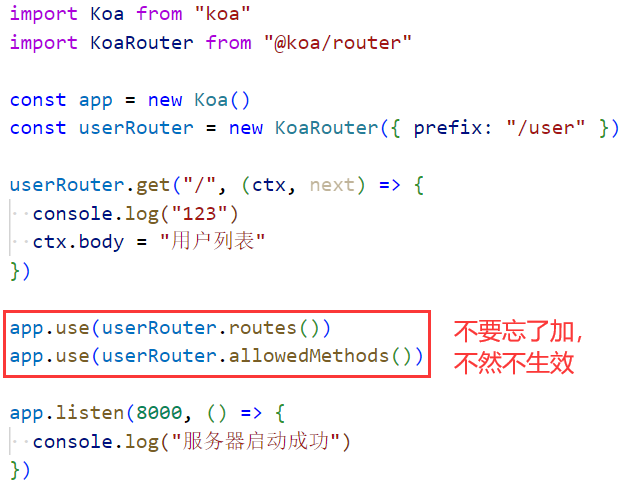

### 2.配置文件

- 目录结构：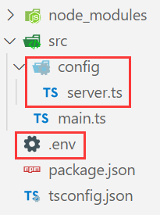，在.env文件中定义端口号:
- 安装dotenv库，通过dotenv加载变量，在serve.ts中导出端口号：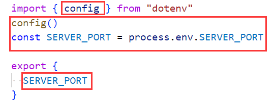
- 在main.ts中导入并使用端口号：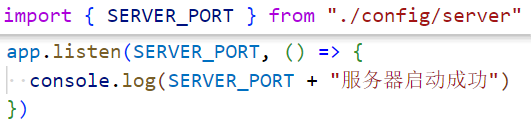

### 3.路由和app的抽取

- 目录结构：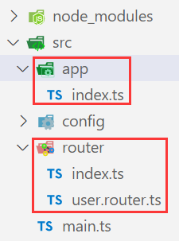

- 路由的抽取：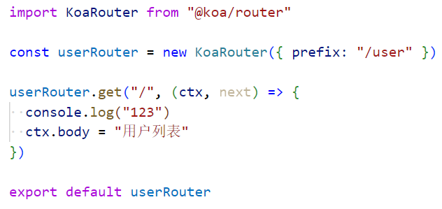

  

- app的抽取：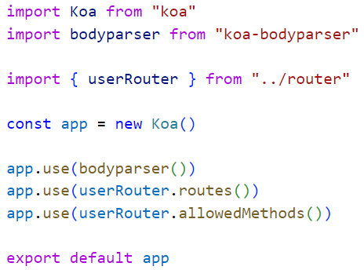

  

- main.ts剩余代码：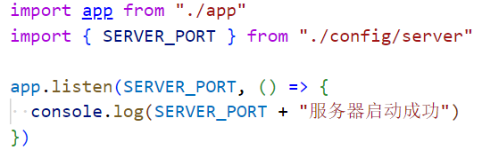

### 4.用户注册接口所引发的问题

- 代码示例：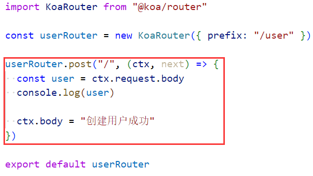
- 问题一：代码报错，这是因为我们使用了bodyparser，还缺少co-body和qs库，安装即可
- 问题二：用户注册接口的逻辑可不仅仅只有这么一点，而且我们以后还要写很多关于用户的接口
  - 所以我们应该进行代码抽取，目录结构：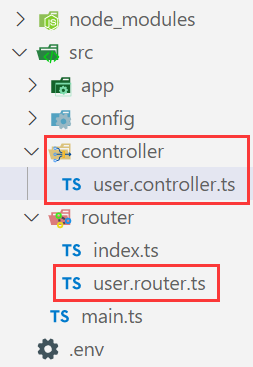
  - user.controller.ts：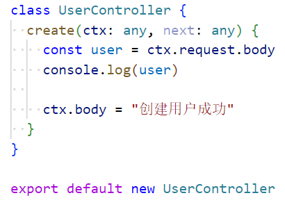
  - user.router.ts：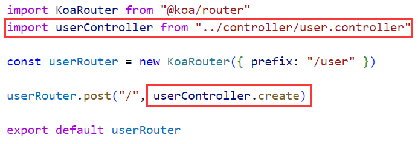
- 问题三：在controller中的代码还需要进行数据库方面的操作，这些操作也是很复杂的，也需要抽取
  - 目录结构：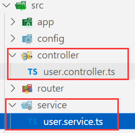
  - user.service.ts：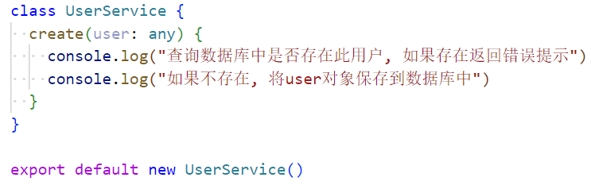
  - user.controller.ts：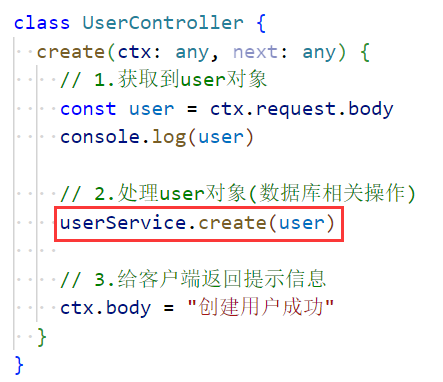

### 5.数据库相关操作

- 安装数据库驱动：mysql2
- 目录结构：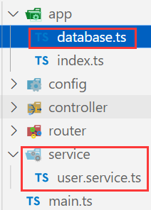，database.ts：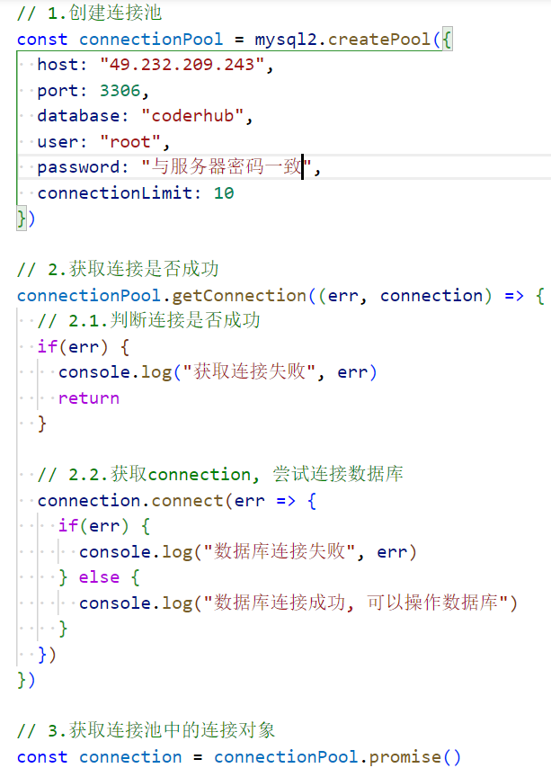
- user.service.ts：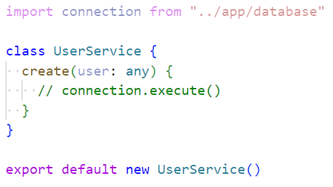

### 6.向数据库存储一个用户

- user.service.ts：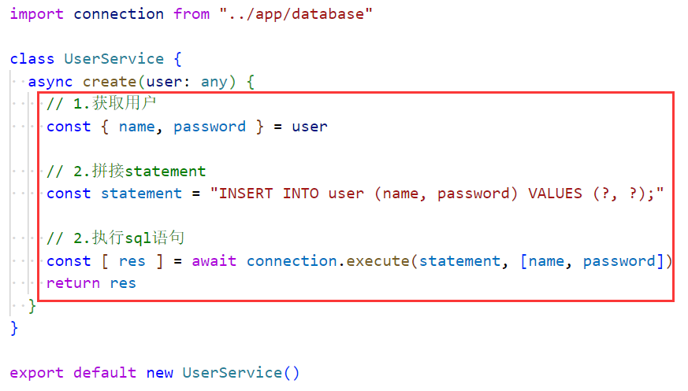

  

- user.controller.ts：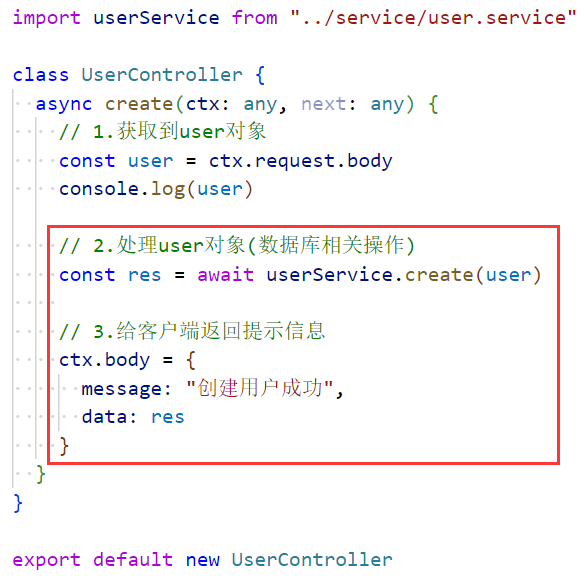

- 请求和结果：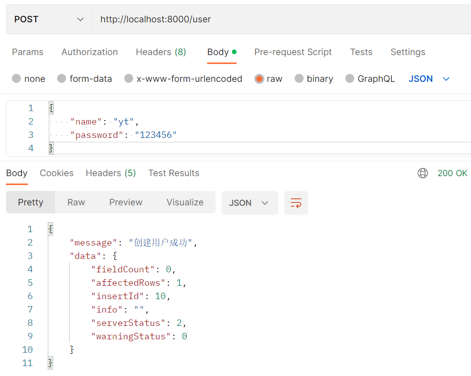

### 7.分层架构总结

- 目录结构：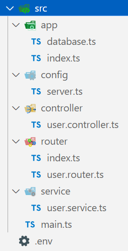
- main.ts：入口文件，监听某一个端口，同时启动服务器
  - .env和config：设置端口号
  - app中的index.ts：应用路由，并将app导出，供main.ts使用
- router文件夹：书写路由，但是路由的中间件交给其他文件
  - controller文件夹：书写路由中间件，但是一些数据库的操作要交给其他文件
- service文件夹：书写数据库相关操作，具体执行哪些sql语句等
  - app中的database.ts：连接数据库，给到service中的文件使用

- main.ts => config/server.ts => .env
  - 主文件（监听端口号启动服务器） => 端口号的寻找和导出 => 存储端口号
- main.ts => app/index.ts => router/index.ts => router/user.router.ts => controller/user.controller.ts => service/user.service.ts => app/database.ts
  - 主文件 => 生效路由/解析/规则 => 创建路由/应用中间件 => 书写中间件/获取传递过来的参数/数据库操作/给客户端返回结果 => 执行sql语句/进行相关判断 => 连接数据库/提供连接