### 1.验证客户端传递过来的数据

- user.controller.ts，在中间件中进行判断：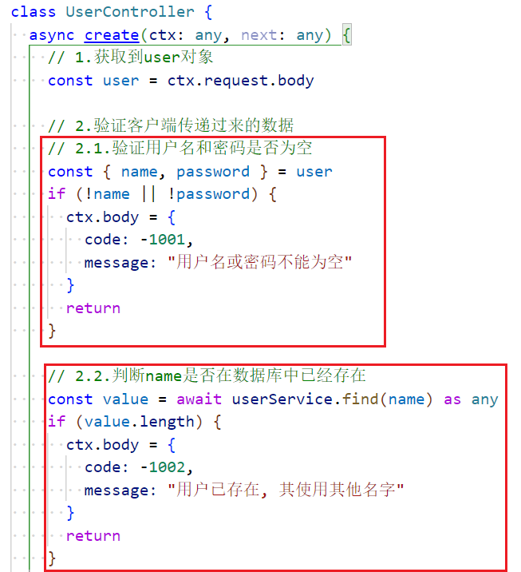
- user.service.ts，执行sql语句：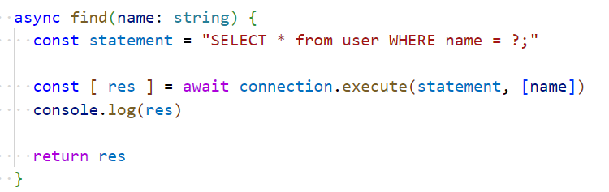
- 代码重构，将user.controller.ts中的验证逻辑抽取到user.router.ts，就是多加了一个中间件，这个中间件都通过了，就会执行next函数，才会开始执行下一个中间件：
  - 但是这样做也是很复杂的，所以还需要抽取

### 2.验证中间件的代码抽取

- 目录结构：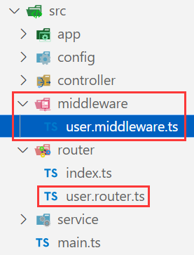，user.middleware.ts：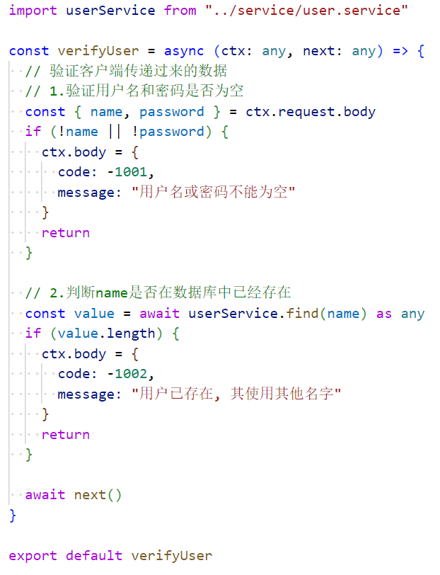
- user.router.ts，应用中间件：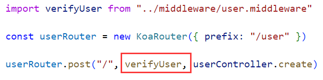

### 3.错误处理代码抽取

- 目录结构：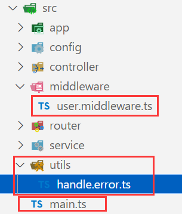，utils/handle.error.ts：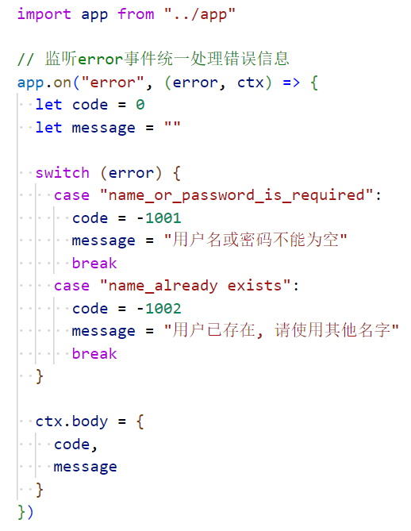
- main.ts，使处理错误的文件生效：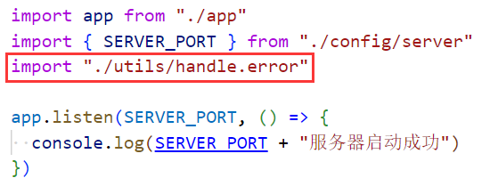
- user.middleware.ts重构代码，发射error事件：

### 4.常量抽取

- 目录结构：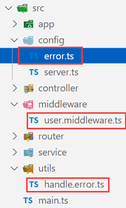

- config/error.ts：

- utils/handle.error.ts：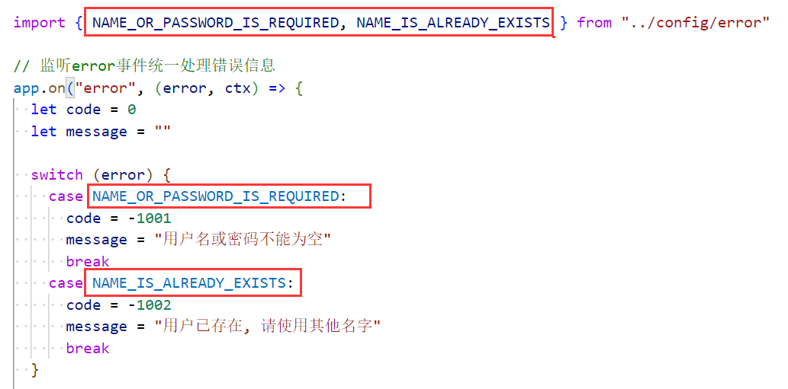
- user.middleware.ts：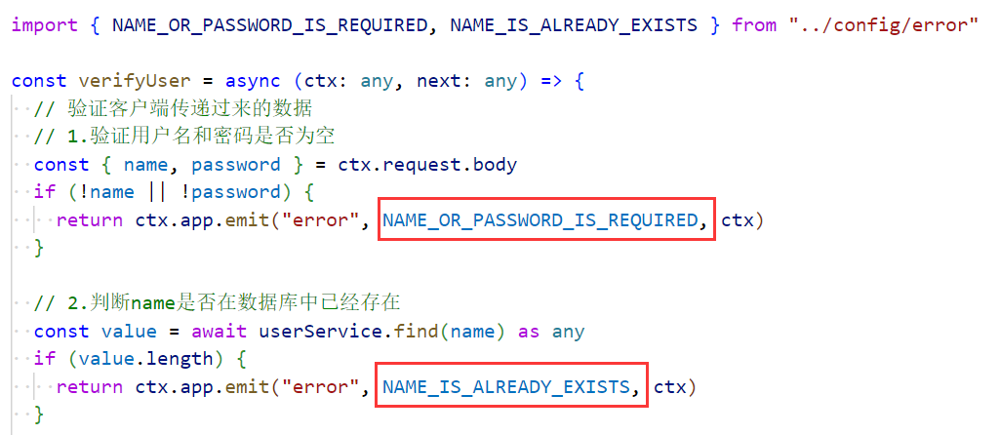

### 5.密码加密

- 对用户传递过来的密码进行加密，目录结构：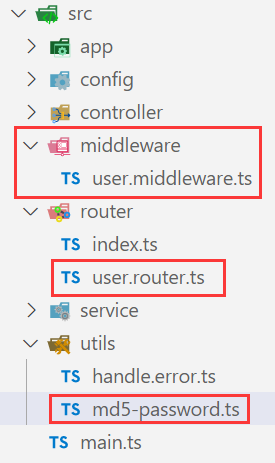
- md5-password.ts，通过md5进行加密：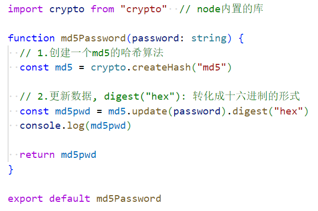

- user.middleware.ts，加密传递过来的密码：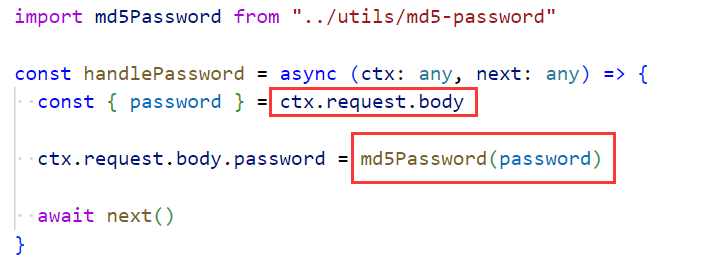
- user.router.ts，应用中间件：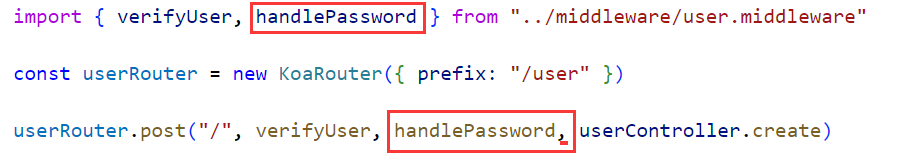

- 效果：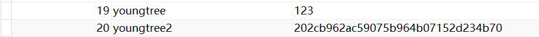