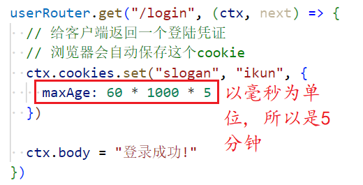

### 1.登录凭证

- 之前的两份笔记已经将注册的整体逻辑讲完了
- 接下来就应该讲登录相关的功能和知识了
- 下面我们就来说一说登录之后，返回凭证的问题
- 首先http是一个无状态的协议
  - 假如你通过账号密码登录了某一个网站
  - 你想要看一下自己的信息，你需要重新发起请求，但是http是一个无状态的协议
  - 所以你是拿不到自己的信息的
  - 那怎么办？
- 输入账号和密码点击登录，就等同于你向房东交了钱并签署了租房协议
- 登录成功后，服务器会给你一个凭证，就等同于房东交给你一把钥匙
- 你通过凭证查看自己的信息，就等同于你去用钥匙开门，查看房间

### 2.cookie

- 浏览器发送网络请求时，会自动携带上cookie
- cookie保存在客户端，分为内存cookie和硬盘cookie
  - 内存cookie由浏览器来维护，保存在内存在，浏览器关闭就会消失，类似于sessionStorage
  - 硬盘cookie保存在硬盘中，会有一个过期时间，用户可以手动清理，或者等其过期，才会被清理掉
- 如何判断一个cookie是内存cookie还是硬盘cookie呢？
  - 没有设置过期时间，默认是内存cookie，关闭浏览器时会自动消失
  - 有设置过期时间，但是设置的过期时间不能 <= 0，也就是过期时间必须 > 0，此时就是硬盘cookie

### 3.设置cookie

- 内存cookie
  - 点击按钮设置cookie：
  - 将页面关闭重新输入地址，cookie消失
- 硬盘cookie
  - 设置过期时间：，name在30秒后过期，age在60秒后过期
  - 效果：
  - 删除cookie将过期时间设置为0即可

### 4.cookie常见属性

- expires：设置Date.toUTCString()
- max-age：一年：60 * 60 * 24 * 365，一个月：60 * 60 * 24 * 30，一周：60 * 60 * 24 * 7
- Domain：默认是origin，不包含子域名
  - 给www.baidu.com设置了cookie，当访问：www.baidu.com/user/list，会携带cookie
  - 但是访问：map.baidu.com、tieba.baidu.com、news.baidu.com等子域名时不携带当前cookie
  - 怎样才能让子域名也可以携带当前cookie呢？让服务器设置Domain=baidu.com;即可
- Path：必须以什么路径开头，比如这样设置：Path=/user
  - 那么www.baidu.com/user、www.baidu.com/user/list、www.baidu.com/user/delete，都可以携带此cookie
- js获取cookie：clg(document.cookie)

### 5.服务器设置cookie

- 在服务器为客户端设置cookie：，当你通过浏览器访问/user/login时
  - 浏览器会自动设置此cookie：
  - 设置过期时间：
- 在服务器拿到浏览器携带过来的cookie：
  - 当你访问/user/list时，会自动把cookie携带过来，客户端不需要写任何一行代码

### 6.对cookie进行加密

- 如果你的cookie是明文的，就很容易被伪造，所以我们要对cookie进行加密操作
- 这就得使用到session了，安装koa-session
- 初步设置session：
  - 结果：
- 进一步加密（加盐）：
  - 结果：
- 获取cookie与之前代码一样

- session就是来帮助我们对cookie进行加密的，不要和sessionStorage搞混了