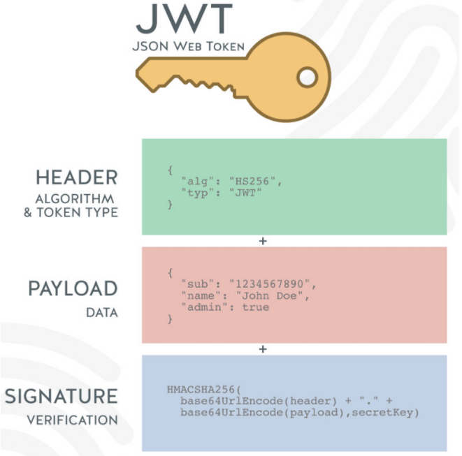
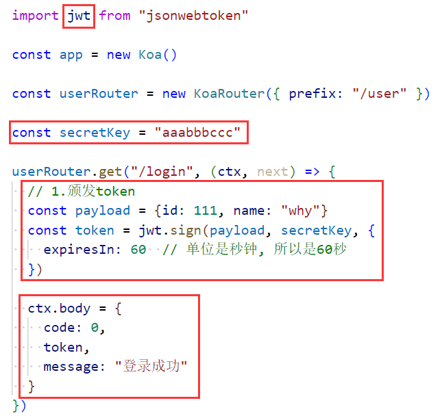
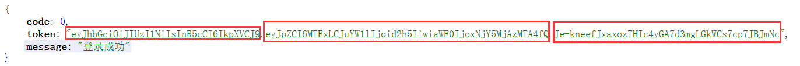
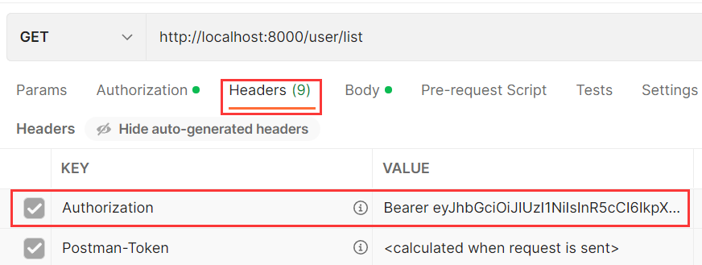
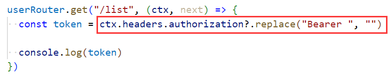
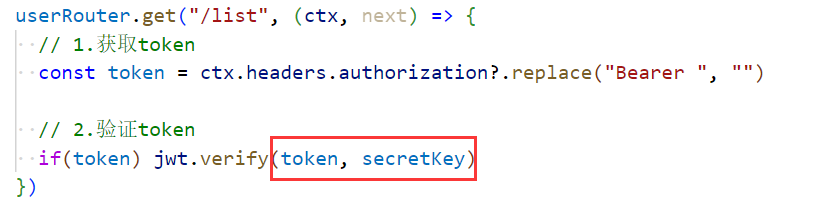
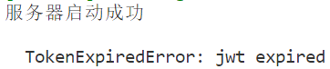
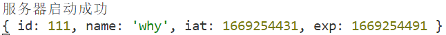
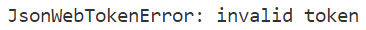
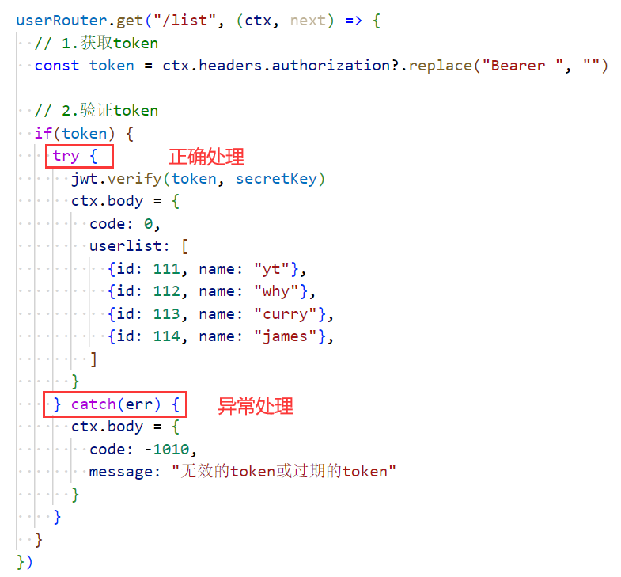

### 1.cookie的缺点

- cookie被附加在每一个http请求中，增加了流量消耗、明文传递，存在安全隐患、4kb的存储限制
- 浏览器不需要手动设置cookie，但是对于IOS、Android，必须手动设置cookie
- 在分布式系统和服务器集群中，如何保证其他系统也可以正确的解析我们的session呢？

### 2.JWT实现Token的机制：

- header
  - alg：采用的加密算法，默认是 HMAC SHA256（HS256），采用同一个密钥进行加密和解密
  - typ：JWT，固定值，通常都写成 JWT 即可
  - 会通过base64Url算法进行编码
- payload
  - 携带的数据，比如我们可以将用户的id和name放到payload中
  - 默认也会携带iat（issued at），令牌的签发时间
  - 我们也可以设置过期时间：exp（expiration time）
  - 会通过base64Url算法进行编码
- signature
  - 设置一个secretKey，通过将前两个的结果合并后进行HMACSHA256的算法
  - HMACSHA256(base64Url(header)+.+base64Url(payload), secretKey)
  - 但是如果secretKey暴露是一件非常危险的事情，因为之后就可以模拟颁发token， 也可以解密token

### 3.颁发token

- 安装：jsonwebtoken
- 代码示例：，结果：
  - 三个红框分别是：header、payload、signature

### 4.携带token

- 请求示例：
  - 本质是放在headers中：
- 获取token：
  - 解密token：，但是经过我们长时间的操作，这个token早就过期了，所以会抛出异常：
  - 如果没过期就可以拿到结果：
  - 如果你的token不对，会抛出异常：，无效的token
- 处理token：
  - 对于这种对称加密，secretKey就显得格外重要了，避免暴露，但是这种对称加密问题很大

