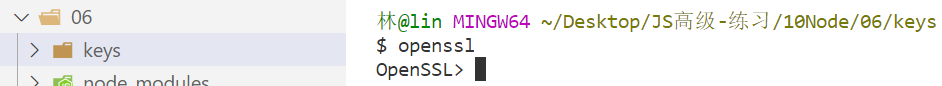
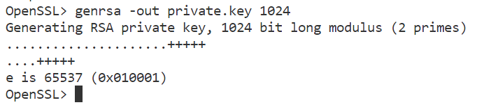
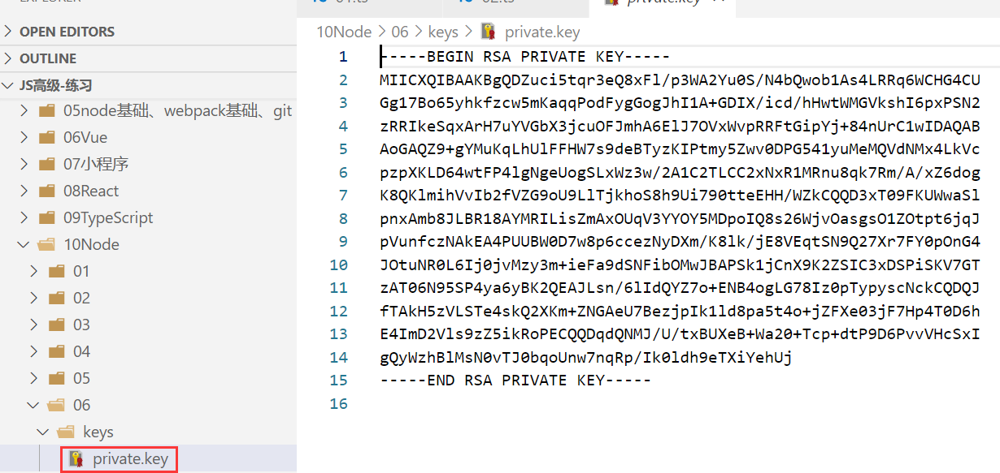
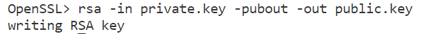
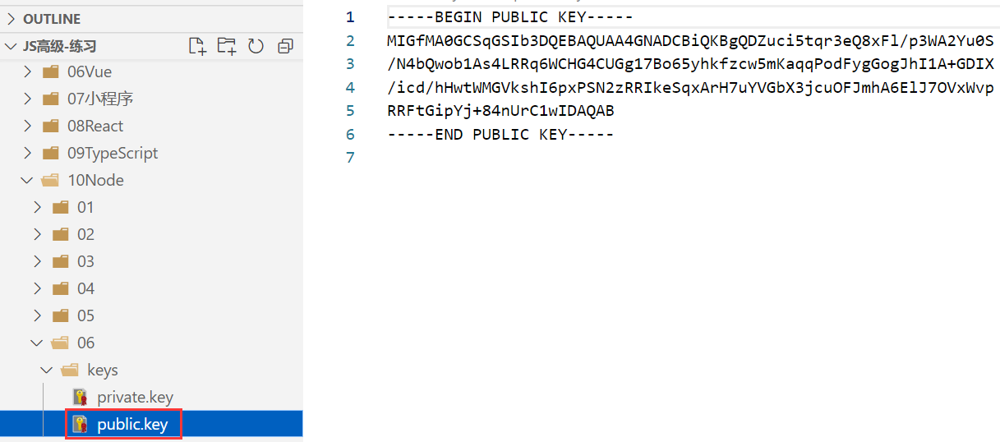
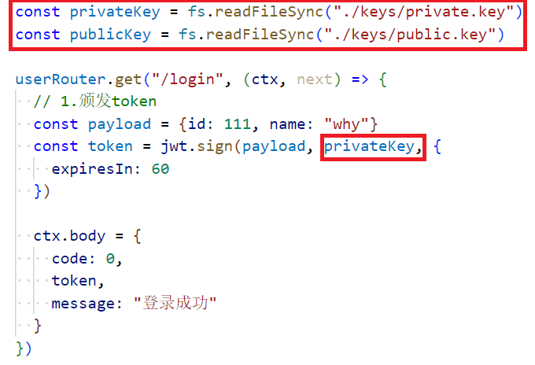
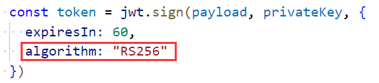
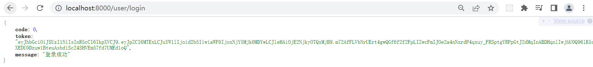
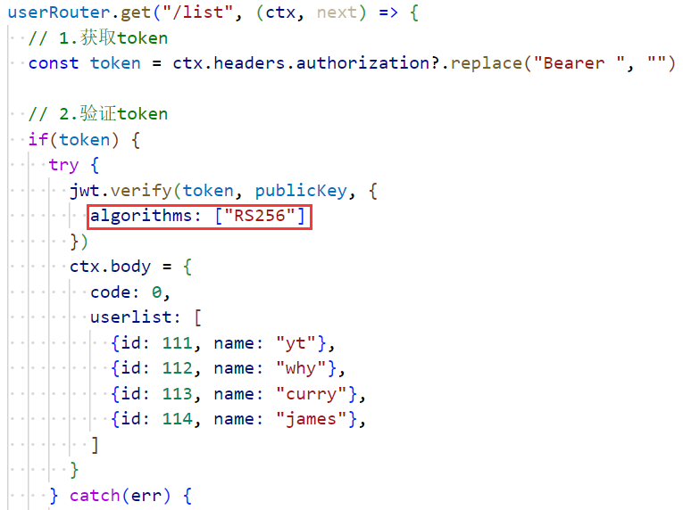
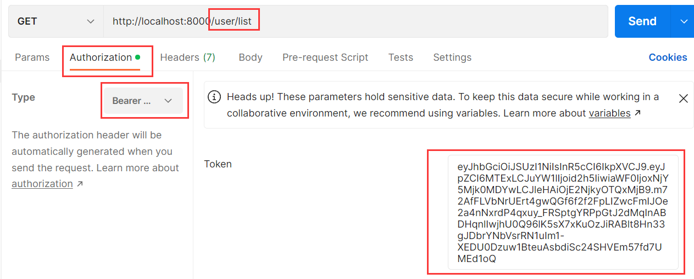

### 1.对称加密的缺点

- 在分布式系统中，每一个子系统都需要获取到秘钥
- 拿到秘钥后，这个子系统既可以发布令牌，又可以验证令牌
- 但是这样是不安全的，对于一些资源服务器来说，只需要有验证令牌的能力就可以了

- 要想解决这个问题就得使用非对称加密，RS256
  - 私钥：发布令牌
  - 公钥：验证令牌
- 需要使用openssl来生成公钥和私钥

### 2.生成公钥和私钥

- 在keys文件夹目录下敲openssl回车：
- 生成私钥：
  - genrsa：生成rsa的私钥，-out：输出，private.key：私钥文件名，1024：长度
  - 此时在keys文件夹中生成private.key文件，这个就是私钥：
- 利用私钥生成公钥：
  - rea：加密算法，-in private.key：输入私钥，-pubout：公钥输出，-out public.key：输出public.key文件
  - 在keys文件中生成public.key文件：

### 3.使用公钥和私钥

- 颁发token：
  - 这样做，少做了一步，没有传算法：
  - 结果：
- 验证token：

