### 1.创建登录路由

- 目录结构和代码示例：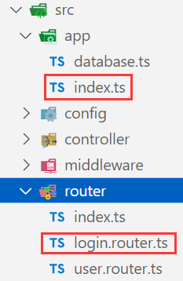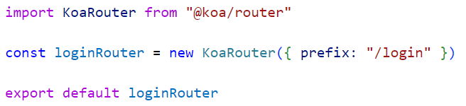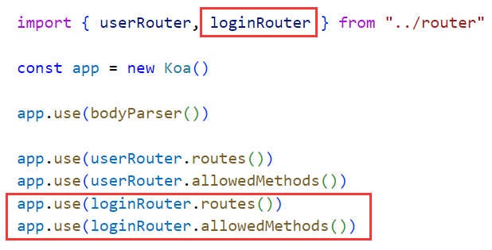
- 代码结构：目录结构：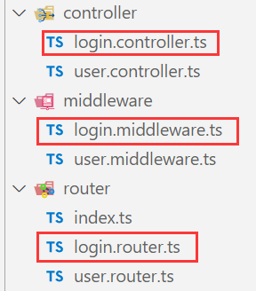，middleware中进行验证，判断密码是否为空以及其他验证，验证通过，进入controller中间件，颁发令牌
  - login.router：注册中间件：
  - login.middleware：verifyLogin中间件处理验证问题：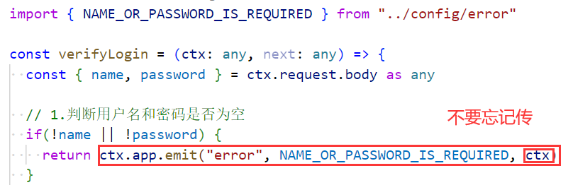
  - login.controller.ts：sign中间件处理颁发令牌问题：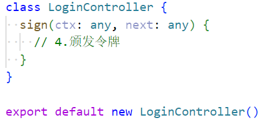

### 2.查询数据库

- 验证用户是否存在：目录结构：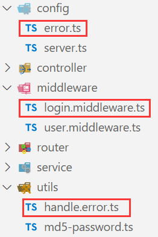，error：错误常量，middleware调用数据库操作，handle.error：处理错误
- 验证用户名是否存在，密码是否正确：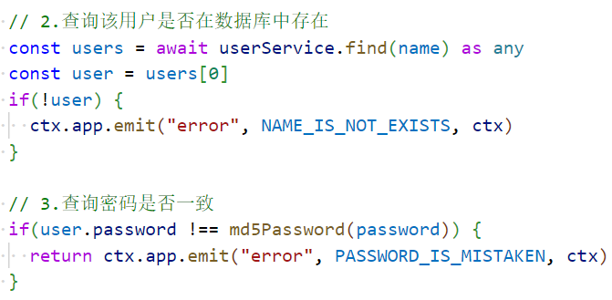

### 3.颁发token

- 传递数据，login.middleware：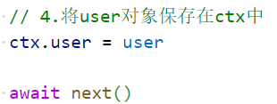
- 读取秘钥：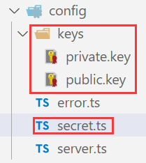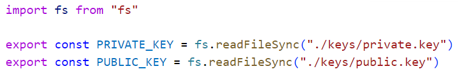
  - 这里读取秘钥存在路径问题，这个问题跟我们的启动目录有关：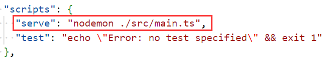
  - 需要这么写：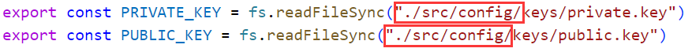
  - 也可以使用相对路径：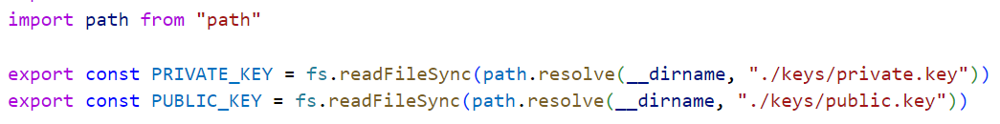
- 颁发token：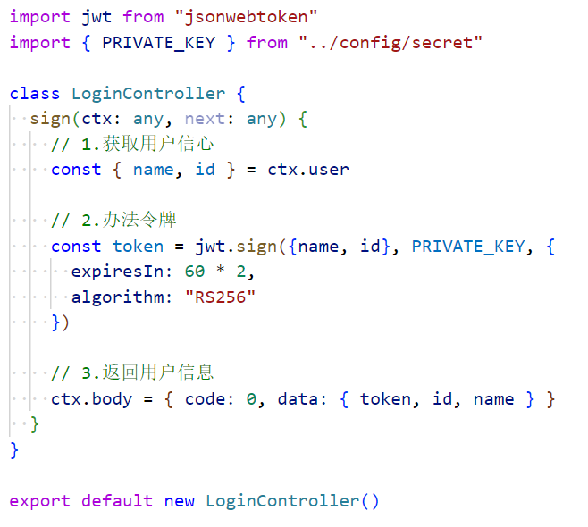，要测试，时间写了两分钟，一般一个周或月
  - 结果：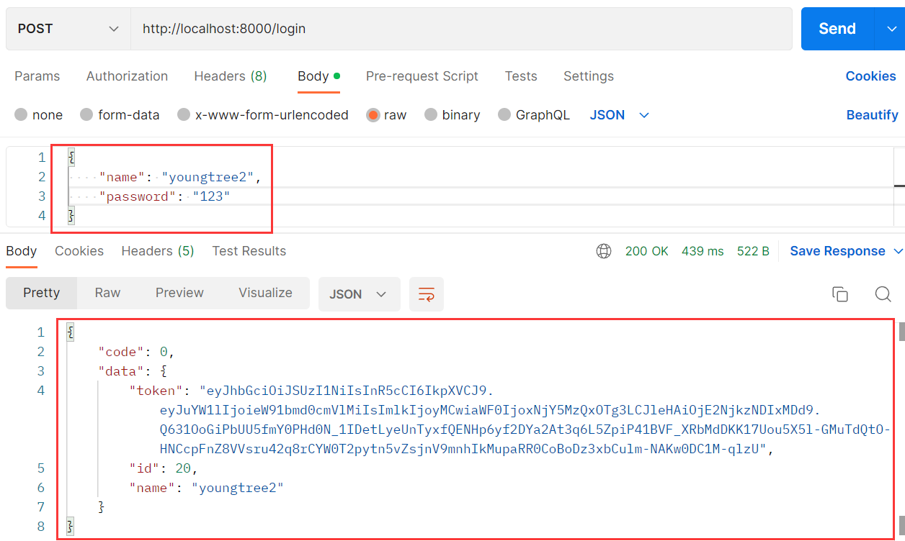

### 4.验证token

- login.router.ts：，注册test接口，使用test中间件
- login.controller.ts：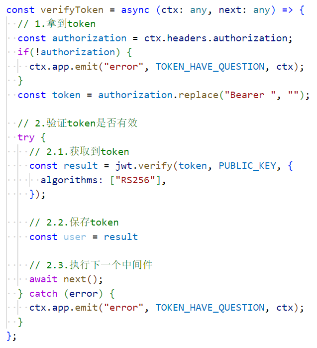，验证token

### 5.验证token的封装

- 不仅仅是/login/test这个接口会验证token，其他的接口，比如我的信息，评论等等都需要验证token
  - 所以我们应该把它封装为一个中间件
- login.middleware.ts：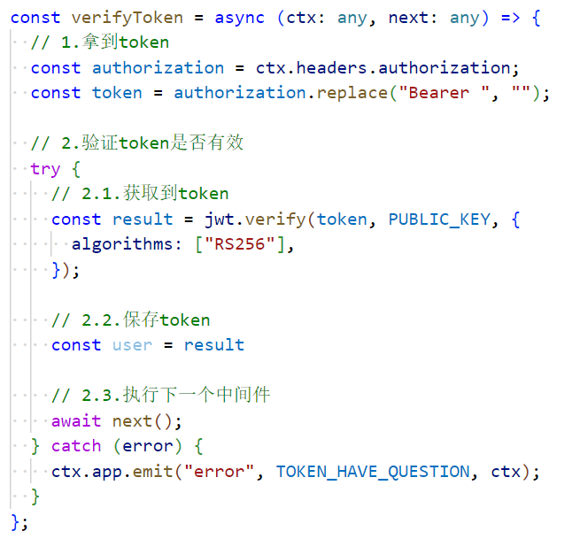，书写验证代码
- login.router.ts：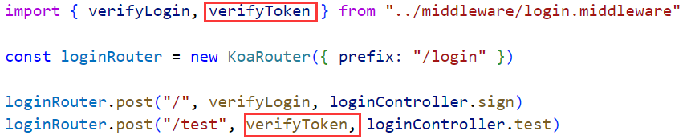，使用验证token的中间件

- 登录时将token加入到postman的全局中：
  - 第一行：pm代表postman，它的结果用json进行解析
  - 第二行：将解析的结果以token命名，设置到postman的全局变量中

### 6.动态的注册所有路由对象

- 让router能够生效我们每次都需要在app/index.ts中写这些代码：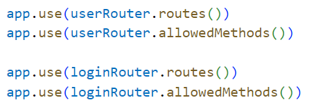
  - 很麻烦，我们想有没有什么办法可以自动化生成这些代码
- 目录结构：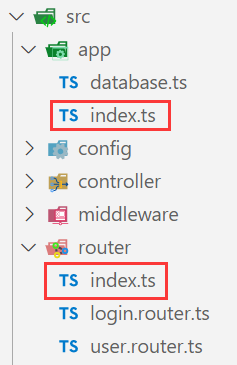，在router/index.ts中获取router对象，并通过app注册router
  - app得去app/index.ts中拿，所以要获取router/index.ts中的函数，把app作为参数传过去
- router/index：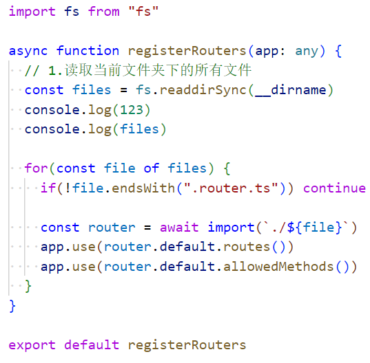，app/index：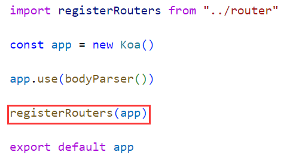

