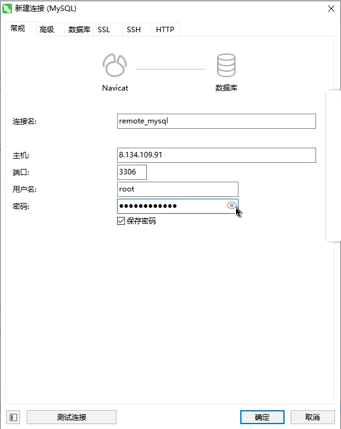

### 1.安装node

- 搜索nodejs：
- 安装nodejs：

### 2.安装MySQL

- 搜索mysql-server：
- 安装mysql-server：

### 3.启动mysql-server

- 启动：

- 查看是否启动成功：
- 开机自启动：

### 4.设置密码

- 输入命令：
- 选项：
- 选项：
- 连接数据库：

### 5.修改权限

- 使用mysql表：
- 修改mysql表的字段：
- 让配置生效：
- 再查询一下就变成%了：
- 退出：
- 可以进行远程连接：
- 有可能连不上，因为服务器没有开启3306端口，开启就可以连接上了

### 6.迁移sql文件

- 转存sql文件：
- 运行sql文件：
  - 选中刚才的文件，运行即可

### 7.启动项目

- 把项目移进去：
- 进入到node-p，安装相关依赖npm install
- 启动：npm run serve
- 开启服务器的8000端口

### 8.管理node进程

- 安装pm2：npm install pm2 -g
- 启动：
- 常用命令：

