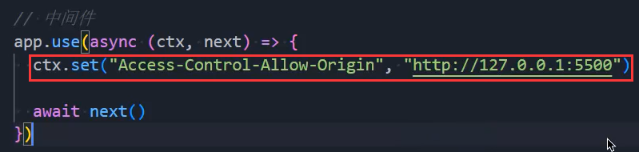
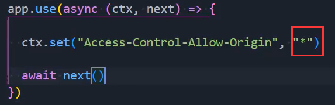
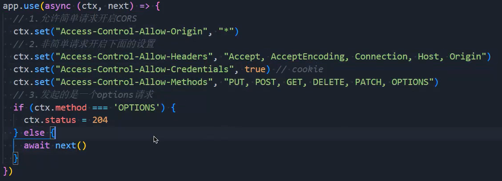
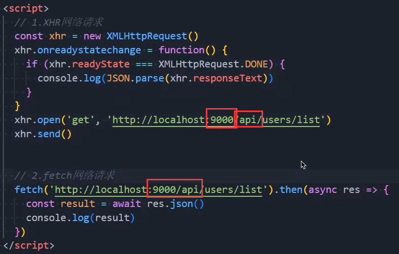
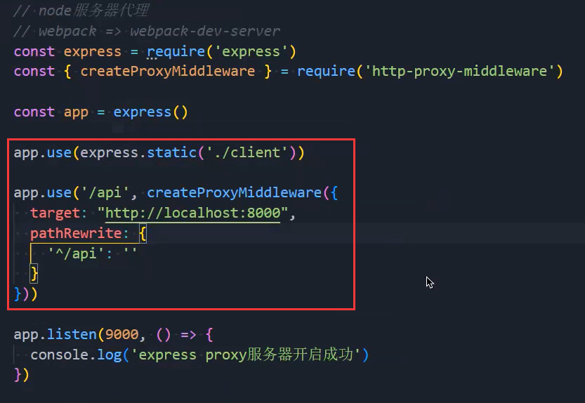
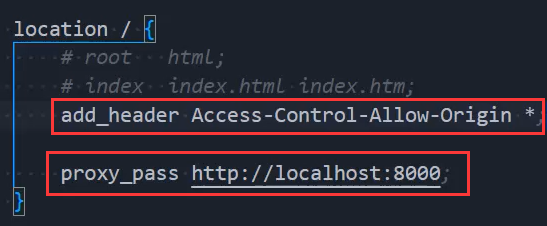
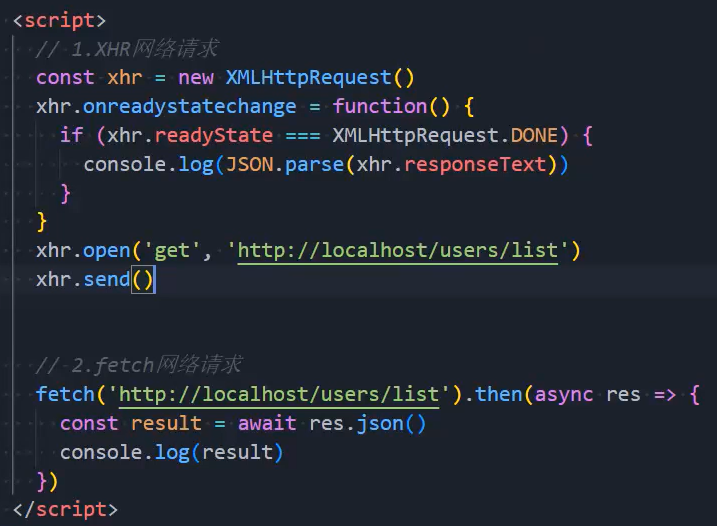
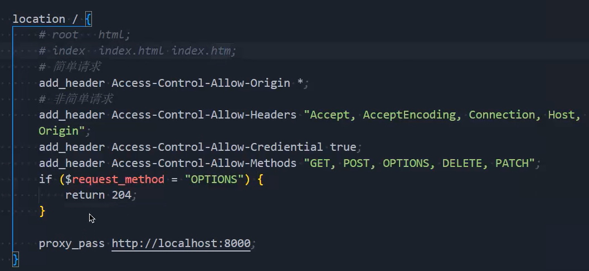

### 1.浏览器的同源策略

- 同源策略：一个重要的安全策略
  - 用于限制一个origin的文档，或者它所加载的脚本，如何能与另一个源的资源进行交互
- 它能帮助阻隔恶意文档，减少可能被攻击的媒介
- 如果两个URL的protocol（协议）、port（端口）和host（主机地址）都相同的话，则这两个URL是同源
- 举例：浏览器通过某个地址访问了服务器中的index.html文件，然后下载js和css文件都是在同一个服务器同一个端口
  - 在运行js时，我们可能会通过ajax去另一台服务器获取数据，浏览器发现有两个源，一个是获取html/js/css的源，一个是获取数据的源，这是两台服务器，浏览器就会限制后一个源，不让你获取数据
- 如果浏览器不限制这个问题，黑客可能会注入一个自己写的脚本，这个脚本是连接的自己的服务器
  - 如果此时你输入了账户密码，由于连接的是黑客的服务器，黑客就会看到我们的账号和密码，较为危险
- protocol（协议）、port（端口）和host（主机地址）有一个不一样，就会引起同源策略，进而出现跨域问题
  - 这个方案被称为：协议/主机/端口 元祖
  - [protocol, port, host]元祖中的这三个东西都必须相同

### 2.解决方案

- 方案一：将项目和接口通过koa-static部署在同一个服务器，同一个端口上，这样协议主机和端口这三者就一样了
- 方案二：CORS：跨域资源共享
- 方案三：node代理服务器：webpack中就是它
- 方案四：nginx反向代理

### 3.CORS

- 基于http的headers的机制
- 在服务器中标识，除了自己以外，谁可以访问我
- 假如index.html运行在http://127.0.0.1:5500上，然后当使用网络请求，请求http://127.0.0.1:8000/user/list时，浏览器发现响应的数据中的headers中存在某个东西，服务器允许你访问，就可以访问到数据额
- 简单请求
  - 允许5500访问：
  - 允许任何域访问：
- 非简单请求：

### 4.node代理（开发阶段）

- 比如刚才的5500端口的index.html文件访问8000端口的数据
- 我让一个node服务器去访问8000端口的数据，node服务器是没有跨域问题的，只有浏览器有
- 所以问题就来到了，浏览器如何拿到node服务器的数据
  - 它也有跨域问题，但是可以用方案一解决
- 请求数据：
- 代理服务器：

### 5.nginx反向代理（发布阶段）

- 跟node一样，不要直接访问数据，通过nginx做一个代理，去访问nginx服务器
  - nginx帮助我们去访问数据
  - 但是浏览器访问nginx也存在跨域问题，所以它的解决方案是：方案二：CORS
- 简单请求的配置：
- 请求：
- 非简单请求的配置：

