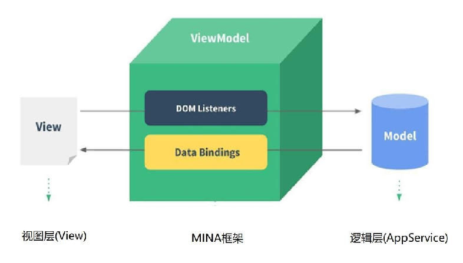

### 1.准备

- 注册账号 – 申请AppID

- 下载小程序开发工具

- vscode插件：

- 小程序项目结构：

- 阅读官方文档：指南、框架、组件、API这个四个部分

- 开发体验

  ```html
  <view>{{ message }}</view>
  
  <!-- block类似于vue中的template元素 -->
  <block wx:for="{{ list }}" wx:key="*this">
    <view>{{ item }} --- {{ index }}</view>
  </block>
  
  <view class="counter">{{ counter }}</view>
  <button class="up" bindtap="increment">+1</button>
  <button class="down" bindtap="decrement">-1</button>
  ```

  ```js
  Page({
    data: {
      message: "Hello Mini",
      list: ["123", "456", "abc", "哈哈哈"],
      counter: 0
    },
    increment() { this.setData({ counter: this.data.counter + 1 }) },
    decrement() { this.setData({ counter: this.data.counter - 1 }) }
  })
  ```

### 2.架构和模型

- MVVM架构：

  - MVVM为什么好用呢？
    - DOM Listeners：ViewModel层可以将DOM的监听绑定到Model层
    - Data Bindings：ViewModel层可以将数据的变量，响应式的变化反应到View层

- 双线程模型

  - 小程序的宿主环境是：微信客户端
    - 宿主环境可以执行小程序的各种文件
  - 当小程序运行在 WebView 环境下时，会有什么问题呢？
    - JS 逻辑、DOM 树创建、CSS 解析、样式计算、Layout、Paint (Composite) 都发生在同一线程中
    - 在 WebView 上执行过多的 JS 逻辑可能阻塞渲染，导致界面卡顿
  - 小程序考虑到性能与安全的问题，采用了「双线程模型」的架构
    - WXML模块和WXSS样式运行于 渲染层，渲染层使用WebView线程渲染
      - 当一个程序有多个页面时，会使用多个WebView的线程
    - JS脚本（app.js/home.js等）运行于 逻辑层，逻辑层使用 JsCore 运行 JS脚本
      - 这两个线程都会经由微信客户端（Native）进行中转并交互

  

### 3.配置文件

- sitemap.json
  - 微信会爬取你的页面内容, 当用户在自己的微信中搜索时可以搜索到你开发的小程序
- project.private.config.json：一些个人配置信息
  - 比如：项目名字，是否开启热重载, 是否开启地址检查，当前版本库的版本号
  - 这个文件中设置的内容会覆盖掉project.config.json文件中的相同设置
  - 与project.config.json配置不同时会改变这个文件中的配置
- project.config.json：一些基础配置
  - 比如项目名称、appid
  - 这个文件一般不会发生变化
- app.json：全局配置
  - pages: 页面路径列表
    - 用于指定小程序由哪些页面组成，每一项都对应一个页面的 路径（含文件名） 信息
    - 小程序中所有的页面都必须在pages中进行注册
  - window: 全局的默认窗口展示
    - 用户指定窗口如何展示, 其中还包含了很多其他的属性
  - tabBar: 底部tab栏的展示
- page.json：页面的单独配置
  - 每一个小程序页面也可以使用 .json 文件来对本页面的窗口表现进行配置
  - 页面中配置项在当前页面会覆盖 app.json 的 window 中相同的配置项

### 4.app.json

```json
{
  "pages":[
    "pages/index/index",
    "pages/category/category",
    "pages/order/order",
    "pages/profile/profile",
    "pages/logs/logs"
  ],
  "window":{
    "backgroundTextStyle":"dark",  // 下拉刷新那三个点的颜色
    "navigationBarBackgroundColor": "#ff8189",  // 整个小程序的顶部tabbar的颜色
    "navigationBarTitleText": "Weixin",  // tabbar标题
    "navigationBarTextStyle":"black",  // tabbar标题颜色
    "enablePullDownRefresh": true
    // 是否允许下拉刷新, 一般不会在全局直接开启, 而是单独为每个页面进行配置
  },
  "tabBar": {
    "selectedColor": "#ff8189",  // 设置选中之后的文本颜色
    "list": [
      {
        "pagePath": "pages/index/index",
        "text": "首页",
        "iconPath": "./assets/home.png",
        "selectedIconPath": "./assets/home_active.png"
      },
      {
        "pagePath": "pages/category/category",
        "text": "分类",
        "iconPath": "./assets/category.png",
        "selectedIconPath": "./assets/category_active.png"
      },
      {
        "pagePath": "pages/order/order",
        "text": "订单",
        "iconPath": "./assets/cart.png",
        "selectedIconPath": "./assets/cart_active.png"
      },
      {
        "pagePath": "pages/profile/profile",
        "text": "我的",
        "iconPath": "./assets/profile.png",
        "selectedIconPath": "./assets/profile_active.png"
      }
    ]
  },
  "style": "v2",
  "sitemapLocation": "sitemap.json"
}
```

### 5.案例

下拉刷新数据和上拉加载更多

```js
// js
Page({
  data: { listCount: 30 },
  onPullDownRefresh() {
    setTimeout(() => {
      this.setData({ listCount: 30 })
      wx.stopPullDownRefresh({ success: (res) => { console.log("成功", res) } })
    }, 1000)
  },
  onReachBottom() { this.setData({ listCount: this.data.listCount + 30 }) }
})
```

```html
<!-- wxml -->
<block wx:for="{{ listCount }}" wx:key="*this">
  <view>{{ item }}</view>
</block>
```

```json
// json
{
  "navigationBarTitleText": "个人信息",  // 顶部tabbar的文本
  "navigationBarBackgroundColor": "#f00",  // 顶部tabbar的背景色
  "enablePullDownRefresh": true,  // 此页面是否开启下拉刷新
  "onReachBottomDistance": 100  // 距离底部100时就回调onReachBottom函数
}
```

