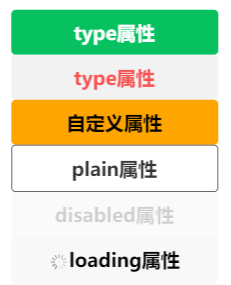

### 1.text

```html
<text>Hello World</text>
<text user-select>{{ message }}</text>
<text user-select="{{true}}">{{ message }}</text>
<text decode>&gt;</text>
```

```js
Page({ data: { message: "Hello mini" } })
```

- true需要写在双大括号内
- user-select属性：长按文字会被选中
- decode：解析字符实体

### 2.button

- 基本使用

  ```html
  <button>按钮</button> <!-- 块级 -->
  
  <button size="mini">size属性</button>  <!-- 内联级 -->
  
  <button type="primary">type属性</button>
  <button type="warn">type属性</button>
  <button class="btn">自定义属性</button>
  
  <button plain>plain属性</button>
  <button disabled>disabled属性</button>
  <button loading>loading属性</button>
  <button hover-class="active">hover效果</button>
  ```

  ```css
  .btn { background-color: orange; }
  .active {
    color: white;
    background-color: black;
  }
  ```
  

- 打开客服会话

  ```html
  <button open-type="contact">打开客服会话</button>
  ```

- 获取用户信息

  ```html
  <!-- 获取不到完整的用户信息 -->
  <button open-type="getUserInfo" bindgetuserinfo="getUserInfo">用户信息</button>
  
  <!-- 使用这种方式 -->
  <button bindtap="getUserInfo">用户信息</button>
  ```

  ```js
  Page({
    getUserInfo(event) {
      wx.getUserProfile({ desc: 'desc'}).then(res => console.log(res))
    }
  })
  ```

- 获取用户手机号码

  ```html
  <button open-type="getPhoneNumber" bindgetphonenumber="getPhoneNumber">
    手机号码
  </button>
  ```

  ```js
  Page({ getPhoneNumber(event) { console.log(event) } })
  ```

  - 个人项目是不能获取用户手机号的，企业级项目可以

### 3.view

```html
<view bindtap="onViewClick">我是view组件</view>
<view hover-class="active">哈哈哈</view>
```

```js
Page({ onViewClick() { console.log("onViewClick"); }})
```

```css
.active {
  color: white;
  background-color: black;
}
```

### 4.image

- 基本使用

  ```html
  <image src="/assets/9.jpg"/>
  <image src="https://pic3.zhimg.com/v2-9be23000490896a1bfc1df70df50ae32_b.jpg"/>
  ```

  - image组件的宽高是固定的：320 x 240

- mode属性

  ```html
  <image src="/assets/9.jpg" mode="aspectFit"/>
  <image src="/assets/9.jpg" mode="widthFix"/>
  <image src="/assets/9.jpg" mode="heightFix"/>
  ```

  - widthFix：宽度不变，高度自动变化，保持原图宽高比不变，这个值最常用

- 选择本地图片

  ```html
  <button bindtap="onChooseImage">选择图片</button>
  <image class="img" src="{{chooseImageUrl}}" mode="widthFix"/>
  ```

  ```js
  Page({
    data: { chooseImageUrl: "" },
    onChooseImage() {
      wx.chooseMedia({ mediaType: "image" }).then(res => {
        const imagePath = res.tempFiles[0].tempFilePath
        this.setData({ chooseImageUrl: imagePath })
      })
    },
  })
  ```

### 5.scroll-view

- 上下滚动（在y轴上滚动）

  ```js
  Page({ data: { viewColors: ["red", "blue", "green", "skyblue", "purple", "yellow"] }})
  ```

  ```html
  <scroll-view class="container" scroll-y>
    <block wx:for="{{viewColors}}" wx:key="*this">
      <view class="item" style="background: {{item}};">{{item}}</view>
    </block>
  </scroll-view>
  ```

  ```css
  .container {
    background-color: orange;
    height: 150px;
  }
  
  .item {
    width: 100px;
    height: 100px;
  }
  ```

- 左右滚动（在x轴上滚动）

  ```html
  <scroll-view
    class="container"
    scroll-x
    enable-flex
  >
    <block wx:for="{{viewColors}}" wx:key="*this">
      <view class="item" style="background: {{item}};">{{item}}</view>
    </block>
  </scroll-view>
  ```

  - 想要为scroll-view开启flex布局，必须加enable-flex属性

  ```css
  .container {
    background-color: orange;
    height: 150px;
    display: flex;
  }
  
  .item {
    width: 100px;
    height: 100px;
    flex-shrink: 0;
  }
  ```

- 事件监听

  ```js
  Page({
    data: { viewColors: ["red", "blue", "green", "skyblue", "purple", "yellow"] },
    onScrollToUpper() { console.log("到达左边或者到达顶部") },
    onScrollToLower() { console.log("到达右边或者到达底部") },
    onScroll(event) { console.log("滚动中", event) }
  })
  ```

  ```html
  <scroll-view 
    class="container scroll-x" 
    scroll-x
    enable-flex
    bindscrolltoupper="onScrollToUpper"
    bindscrolltolower="onScrollToLower"
    bindscroll="onScroll"
  >
    <block wx:for="{{viewColors}}" wx:key="*this">
      <view class="item" style="background: {{item}};">{{item}}</view>
    </block>
  </scroll-view>
  ```

### 6.input

```html
<input type="text" model:value="{{message}}" bindinput="textInput"/>
```

```js
Page({
  data: { message: "Hello mini" },
  textInput() {}  // 不加这个事件绑定会报警告
})
```

### 7.所有内置组件都可使用的属性

- id、class、style、hidden、data-*、`bind*/catch*`